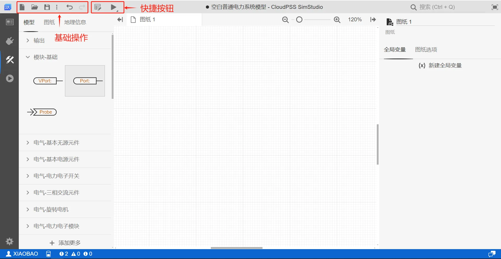
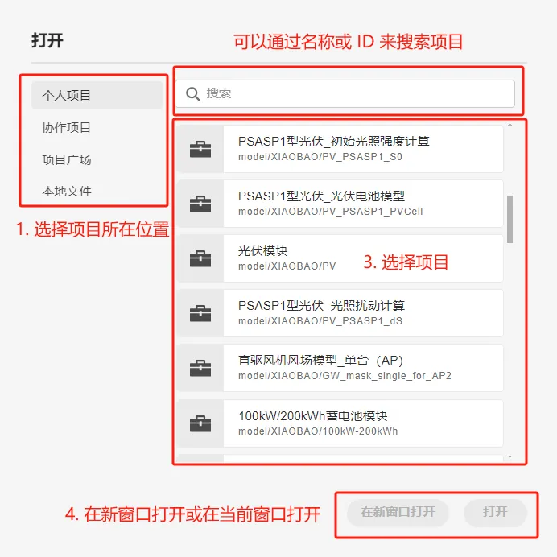
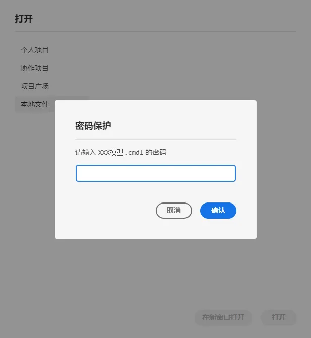
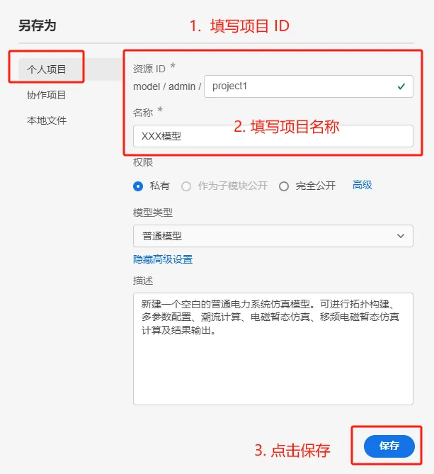
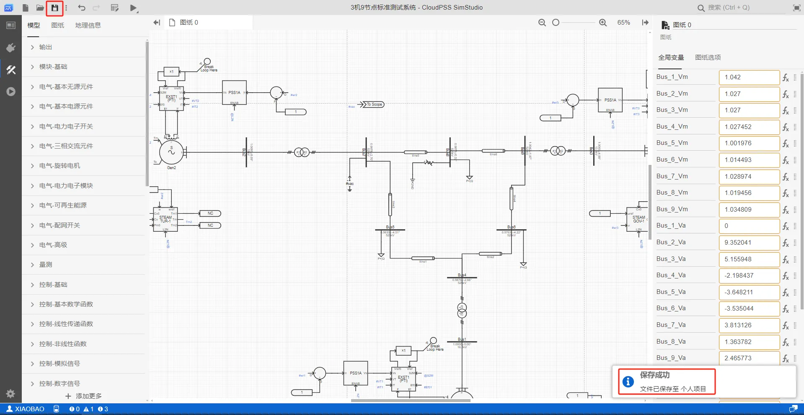
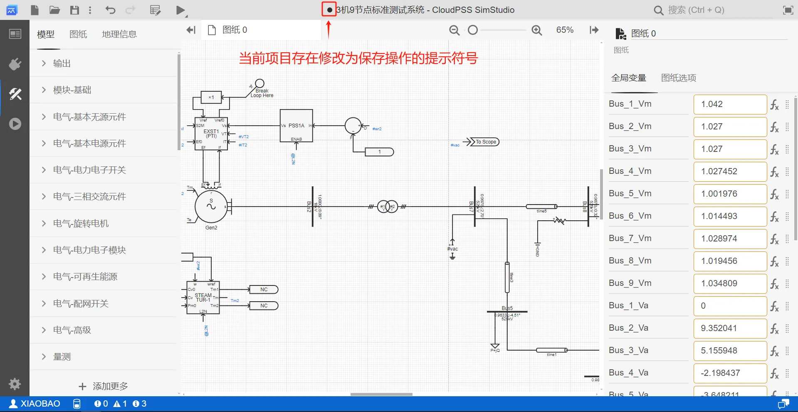
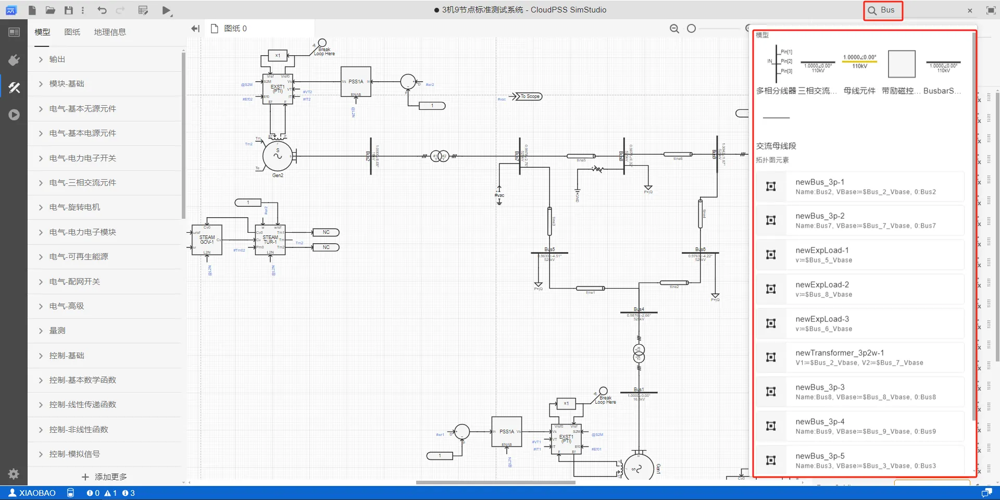
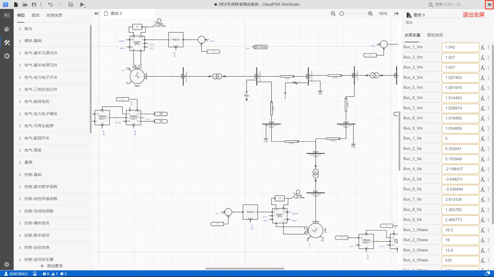
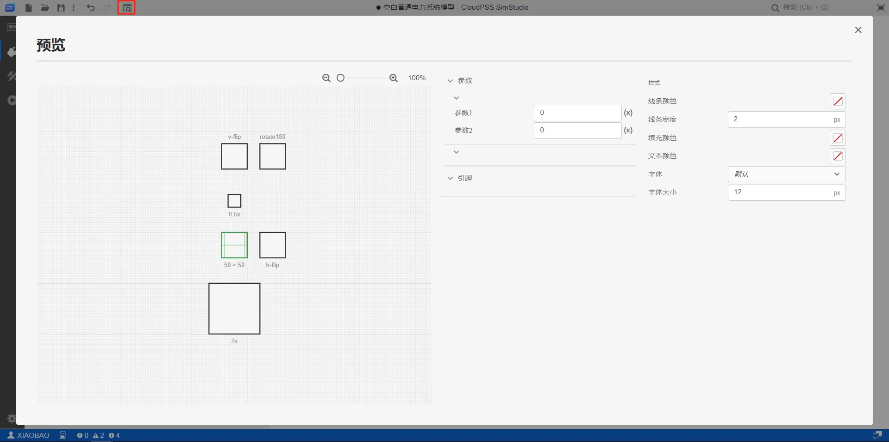
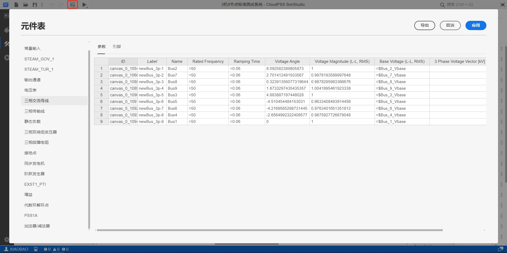

本文档主要介绍 **SimStudio 工作台** - **工具栏** 的各项功能。

## 页面功能

工具栏主要集成了对 SimStudio 项目的基本操作和快捷按钮两类功能。
+ **基本操作**：包括项目层面的**新建**、**打开**、**保存**和**另存为**功能，编辑层面的**撤销/重做**功能，以及**搜索**和**全屏**两项辅助功能。
+ **快捷按钮**：根据当前标签页的不同，工具栏会显示不同的特殊快捷按钮，如接口标签页下的**预览**、实现标签页下的**元件表**、实现和运行标签页下的**启动任务**。
  

## 基本操作

### 新建

点击工作栏左上侧**新建**按钮，会弹出新建项目对话框。用户可以选择任一项目模板，点击**新建**即可创建项目。点击对话框外任意空白处，可关闭该窗口。

:::tip
CloudPSS SimStudio 模型工坊预置了丰富的项目模板，除空白项目以外，覆盖旋转电机及其控制系统、IEEE 标准系统、电压源变流器及其控制系统、储能并网发电系统、光伏并网发电系统、高压直流输电系统、直流微电网系统、模块化多电平变流器及其控制系统、综合能源系统应用场景的多类典型案例。

用户可基于基础模板案例快速构建可准确、稳定仿真的模型，并基于此开展学习和研究工作。
:::

### 打开

点击工作栏左上侧**打开**按钮，会弹出打开项目对话框，用户可分别从云空间中的**个人仿真**、**协作项目**、**仿真广场**打开以及从**本地文件**上传 SimStudio 项目。
+ **个人项目**：云空间中保存的当前用户创建的全部项目。
+ **协作项目**：云空间中保存的当前用户所加入**协作组织**的协作项目。有关协作组织的建立，可参见 [组织管理](../../../../50-user-center/40-general-account-settings/40-organization-management/index.md "组织管理") 帮助页。
+ **项目广场**：云空间中保存的权限为**公开**的全部项目，包含所有用户创建的项目。
+ **本地文件**：保存在用户本地设备上的项目文件（**cmdl**格式）。通过“**拖放文件到此处**”或“**点击以打开文件选择对话框**”选择本地模型文件上传。

:::warning 支持的本地文件类型
+ **SimStudio 工作台** 内的 **打开本地文件** 功能，与 **SimStudio 导览页** 的 **上传并打开…** 功能相同，仅支持 SimStudio 导出的 **cmdl** 格式模型文件。
+ 通过**SimStudio 导览页**导出的模型压缩包（**zip**格式）无法通过此功能上传。
+ 对于有**密码保护**的本地模型文件，打开时需要输入**保存时设置的保护密码**。
:::

### 另存为

对于**新建项目**，点击工作栏左上侧**保存**按钮、或右边**更多**弹出的**另存为**按钮后，会弹出另存为对话框，选择保存位置为云空间的**个人项目**、**协作项目**，或下载至**本地文件**。

#### 1. 保存至个人项目

选择保存在**个人项目**时，必须填写**资源 ID**（`RID`）中的**项目 ID**和**名称**，点击保存按钮即可实现项目文件的保存。

:::info 资源 ID（或 `RID` ）

**资源 ID**（或 **RID** ）是在 CloudPSS XStudio 中标识项目的**唯一**、**不可重复**的标识符。

完整的 **SimStudio 项目 `RID`** 格式：**`model/用户名/项目ID`**

为保证 CloudPSS XStudio 中每个项目 `RID` 的唯一性，同一用户输入的**项目 ID**不可重复。
:::

#### 2. 保存至协作项目

选择保存在**协作项目**时，必须在**资源 ID** 中选择**协作组织 ID**，填入**项目 ID** 和**名称**，点击保存按钮即可实现项目文件的保存。

:::info

保存云空间项目（选择**个人项目**、**协作项目**）时，可选择性配置项目**权限**、**类型**和**描述**，也可留空或保持默认选项。

其中，**权限**、**类型**和**描述**配置与**总览标签页**配置项一致，其配置方法参见 [总览](../20-function-zone/10-summary-tab/index.md) 帮助页。

:::

#### 3. 保存为本地文件

选择保存在**本地文件**时，必须填入**文件名**，还可选择性配置**密码**，点击保存即可将**cmdl**格式的模型文件下载至本地设备。

### 保存

对于**已保存过的项目**，再次点击**保存**按钮，新的修改将会覆盖旧的项目。

:::tip 修改未保存的提示
当前项目存在**修改未保存**的操作时，工具栏的项目名称前面会出现**提示符号**，请注意随手保存。

:::

### 撤销/重做

点击工作栏左上侧**撤销**按钮，撤回上一步操作。

点击工作栏左上侧**重做**按钮，重做上一步操作。

支持对用户**打开项目后所有操作**的撤销的重做，无次数限制。

### 搜索

工作栏右上侧提供**搜索框**，可用于搜索命令、页面元素等。用户在搜索框内输入搜索内容，可以搜索出**当前项目**与包含**用户搜索内容**的全部元素。

**搜索**功能的详细用法参见 [搜索栏](../40-search-bar/index.md) 帮助页。

### 全屏

点击工作栏右上侧搜索栏旁边的**全屏**按钮，SimStudio 工作台将进入全屏模式，全屏模式下再次点击该按钮将退出全屏。

## 快捷按钮

### 预览

当功能区切换到**接口标签页**时，工具栏会出现**预览**快捷按钮，点击**预览**按钮，弹出预览对话框。预览功能用于对模型封装后的参数、引脚和图标进行预览。具体使用方法参见 [模型封装](../../50-modeling/40-module-packaging/index.md) 帮助页。

### 元件表

当功能区切换到**实现标签页**时，工具栏会出现**元件表**快捷按钮，点击**元件表**按钮，弹出元件表对话框。元件表功能用于批量查看、编辑、导入/导出元件的参数及引脚配置。具体使用方法参见 [元件表](../../50-modeling/20-component-table/index.md) 帮助页。

### 启动任务

当功能区切换到**实现标签页**或**运行标签页**时，工具栏会出现**启动任务**快捷按钮。该按钮可在**实现标签页**快速启动任务，避免用户在调试模型拓扑和仿真参数时，频繁切换实现和运行标签页。

+ 鼠标**左键**点击**启动任务**，系统会自动选择当前选中的**参数方案**和**计算方案**，快速启动计算任务，并跳转至**结果标签页**，显示当前方案的计算结果。

+ 鼠标**右键**点击**启动任务**按钮，系统会弹出当前选中的**参数方案**和**计算方案**参数配置列表，方便用户快速修改参数和计算方案。

