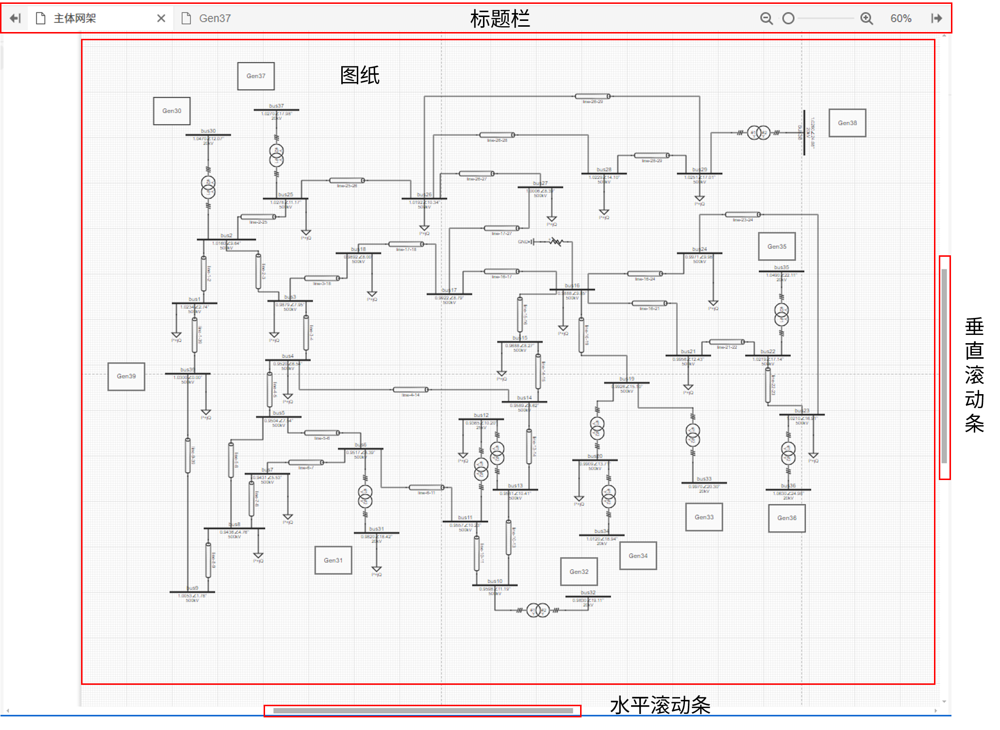
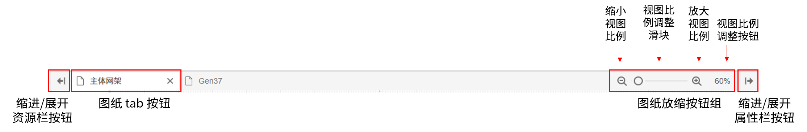
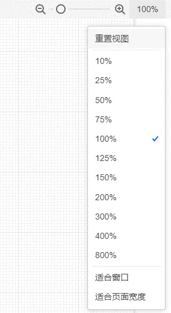
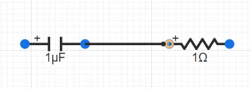
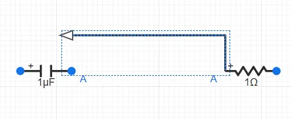
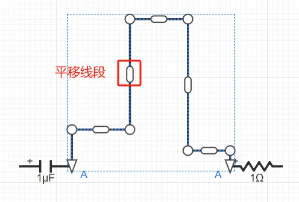
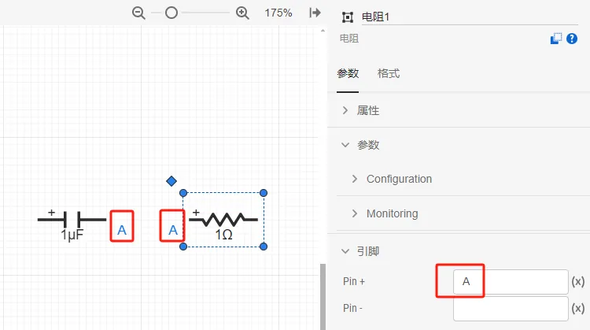
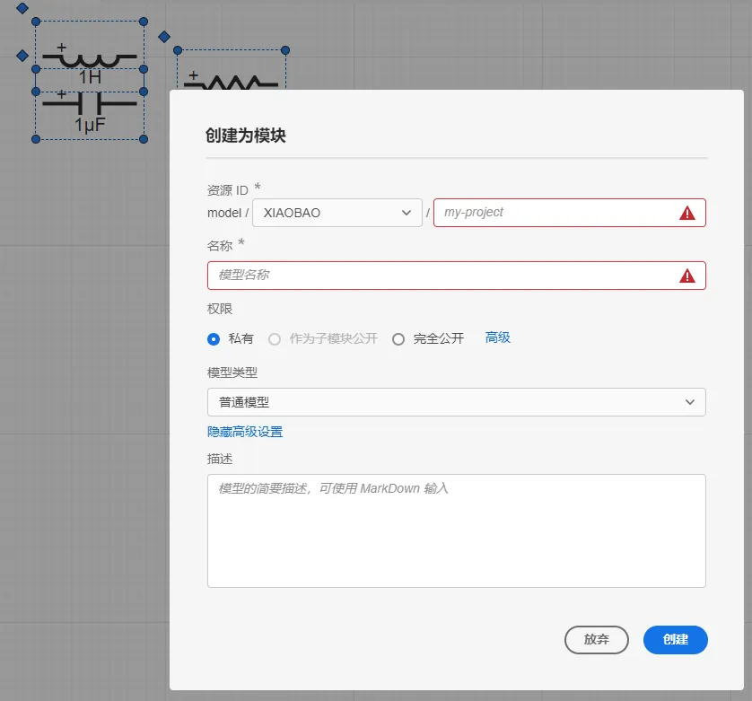
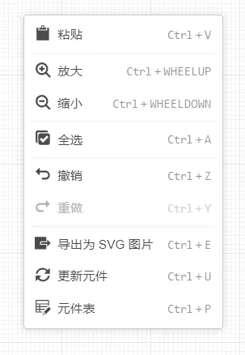

<!-- :::danger 批注
1. 页面功能口语化严重，且错误较多。垂直滚动条在左侧？可以不用写方位。一共就4个东西，配图说明即可。
   需要加方位（XX的顶部、XX的底部、XX的左侧、XX的右侧）的地方：（已修改）
   1. 当所介绍的功能按钮比较小，而页面元素较多时，且通过方位可快速定位到该功能的位置，可以使用方位。
   2. 介绍操作流程时，介绍操作前后两个操作的动线时，可使用方位衔接。例如：拖拽XX到YY，在YY右侧的参数卡中，可修改XX的参数。
2. 注意规范命名，尤其是图片内部的标注、图片题注的命名，要与文字一致。不要出现重复的名称，比如**工具栏**，工作台已经有标题栏了。这里可以叫 标题栏。（已修改）
3. 按键用加粗即可，不用代码框。（已修改）
::: -->

本文档介绍 **SimStudio 工作台** - **实现标签页** - **拓扑编辑区** 的基本操作。

## 页面功能

SimStudio 工作台拓扑编辑区提供类似 Simulink、PSCAD 等仿真软件的拓扑建模方法，支持通过拖拽、放置、连接、选中、批量选中、复制/粘贴等操作快速构建和管理模型拓扑。

拓扑编辑区包括**标题栏**、**图纸**、**垂直滚动条**以及**水平滚动条**。

标题栏提供如下按钮:

+ **缩进/展开**按钮：用于隐藏或显示资源栏和属性栏；
+ **图纸 tab**按钮：在图纸栏选中图纸后，会打开该图纸，并在拓扑编辑区的工具栏内显示该图纸的 tab 按钮，帮助用户快速切换图纸，当打开多个图纸后，可点击 **X** 关闭任意图纸；
+ **图纸缩放**按钮组：通过点击**放大/缩小**按钮，或拖动**滑块**，调整当前图纸的视图比例；也可点击**视图比例**按钮，在下拉菜单中选择图纸的比例。
  

也可按住 <kbd>ctrl</kbd> <kbd>鼠标滚轮向下或向上</kbd> 缩放视图。

垂直滚动条: 长按垂直滚动条向上或向下移动图纸查看其余部分，也可使用 <kbd>鼠标滚轮向下或向上</kbd> 完成图纸的垂直移动。

水平滚动条: 长按水平滚动条向左或向右移动图纸查看其余部分，也可使用 <kbd>Shift</kbd> <kbd>鼠标滚轮向下或向上</kbd> 完成图纸的水平移动。

:::tip 缩放范围
最小缩放级别为 0.1 %，最大缩放级别为 800 %。
:::

## 基础操作

### 元件放置

拓扑编辑过程中元件放置方法主要有 3 种。
+ 在**模型标签页**中选择待添加的元件，直接拖拽至拓扑编辑区。
+ 在**工具栏** - **搜索**处查找模型库中的元件，选择待添加的元件，直接拖拽至拓扑编辑区。
+ 选中拓扑编辑区中的现有元件，通过复制、粘贴的方式批量添加元件。支持**同平台项目间跨网页剪切/复制/粘贴**。

### 元件排布

拓扑编辑过程中元件的移动方法主要有 3 种。
+ 选中拓扑编辑区中的现有元件，鼠标拖拽可实现元件位置的移动；按住 <kbd>Shift</kbd> 键拖拽可实现自动引脚对齐、居中对齐等吸附特性。
+ 选中拓扑编辑区中的现有元件，通过键盘方向键可控制元件位置精确移动。每次移动距离为 5 个单位。
+ 选中拓扑编辑区中的现有元件，通过修改**格式卡**中的**X**和**Y**位置坐标，可精确控制元件位置。具体方法参见 [格式卡](../40-style-panel/index.md)。

拓扑编辑过程中元件的缩放方法主要有 2 种。
+ 选中拓扑编辑区中的现有元件，按住元件图标四角的**圆形图标**拖拽，可对元件进行等比例缩放。
+ 选中拓扑编辑区中的现有元件，通过修改**格式卡**中的**宽度**和**高度**，可精确控制元件图标大小。具体方法参见 [格式卡](../40-style-panel/index.md)。

拓扑编辑过程中元件的旋转、翻转方法主要有 3 种。
+ 选中拓扑编辑区中的现有元件，按住元件图标左上方的**菱形图标**拖拽，可对元件进行任意角度旋转。
+ 选中拓扑编辑区中的现有元件，右键弹出菜单，选择顺/逆时针旋转，可对元件进行 90° 旋转。
+ 选中拓扑编辑区中的现有元件，通过修改**格式卡**中的**排列配置**，可对元件进行 90° 旋转和镜像翻转。具体方法参见 [格式卡](../40-style-panel/index.md)。

### 元件连接

拓扑编辑过程中元件之间的连接方法主要有 2 种。

1. 直接使用**连接线**连接元件
   将鼠标光标移至元件引脚处，若该引脚出现蓝色圆形阴影，说明该引脚可用。此时单击该引脚，按住鼠标左键并移动光标至需要被连线的引脚处，当该引脚处出现橙色边框，松开鼠标左键即完成两个元件的连线。
   
   

   选中连线后，将鼠标悬停在连线上，连线的两端会出现连个箭头，中间会出现一个圆角矩形，鼠标左键常按箭头可以任意拖放箭头位置，调整连线的首末端。
   
   

   鼠标左键常按圆角矩形可以平移线段位置。
   
   

2. 通过**引脚标签**连接元件
   
   若出现元件较多、连线不便的情况，可以通过设置**引脚标签**的方式对两个及以上的引脚进行连接。选择需要连接的元件，在**参数卡**的引脚处填写**引脚标签**。若两个元件对应引脚处填写的**引脚标签**相同，则两个元件即实现连接。如下图所示。

   

:::warning

1. 电气引脚与控制引脚不能互相连接。
1. 控制输入引脚不能并联，控制输出引脚不能并联。也即控制输出引脚需连接至另一控制输入引脚。
1. 引脚连接需满足维数要求。例如`三相交流电压源`的正端为三维电气引脚，不能直接与单相电阻的一维引脚连接，此时可加入`分线器`进行电气引脚拆分。同理，多维的控制引脚加入`多路信号合并`或`多路信号分离`元件进行拆分/聚合。

:::

## 快捷菜单（选中状态）

在拓扑编辑区，选中/框选图纸中的单个或多个元素（包括元件、连接线、图纸辅助工具等），右键弹出快捷菜单（选中状态），提供多项基础编辑操作。

### 剪切

剪切图纸中的选中的全部元素。

### 复制

复制图纸中的选中的全部元素。

### 创建副本

在当前图纸中创建选中的全部元素的副本，并选中所创建的副本。

### 删除

删除图纸中的选中的全部元素。

### 顺/逆时针旋转

将所选中的全部**元件**和**图纸辅助工具**顺/逆时针旋转 90°。对连接线操作无效。

### 撤销/重做

撤回/重做上一步操作。

### 导出为 SVG 图片

将所选中的全部元素导出为 SVG 格式的矢量图。

### 打开模块

若所选中的是元件/模块，点击打开模块会以浏览器新标签页形式打开该模块的 SimStudio 项目，从而查看该元件/模块的内部细节。

:::warning 权限要求
当前用户必须具备该元件的**完全公开**或**读**访问权限才可执行打开模块操作。
:::

### 帮助

若所选中的是单个元件，点击则会打开该元件的帮助文档。若该元件是 CloudPSS 官方元件库元件，帮助文档以浏览器新标签页形式打开。若该元件是用户自定义元件，帮助文档则以弹出对话框的形式打开。

### 创建为子模块

选中多个元素后，可选择创建为子模块，可将这部分拓扑另存为一个单独的模型项目。该功能详细使用说明参见 [模块封装](../../../../50-modeling/40-module-packaging/index.md)。

## 快捷菜单（非选中状态）

在拓扑编辑区，未选中任何元素情况下点击右键，可弹出快捷菜单（非选中状态），提供多项基础编辑操作。

### 粘贴

点击图纸空白处，粘贴剪切/复制的元素。

:::tip 同平台项目间跨网页剪切/复制/粘贴
SimStudio 支持**同平台项目间跨网页剪切/复制/粘贴**。跨网页剪切/复制/粘贴可以将所选元素在多个 SimStudio 项目之间移动，实现重复性拓扑的快速复用。
:::

### 放大/缩小

放大或缩小拓扑编辑区当前图纸的视图比例。

### 全选

全选图纸上的全部元素。

### 更新元件

获取元件的最新版本。该功能详细使用说明参见 [模块封装](../../../../50-modeling/40-module-packaging/index.md)。

### 元件表

弹出元件表对话框。该功能详细使用说明参见 [元件表](../../../../50-modeling/20-component-table/index.md)。
