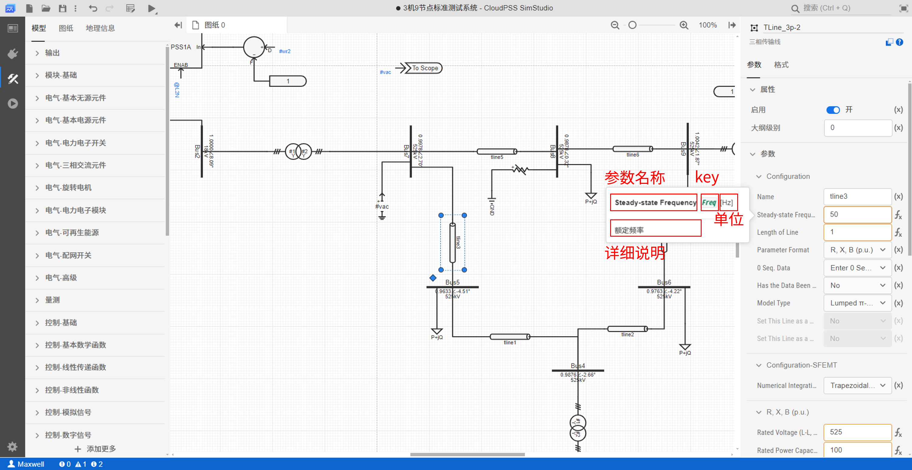
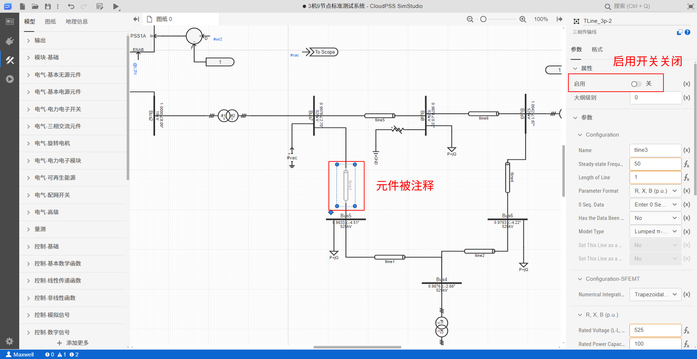

:::warning 修改建议 
1. 这篇文档太长，参数卡部分的内容太多，都已经到6级标题了，建议单独作为一篇子文档，可以详细讲解一下其中的大纲、浮窗、多选后参数配置等问题。
:::

## 功能定义

参数卡主要负责对图纸中元件的参数进行设置。

## 功能说明

在拓扑编辑区，点击鼠标左键选中元件后，右侧的属性栏内会出现元件的参数卡，由**属性**、**参数**和**引脚**三部分组成。

:::tip 参数卡悬浮窗
当鼠标移动到参数卡的某项参数上方，或处在某项参数的编辑状态时，当前参数的左侧会浮动显示当前参数的辅助信息，包括：
+ 参数名称、详细说明、`key`、单位 四种辅助信息
:::

### 属性

属性包括**启用**选项和**大纲级别**参数。

#### 启用

当启用开关打开时，元件被启用；关闭时，该元件会被注释掉，不参与仿真计算。在图纸中显示为浅灰色。

#### 大纲级别

当图纸中元件过多时，用户可以配置图纸中每个元件的大纲级别，来控制其在图纸中的显示层级，图纸中会隐藏大纲级别大于当前缩放级别的元件。

<!-- 缺乏大纲级别的详细介绍。 -->

### 参数

用于配置当前元件的参数。参数的具体配置方法参见 [参数、变量及引脚](../../../../50-modeling/10-params-variables-pins/index.md) 帮助页。

### 引脚

用于配置当前元件的引脚标签，实现不同元件间引脚的连接。引脚的具体配置方法参见 [参数、变量及引脚](../../../../50-modeling/10-params-variables-pins/index.md) 帮助页。  

不同元件的参数和引脚介绍参见相关元件的帮助页，可以通过点击元件标签右下方的元件**元件帮助**按钮快速跳转。

### 元件参数支持多选编辑

+ 多选后，可统一设置所选元件的**启用**、**大纲级别**属性
+ 多选后，不同元件中，值相同的参数可统一快速编辑

如下图所示，同时选中两个**母线**元件后，相同的参数**Rated Frequency**和**Ramping Time**可统一编辑

