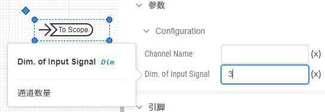

## 参数定义

整数类型的参数可配置项如下表所示。

| 配置项 | 含义 | 说明 |
| :--- | :--- | :--- | 
| **键** | 参数的唯一标识符 | 填写英文、数字及下划线```_```组成的字符串，不可以数字开头。参数的键为参数的唯一标识，**不可重复**。 | 
| **名称** | 参数的显示名称 | 填写字符串，可以填写中文，可以重复。 | 
| **详细描述** | 鼠标在参数上悬浮时，悬浮框显示的补充说明 | 填写字符串，可以用Markdown输入，可以填写中文，可以重复。 |
| **条件** | 参数的可用性条件 | 填写逻辑表达式，默认为true，可以直接调用其它参数。以调用**键**为```par```的参数为例，可以支持``` (par-1)>1 ```, ```sqrt(par)```等表达式形式。与**参数调用**的[“表达式”模式](../../../10-params-variables-pins/index.md#表达式模式)的区别在于，此处在**参数定义**时不需要使用```$```标识符。 |
| **类型** | 参数的类型选择 | 此处选择```整数```选项。 |
| **输入类型** | 可在```变量```和```常量```间选择其一 | 目前CloudPSS仅支持```常量```类型，此处请选择```常量```。如果需要实现可变的参数，请参考将```类型```改为[虚拟引脚](../90-virtual-pin/index.md) |
| **默认值** | 参数的整数默认值，即在新调用本模块或在本模块中新建[参数方案](../../../30-param-config/index.md)时的默认值 | 填写的参数默认值应满足```最小值```、```最大值```、```区间```的条件。 |
| **最小值** | 参数范围的整数最小值 | 可填写整数类型的数值，其值应小于```最大值```。缺省时，视为无穷小。 |
| **最大值** | 参数范围的整数最大值 | 填写整数类型的数值，其值应大于```最小值```。缺省时，视为无穷大。 |
| **区间** | 参数可填写范围的区间类型 | 选择该整数参数的区间类型，与```最小值```、```最大值```结合使用，规定参数的可选范围。可在```(开区间)```、```(左开区间]```、```[右开区间)```、```[闭区间]```选择其一。 |
| **单位** | 参数的单位，在调用模块时显示在输入框右侧 | 填写字符串，默认为空。 |

## 案例

在```输出通道```元件中，其```通道数量```（键为```Dim```）的参数类型即为整数。

参数定义如下：


在调用时，可以填写整数：




