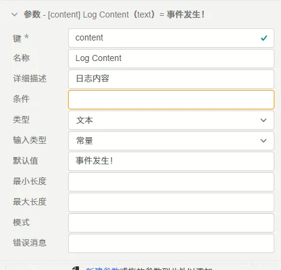
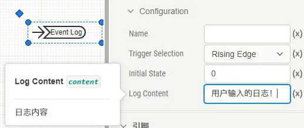

## 参数定义

文本类型的参数可配置项如下表所示。

| 配置项 | 含义 | 说明 |
| :--- | :--- | :--- | 
| **键** | 参数的唯一标识符 | 填写英文、数字及下划线```_```组成的字符串，不可以数字开头。参数的键为参数的唯一标识，**不可重复**。 | 
| **名称** | 参数的显示名称 | 填写字符串，可以填写中文，可以重复。 | 
| **详细描述** | 鼠标在参数上悬浮时，悬浮框显示的补充说明 | 填写字符串，可以填写中文，可以用Markdown输入，可以重复。 |
| **条件** | 参数的可用性条件 | 填写逻辑表达式，默认为true，可以直接调用其它参数。以调用**键**为```par```的参数为例，可以支持``` (par-1)>1 ```, ```sqrt(par)```等表达式形式。与**参数调用**的[“表达式”模式](../../../10-params-variables-pins/index.md#表达式模式)的区别在于，此处在**参数定义**时不需要使用```$```标识符。 |
| **类型** | 参数的类型选择 | 此处选择```文本```选项。 |
| **输入类型** | 可在```变量```和```常量```间选择其一 | 目前CloudPSS仅支持```常量```类型，此处请选择```常量```。如果需要实现可变的参数，请参考将```类型```改为[虚拟引脚](../90-virtual-pin/index.md) |
| **默认值** | 参数的文本默认值，即在新调用本模块或在本模块中新建[参数方案](../../../30-param-config/index.md)时的默认值 | 填写的参数默认值应满足```最小长度```、```最大长度```、```模式```的条件。 |
| **最小长度** | 文本的最小长度 | 填写文本的最小长度，填写整数，其值应小于或等于```最大长度```。缺省时，视为0。 |
| **最大长度** | 文本的最大长度 | 填写文本的最大长度，填写整数，其值应大于或等于```最小长度```。缺省时，视为无穷大。 |
| **模式** | 文本需匹配的正则表达式 | 正则表达式字符串，例如需要规范输入文本以```#```开头，以```!```结尾，此处可填写```^#.*?!$```。 |
| **错误消息** | 文本匹配失败时的错误消息 | 填写字符串，当模块调用时填写的参数数值不满足```模式```的条件时，显示的报错消息。为空时，报错信息显示“参数不满足要求的格式”。 |

## 案例

在```事件日志```元件中，其```日志内容```（键为```content```）的参数类型即为文本。

参数定义如下：



在调用时，可以填写文本：



