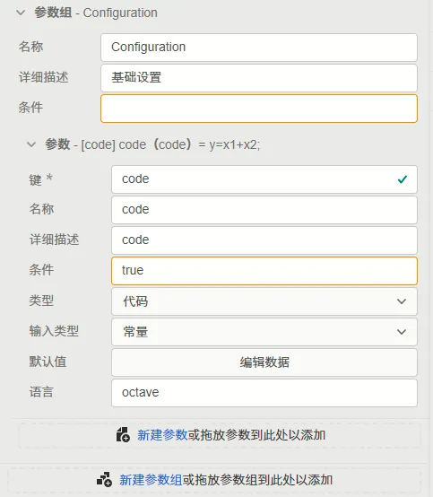
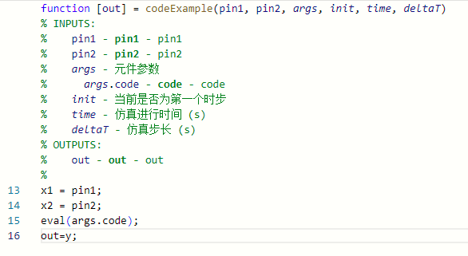
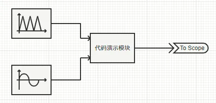
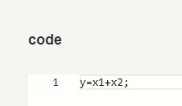
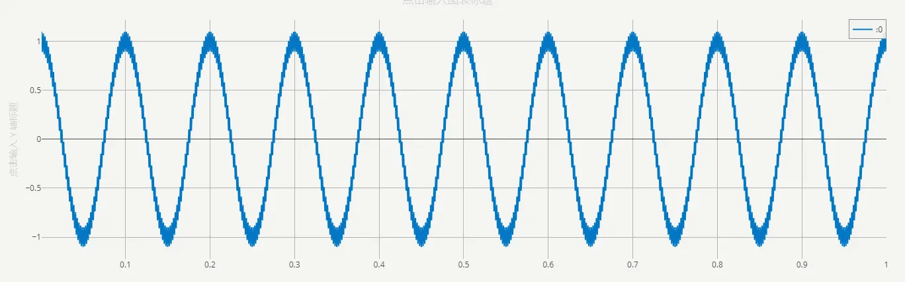
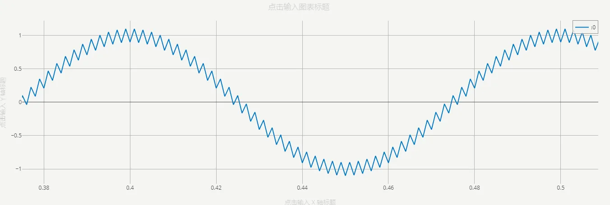

## 参数定义

定义为```代码```的参数，在传到计算内核时将以```文本```的形式进行处理，即代码类型参数的本质为```文本```。

与```文本```类型的参数不同的是，```代码```参数提供多行输入框以及语法高亮，便于输入代码形式的文本。

代码类型的参数可配置项如下表所示。

| 配置项 | 含义 | 说明 |
| :--- | :--- | :--- | 
| **键** | 参数的唯一标识符 | 填写英文、数字及下划线```_```组成的字符串，不可以数字开头。参数的键为参数的唯一标识，**不可重复**。 | 
| **名称** | 参数的显示名称 | 填写字符串，可以填写中文，可以重复。 | 
| **详细描述** | 鼠标在参数上悬浮时，悬浮框显示的补充说明 | 填写字符串，可以填写中文，可以用Markdown输入，可以重复。 |
| **条件** | 参数的可用性条件 | 填写逻辑表达式，默认为true，可以直接调用其它参数。以调用**键**为```par```的参数为例，可以支持``` (par-1)>1 ```, ```sqrt(par)```等表达式形式。与**参数调用**的[“表达式”模式](../../../10-params-variables-pins/index.md#表达式模式)的区别在于，此处在**参数定义**时不需要使用```$```标识符。 |
| **类型** | 参数的类型选择 | 此处选择```代码```选项。 |
| **输入类型** | 可在```变量```和```常量```间选择其一 | 目前CloudPSS仅支持```常量```类型，此处请选择```常量```。如果需要实现可变的参数，请参考将```类型```改为[虚拟引脚](../90-virtual-pin/index.md) |
| **默认值** | 参数的代码默认值，即在新调用本模块或在本模块中新建[参数方案](../../../30-param-config/index.md)时的默认值 | 在参数列表中为按钮的形式，点击后弹出代码编辑窗口，可在多行编辑器中编辑代码。 |
| **语言** | 代码语法高亮的语言 | 只影响代码编辑时的语法高亮方法，不影响该参数的值。可以填写```python```, ```octave```, ```c```, ```cpp```, ```javascript```等。 |

## 案例

这里创建一个在调用时输入自定义代码进行计算的octave控制元件，项目下载链接：[代码形式案例](./model-code-example.zip)，可参考 [上传算例压缩包](../../../../../../50-user-center/30-cloudpss-apps/10-simstudio-cloud-space/index.md#项目管理)的**上传算例压缩包**，上传该测试项目。

首先，按照[octave元件文档](../../../../../../20-emtlab/50-emts/50-user-defined/10-octave-control/index.md)所描述的方法，创建一个自定义octave元件。

设置共2个输入引脚，1个输出引脚。元件参数设置如下：



在octave代码中，采用```eval()```函数引用代码参数，如下所示：



调用该封装模块构造案例，输入频率500Hz、幅值0.1的三角波以及频率10Hz、幅值1的正弦波：



在代码参数中，输入加法运算的逻辑：



测试结果：




