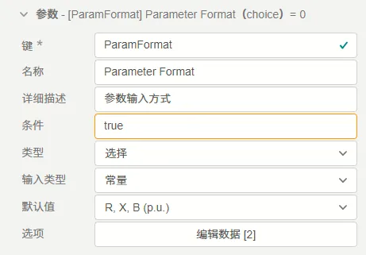
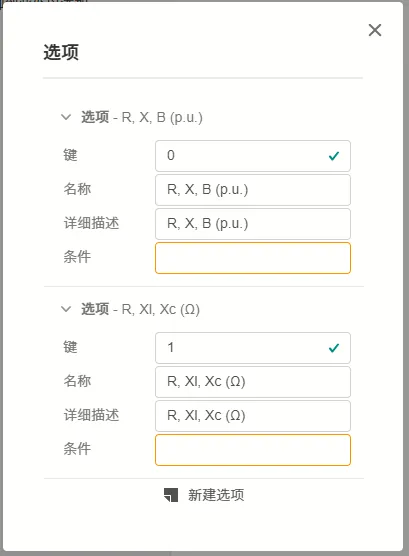
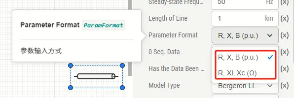

## 参数定义

**选择**类型的参数可配置项如下表所示。

| 配置项 | 含义 | 说明 |
| :--- | :--- | :--- | 
| **键** | 参数的唯一标识符 | 填写英文、数字及下划线```_```组成的字符串，不可以数字开头。参数的键为参数的唯一标识，**不可重复**。 | 
| **名称** | 参数的显示名称 | 填写字符串，可以填写中文，可以重复。 | 
| **详细描述** | 鼠标在参数上悬浮时，悬浮框显示的补充说明 | 填写字符串，可以用Markdown输入，可以填写中文，可以重复。 |
| **条件** | 参数的可用性条件 | 填写逻辑表达式，默认为true，可以直接调用其它参数。以调用**键**为```par```的参数为例，可以支持``` (par-1)>1 ```, ```sqrt(par)```等表达式形式。与**参数调用**的[“表达式”模式](../../../10-params-variables-pins/index.md#表达式模式)的区别在于，此处在**参数定义**时不需要使用```$```标识符。 |
| **类型** | 参数的类型选择 | 此处选择```选择```选项。 |
| **输入类型** | 可在```变量```和```常量```间选择其一 | 目前CloudPSS仅支持```常量```类型，此处请选择```常量```。如果需要实现可变的参数，请参考将```类型```改为[虚拟引脚](../90-virtual-pin/index.md) |
| **默认值** | 选择的默认值，即在新调用本模块或在本模块中新建[参数方案](../../../30-param-config/index.md)时的默认值 | 需要先配置好```选项```栏，再在此处的下拉框中选择默认选项。 |
| **选项** | 配置参数的可选项 | 按钮，点击**编辑数据**后可以配置可选项。分别填写每个选项的**键**、**名称**、**详细描述**和**条件**。其中，**键**为实际传递到后台程序中的值。|


## 案例

在```三相传输线```元件中，参数```Parameter Format```（键为```ParamFormat```）即为选择类型的参数，该参数被用于选择输入标幺值还是输入有名值。



其中，```选项```栏的详细配置如下：



模块调用时，用户可以在可选项中选择其一，如下图所示：




