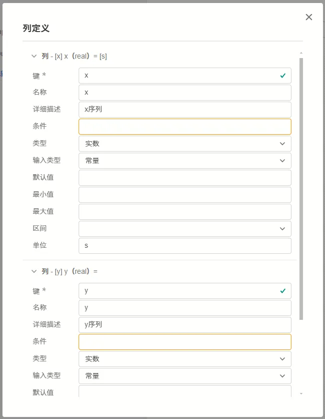
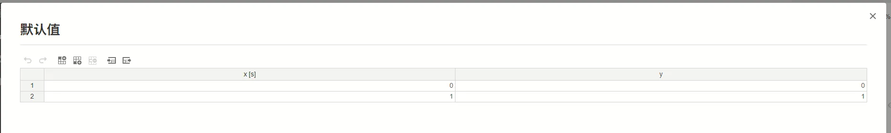

## 参数定义

**表格**类型的参数可配置项如下表所示。

    | 配置项 | 含义 | 说明 |
    | :--- | :--- | :--- | 
    | **键** | 参数的唯一标识符 | 填写英文、数字及下划线 ```_``` 组成的字符串，不可以数字开头。参数的键为参数的唯一标识，**不可重复**。 | 
    | **名称** | 参数的显示名称 | 填写字符串，可以填写中文，可以重复。 | 
    | **详细描述** | 鼠标在参数上悬浮时，悬浮框显示的补充说明 | 填写字符串，可以用Markdown 输入，可以填写中文，可以重复。 |
    | **条件** | 参数的可用性条件 | 填写逻辑表达式，默认为 true，可以直接调用其它参数。以调用**键**为 ```par``` 的参数为例，可以支持 ``` (par-1)>1 ```, ```sqrt(par)``` 等表达式形式。与**参数引用**的[“表达式”模式](../../../10-params-variables-pins/index.md#表达式模式)的区别在于，此处在**参数定义**时不需要使用```$```标识符。 |
    | **类型** | 参数的类型选择 | 此处选择**表格**选项。 |
    | **输入类型** | 可在**变量**和**常量**间选择其一 | 目前 CloudPSS 仅支持**常量**类型，此处请选择**常量**。如果需要实现可变的参数，请参考将类型改为[虚拟引脚](../90-virtual-pin/index.md) |
    | **默认值** | 表格的默认值，即在新调用本模块或在本模块中新建[参数方案](../../../30-param-config/index.md)时的默认值 | 需要先配置好**列定义**栏，再点击此处的**编辑数据**按钮，编写默认表格数据。 |
    | **最小行数** | 表格的最小行数 | 填写整数，表示用户填写该表格时的最小行数。该数值应小于或等于最大行数。 |
    | **最大行数** | 表格的最大行数 | 填写整数，表示用户填写该表格时的最大行数。该数值应大于或等于最小行数。 |
    | **列定义** | 配置表格的列的定义 | 按钮，点击**编辑数据**后可以配置列定义。分别填写每个列的**键**、**名称**、**详细描述**、**条件**、**类型**等，其中，**键**为实际传递到后台程序中的值。这里的可配置项与[参数列表](../index.md)中的类型一致，即可以在表格中嵌套其它**表格**或**选择**类型的参数。|


## 案例

在**自定义曲线( model/CloudPSS/UserDefinedCurve)元件**中，参数 ```Data``` 即为表格类型的参数，该参数被用于输入 x-y 的映射曲线，第一列为 x 序列，第二列为 y 序列。

```Data``` 参数的配置如下：


其中，列定义的配置如下：



可见，这里定义该表格两列均为实数类型。

默认值的配置如下：



这里可以看到，表格中一共有 2 列，分别对应刚才配置的列定义。而行数是可以任意修改的，仅需要满足最小行数和最大行数的限制即可。

这里，自定义曲线元件的 Data 参数默认指示了一条 ```y=x``` 的曲线。

在参数引用时，表格类型的参数将作为一个**列表(list)**类型的数据传递到内部实现中，列表中的每一项均为一个**json字典**。例如，需要引用第1行的x列参数时，应该这样引用：```$Data[0]['x']```
