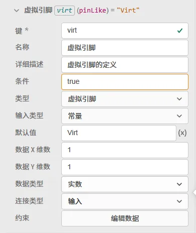
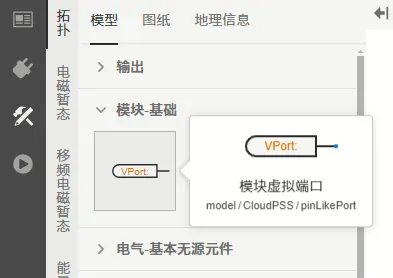
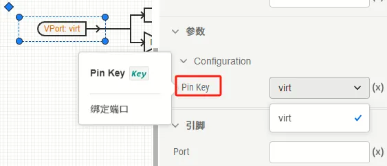
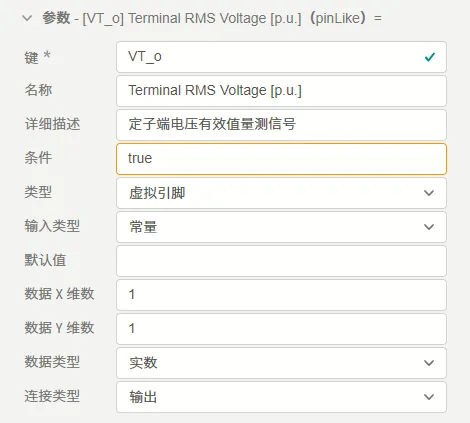

虚拟引脚是最为特殊的参数类别，它虽然在参数列表中进行定义，但在设计逻辑上更贴近于[引脚](../../20-define-module-pin-list/index.md)的概念。

### 定义虚拟引脚

虚拟引脚类型的参数可配置项如下表所示。

    | 配置项 | 含义 | 说明 |
    | :--- | :--- | :--- | 
    | **键** | 参数的唯一标识符 | 填写英文、数字及下划线 <kbd>_</kbd> 组成的字符串，不可以数字开头。参数的键为参数的唯一标识，**不可重复**。 | 
    | **名称** | 参数的显示名称 | 填写字符串，可以填写中文，可以重复。 | 
    | **详细描述** | 鼠标在参数上悬浮时，悬浮框显示的补充说明 | 填写字符串，可以填写中文，可以用 Markdown 输入，可以重复。 |
    | **条件** | 参数的可用性条件 | 填写逻辑表达式，默认为 true，可以直接引用其它参数。以调用**键**为 ```par``` 的参数为例，可以支持 ```(par-1)>1 ```, ```sqrt(par)``` 等表达式形式。与**参数引用**的[“表达式”模式](../../../10-params-variables-pins/index.md#表达式模式)的区别在于，此处在**参数定义**时不需要使用 ```$``` 标识符。 |
    | **类型** | 参数的类型选择 | 此处选择 ```虚拟引脚``` 选项。 |
    | **输入类型** | 可在```变量```和```常量```间选择其一 | 目前 CloudPSS 仅支持**常量**类型，此处请选择**常量**。虚拟引脚类型的参数可以视为引脚，其本身就具有传入可变参数的功能。 |
    | **默认值** | 参数的虚拟引脚默认值，即在新调用本模块或在本模块中新建[参数方案](../../../30-param-config/index.md)时的默认值 | 如果**连接类型**是**输入引脚**，则需要以 <kbd>@</kbd> 符号开头，如果是**输出引脚**，则需要以 <kbd>#</kbd> 符号开头。|
    | **数据 X 维数** | 虚拟引脚数据的行数 | 填写整数，用来定义虚拟引脚的纵向维数。以三相元件为例时，此处填写 3。 |
    | **数据 Y 维数** | 虚拟引脚数据的列数 | 填写整数，用来定义虚拟引脚的横向维数，一般情况下（包括三相元件在内）均为 1。 |
    | **数据类型** | 虚拟引脚的数据类型选择 | 可在实数、 整数、 文本、 布尔之间选择其一，一般情况下选择实数即可。|
    | **连接类型** | 虚拟引脚的电气/控制类型选择 | 可在**输入**、**输出**之间选择其一。目前 SimStudio 的虚拟引脚仅支持**控制引脚**类型，不支持**电气**类型的引脚。|

与引脚的定义不同，用户需在**接口标签页**的**参数列表**中完成对虚拟引脚的定义，**定义虚拟引脚**与[定义参数](../../../../50-modeling/10-params-variables-pins/index.md)类似。



### 绑定虚拟引脚

完成虚拟引脚的定义之后，用户可以在模型库的**模块-基础**栏中找到**模块虚拟端口**元件，如下图所示。



将它添加至图纸后，可以绑定该虚拟引脚，如下图所示。




### 引用虚拟引脚

在绑定好虚拟引脚后，可在[拓扑实现标签页](../../../../40-workbench/20-function-zone/30-design-tab/index.md)中引用该虚拟引脚。

引用虚拟引脚与[引用引脚](../../20-define-module-pin-list/index.md#拓扑实现)类似，这里不过多阐述。

:::info[后续更新]
目前，SimStudio 仅支持在**拓扑实现**中完成虚拟引脚的引用。暂不支持在**代码实现**的元件中引用虚拟引脚，请期待后续更新。
:::


## 案例

在**同步发电机(model/CloudPSS/SyncGeneratorRouter)**元件中，其 **电压源-电机切换信号**（键为 ```s2m```）和 **定子端电压有效值量测信号**（键为 ```VT_o```）的参数类型即为虚拟引脚。

其中，```s2m``` 用来触发电机的电压源-电机转换动作，该虚拟引脚参数的连接类型为**输入**，其参数配置如下：


```VT_o``` 参数用来监测电机的端口电压有效值，该虚拟引脚参数的连接类型为**输出**，其参数配置如下：


