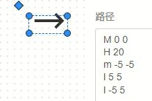
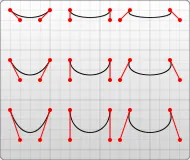
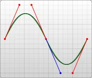
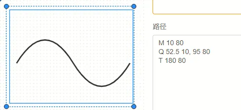
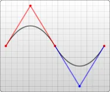
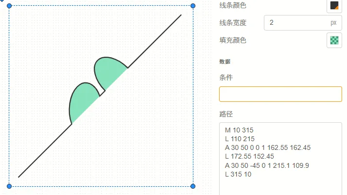
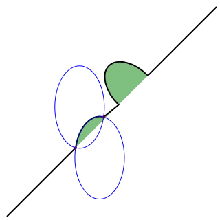
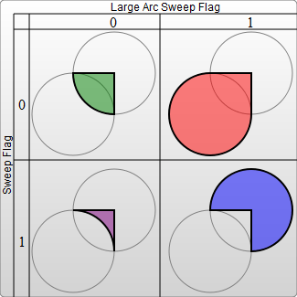

本文档介绍元件图标绘制中路径的使用及属性设置。

## 路径基本介绍

路径类型的图标组件较为复杂，但功能强大。

用户可从图标组件库拖拽或点击```路径```组件，将其添加至绘图工作区。

路径的可配置项如下表所示：

<table>
    <tr>
        <td>**属性模块**</td>
        <td>**属性配置项**</td>
        <td>**含义及说明**</td>
    </tr>
    <tr>
        <td rowspan="4">**大小和位置**</td>
        <td>X</td>
        <td>控制路径左上角的定位点在绘图区中的横坐标，向**右**为正方向。一般填写5的倍数，详见[规范](../70-simstudio-icon-guideline/index.md)。</td>
    </tr>
    <tr>
        <td>Y</td>
        <td>控制路径左上角的定位点在绘图区中的纵坐标，向**下**为正方向。一般填写5的倍数，详见[规范](../70-simstudio-icon-guideline/index.md)。</td>
    </tr>
    <tr>
        <td>宽度</td>
        <td>控制路径组件选框的宽度，但不影响路径组件的实际显示效果。</td>
    </tr>
    <tr>
        <td>高度</td>
        <td>控制路径组件选框的高度，但不影响路径组件的实际显示效果。</td>
    </tr>
    <tr>
        <td rowspan="6">**排列**</td>
        <td>隐藏</td>
        <td>将隐藏该组件，仅影响当前绘图区的视角，不影响调用模块时该组件的实际显示。在组件隐藏后，可以在窗格点击**显示全部**重新显示隐藏的组件。</td>
    </tr>
    <tr>
        <td>显示</td>
        <td>显示该隐藏的组件，仅影响当前绘图区的视角，不影响调用模块时该组件的实际显示。</td>
    </tr>
    <tr>
        <td>置于顶层</td>
        <td>将该组件置于所有组件的最顶层，最顶层的绘图组件将基于透明度覆盖下层的组件，鼠标点击时也会优先选中。</td>
    </tr>
    <tr>
        <td>置于底层</td>
        <td>将该组件置于所有组件的最底层，最底层的绘图组件将被上层的组件覆盖，鼠标点击时不会被优先选中。</td>
    </tr>
    <tr>
        <td>逆时针旋转</td>
        <td>以组件中心点为旋转中心，逆时针旋转该组件。</td>
    </tr>
    <tr>
        <td>顺时针旋转</td>
        <td>以组件中心点为旋转中心，顺时针旋转该组件。</td>
    </tr>
    <tr>
        <td rowspan="3">**样式**</td>
        <td>线条颜色</td>
        <td>点击选色按钮可以弹出调色板，用于选择线条的颜色和透明度.</td>
    </tr>
    <tr>
        <td>线条宽度</td>
        <td>填写线条宽度值，以像素（px）为单位，默认为2px。</td>
    </tr>
    <tr>
        <td>填充颜色</td>
        <td>填写路径的填充颜色。对于未封闭的路径，判断的填充区域时等效于在路径末尾采用```Z```命令时构成的闭合区域。</td>
    </tr>
    <tr>
        <td rowspan="2">**数据**</td>
        <td>条件</td>
        <td>该组件将在什么条件下显示。可以引用[参数列表](../../10-define-module-param-list/index.md)中的参数，例如```mode==1```条件的组件只在参数```mode```值为1时显示。</td>
    </tr>
    <tr>
        <td>路径</td>
        <td>用SVG的语法描述该路径线条的绘制，具体可参考[路径编写方法](#路径编写方法)，以及 [参考链接](#参考链接)。</td>
    </tr>
</table>

## 路径编写方法

在路径组件的属性面板中，```数据```模块下存在```路径```的输入框，可以用SVG的path语法描述这个路径的绘制。

path 元素的形状是通过若干个“命令 + 参数”的序列确定的，我们将讲解这些可用的命令，并且展示一些示例。

每一个命令都用一个关键字母来表示，比如，字母“M”表示的是“Move to”命令，当解析器读到这个命令时，它就知道你是打算移动到某个点。跟在命令字母后面的，是你需要移动到的那个点的 x 和 y 轴坐标。比如移动到 (10,10) 这个点的命令，应该写成“M 10 10”。这一段字符结束后，解析器就会去读下一段命令。

**每一个命令都有两种表示方式，一种是用大写字母，表示采用绝对定位。另一种是用小写字母，表示采用相对定位（例如：从上一个点开始，向上移动 10px，向左移动 7px）。**

我们将路径的命令分为[直线命令](#直线命令)和 [曲线命令](#曲线命令)两种。

### 直线命令

路径有 5 个画直线的命令，顾名思义，直线命令就是在两个点之间画直线。首先是```Move to```命令，M，前面已经提到过，它需要两个参数，分别是需要移动到的点的 x 轴和 y 轴的坐标。假设，你的画笔当前位于一个点，在使用 M 命令移动画笔后，只会移动画笔，但不会在两点之间画线。因为 M 命令仅仅是移动画笔，但不画线。所以 M 命令经常出现在路径的开始处，用来指明从何处开始画。

```
M x y
(or)
m dx dy
```

能够真正画出线的命令有三个（M 命令是移动画笔位置，但是不画线），最常用的是```Line to```命令，L，L需要两个参数，分别是一个点的 x 轴和 y 轴坐标，L 命令将会在当前位置和新位置（L 前面画笔所在的点）之间画一条线段。

```
L x y
(or)
l dx dy
```

另外还有两个简写命令，用来绘制水平线和垂直线。H，绘制水平线。V，绘制垂直线。这两个命令都只带一个参数，标明在 x 轴或 y 轴移动到的位置，因为它们都只在坐标轴的一个方向上移动。

```
H x
(or)
h dx
V y
(or)
v dy
```

现在我们已经掌握了一些命令，可以开始画一些东西了。先从简单的地方开始，画一个简单的矩形，矩形是由水平线和垂直线组成的，所以这个例子可以很好地展现前面讲的画线的方法。

```
M 10 10
H 90
V 90
H 10
L 10 10
```

上述代码效果图：


最后，我们可以通过一个**闭合路径命令** ```Z``` 来简化上面的 path，```Z```命令会从当前点画一条直线到路径的起点，尽管我们不总是需要闭合路径，但是它还是经常被放到路径的最后。另外，Z 命令不用区分大小写。

```
Z
(or)
z
```

所以上面例子里用到的路径，可以简化成这样：

```
M 10 10
H 90
V 90
H 10
Z
```

你也可以使用这些命令的相对坐标形式来绘制相同的图形，如之前所述，相对命令使用的是小写字母，它们的参数不是指定一个明确的坐标，而是表示相对于它前面的点需要移动多少距离。例如前面的示例，画的是一个 80*80 的正方形，用相对命令可以这样描述：

```
M 10 10
h 80
v 80
h -80
Z
```

上述路径是：画笔移动到 (10,10) 点，由此开始，向右移动 80 像素构成一条水平线，然后向下移动 80 像素，然后向左移动 80 像素，然后再回到起点。

在设计图标时，经常会遇到需要绘制**输入引脚**的情况，即一个带有箭头的引脚，这可以用路径组件的直线命令简单地实现。

```
M 0 0 
H 20
m -5 -5
l 5 5
l -5 5
```

这一段代码先绘制长度为20的横线，然后再用```l```命令绘制箭头，效果如下图所示。



### 曲线命令

绘制平滑曲线的命令有三个，其中两个用来绘制贝塞尔曲线，另外一个用来绘制弧形或者说是圆的一部分。

- 贝塞尔曲线命令

贝塞尔曲线的类型有很多，但是在路径里，只存在两种贝塞尔曲线：三次贝塞尔曲线 ```C```，和二次贝塞尔曲线 ```Q```。

我们从稍微复杂一点的三次贝塞尔曲线 ```C``` 入手，三次贝塞尔曲线需要定义一个点和两个控制点，所以用 ```C``` 命令创建三次贝塞尔曲线，需要设置三组坐标参数：

```
C x1 y1, x2 y2, x y
(or)
c dx1 dy1, dx2 dy2, dx dy
```

这里的最后一个坐标 (x,y) 表示的是曲线的终点，另外两个坐标是控制点，(x1,y1) 是起点的控制点，(x2,y2) 是终点的控制点。如果你熟悉代数或者微积分的话，会更容易理解控制点，控制点描述的是曲线起始点的斜率，曲线上各个点的斜率，是从起点斜率到终点斜率的渐变过程。这里展示一个```C```命令的例子。

```
M 10 10 C 20 20, 40 20, 50 10
M 70 10 C 70 20, 110 20, 110 10
M 130 10 C 120 20, 180 20, 170 10
M 10 60 C 20 80, 40 80, 50 60
M 70 60 C 70 80, 110 80, 110 60
M 130 60 C 120 80, 180 80, 170 60
M 10 110 C 20 140, 40 140, 50 110
M 70 110 C 70 140, 110 140, 110 110
M 130 110 C 120 140, 180 140, 170 110
```

在Simstudio中的效果如下：


可以在下图中观察到以上代码中，设定的控制点：



你可以将若干个贝塞尔曲线连起来，从而创建出一条很长的平滑曲线。通常情况下，一个点某一侧的控制点是它另一侧的控制点的对称（以保持斜率不变）。这样，你可以使用一个简写的贝塞尔曲线命令 S，如下所示：

```
S x2 y2, x y
(or)
s dx2 dy2, dx dy
```

S 命令可以用来创建与前面一样的贝塞尔曲线，但是，如果 S 命令跟在一个 C 或 S 命令后面，则它的第一个控制点会被假设成前一个命令曲线的第二个控制点的中心对称点。如果 S 命令单独使用，前面没有 C 或 S 命令，那当前点将作为第一个控制点。下面是 S 命令的语法示例，图中左侧红色标记的点对应的控制点即为蓝色标记点。

```
M 10 80 
C 40 10, 65 10, 95 80 
S 150 150, 180 80
```



另一种可用的贝塞尔曲线是二次贝塞尔曲线 ```Q```，它比三次贝塞尔曲线简单，只需要一个控制点，用来确定起点和终点的曲线斜率。因此它需要两组参数，控制点和终点坐标。

```
Q x1 y1, x y
(or)
q dx1 dy1, dx dy
```

就像三次贝塞尔曲线有一个 S 命令，二次贝塞尔曲线有一个差不多的 T 命令，可以通过更简短的参数，延长二次贝塞尔曲线。

```
T x y
(or)
t dx dy
```

和之前一样，快捷命令 T 会通过前一个控制点，推断出一个新的控制点。这意味着，在你的第一个控制点后面，可以只定义终点，就创建出一个相当复杂的曲线。需要注意的是，T 命令前面必须是一个 Q 命令，或者是另一个 T 命令，才能达到这种效果。如果 T 单独使用，那么控制点就会被认为和终点是同一个点，所以画出来的将是一条直线。

这里是一个```Q```命令和```T```命令的例子：

```
M 10 80 
Q 52.5 10, 95 80 
T 180 80
```

在simstudio中的效果如下：



为了便于理解，可加上控制点，参考如下图像：



- 弧形

弧形命令 A 是另一个创建 SVG 曲线的命令。基本上，弧形可以视为圆形或椭圆形的一部分。假设，已知椭圆形的长轴半径和短轴半径，并且已知两个点（在椭圆上），根据半径和两点，可以画出两个椭圆，在每个椭圆上根据两点都可以画出两种弧形。所以，仅仅根据半径和两点，可以画出四种弧形。为了保证创建的弧形唯一，A 命令需要用到比较多的参数：

```
 A rx ry x-axis-rotation large-arc-flag sweep-flag x y
 a rx ry x-axis-rotation large-arc-flag sweep-flag dx dy
```

弧形命令 A 的前两个参数分别是 x 轴半径和 y 轴半径。弧形命令 A 的第三个参数表示弧形的旋转情况，下面的例子可以很好地解释它：

```
M 10 315
L 110 215
A 30 50 0 0 1 162.55 162.45
L 172.55 152.45
A 30 50 -45 0 1 215.1 109.9
L 315 10
```



如图例所示，画布上有一条对角线，中间有两个椭圆弧被对角线切开 (x radius = 30, y radius = 50)。第一个椭圆弧的 x-axis-rotation（x 轴旋转角度）是 0，所以弧形所在的椭圆是正置的（没有倾斜）。在第二个椭圆弧中，x-axis-rotation 设置为 -45，所以这是一个旋转了 45 度的椭圆，并以短轴为分割线，形成了两个对称的弧形。参看图示中的第二个椭圆形。

对于上图没有旋转的椭圆，只有 2 种弧形可以选择，不是 4 种，因为两点连线（也就是对角线）正好穿过了椭圆的中心。像下面这张图，就是普通的情况，可以画出两个椭圆，四种弧。



上面提到的四种不同路径将由接下来的两个参数决定。如前所讲，还有两种可能的椭圆用来形成路径，它们给出的四种可能的路径中，有两种不同的路径。这里要讲的参数是 large-arc-flag（角度大小）和 sweep-flag（弧线方向），large-arc-flag 决定弧线是大于还是小于 180 度，0 表示小角度弧，1 表示大角度弧。sweep-flag 表示弧线的方向，0 表示从起点到终点沿逆时针画弧，1 表示从起点到终点沿顺时针画弧。下面的例子展示了这四种情况。



第一种为绿色部分：

```
M 80 80
A 45 45, 0, 0, 0, 125 125
L 125 80 Z
```

第二种为红色部分：

```
M 230 80
A 45 45, 0, 1, 0, 275 125
L 275 80 Z
```

第三种为紫色色部分：

```
M 80 230
A 45 45, 0, 0, 1, 125 275
L 125 230 Z

```

第四种为蓝色部分：

```
M 230 230
A 45 45, 0, 1, 1, 275 275
L 275 230 Z
```

最后两个参数是指定弧形的终点，弧形可以简单地创建圆形或椭圆形图标，比如你可以创建若干片弧形，组成一个饼图。

## 参考链接

SVG路径编写方法：https://developer.mozilla.org/zh-CN/docs/Web/SVG/Tutorial/Paths
