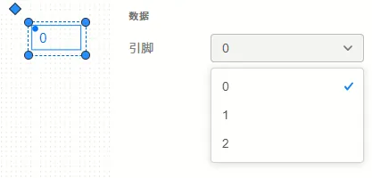

本文档介绍元件图标绘制中引脚的使用及属性设置。

用户可从图标组件库拖拽或点击```引脚```组件，将其添加至绘图工作区，并在属性编辑区中完成引脚的绑定。

引脚的可配置项如下表所示：

<table>
    <tr>
        <td>**属性模块**</td>
        <td>**属性配置项**</td>
        <td>**含义及说明**</td>
    </tr>
    <tr>
        <td rowspan="4">**大小和位置**</td>
        <td>X</td>
        <td>控制引脚左上角的定位点在绘图区中的横坐标，向**右**为正方向。一般填写5的倍数，详见[规范](../70-simstudio-icon-guideline/index.md)。</td>
    </tr>
    <tr>
        <td>Y</td>
        <td>控制引脚左上角的定位点在绘图区中的纵坐标，向**下**为正方向。一般填写5的倍数，详见[规范](../70-simstudio-icon-guideline/index.md)。</td>
    </tr>
    <tr>
        <td>宽度</td>
        <td>控制引脚组件框的宽度，不影响实际引脚的位置。</td>
    </tr>
    <tr>
        <td>高度</td>
        <td>控制引脚组件框的高度，不影响实际引脚的位置。</td>
    </tr>
    <tr>
        <td rowspan="6">**排列**</td>
        <td>隐藏</td>
        <td>将隐藏该组件，仅影响当前绘图区的视角，不影响调用模块时该组件的实际显示。在组件隐藏后，可以在窗格点击**显示全部**重新显示隐藏的组件。</td>
    </tr>
    <tr>
        <td>显示</td>
        <td>显示该隐藏的组件，仅影响当前绘图区的视角，不影响调用模块时该组件的实际显示。</td>
    </tr>
    <tr>
        <td>置于顶层</td>
        <td>将该组件置于所有组件的最顶层，最顶层的绘图组件将基于透明度覆盖下层的组件，鼠标点击时也会优先选中。</td>
    </tr>
    <tr>
        <td>置于底层</td>
        <td>将该组件置于所有组件的最底层，最底层的绘图组件将被上层的组件覆盖，鼠标点击时不会被优先选中。</td>
    </tr>
    <tr>
        <td>逆时针旋转</td>
        <td>以组件中心点为旋转中心，逆时针旋转该组件。</td>
    </tr>
    <tr>
        <td>顺时针旋转</td>
        <td>以组件中心点为旋转中心，顺时针旋转该组件。</td>
    </tr>
    <tr>
        <td rowspan="3">**样式**</td>
        <td>线条颜色</td>
        <td>不影响引脚组件。</td>
    </tr>
    <tr>
        <td>线条宽度</td>
        <td>不影响引脚组件。</td>
    </tr>
    <tr>
        <td>填充颜色</td>
        <td>不影响引脚组件。</td>
    </tr>
    <tr>
        <td>数据</td>
        <td>引脚</td>
        <td>下拉框，可以在这里选中[引脚列表](../../20-define-module-pin-list/index.md)中**可见**的引脚，进行绑定。</td>
    </tr>
</table>

在合适的位置放好引脚后，需要在属性编辑区的```数据```模块中选中需要绑定的引脚，完成绑定，如下图所示。

