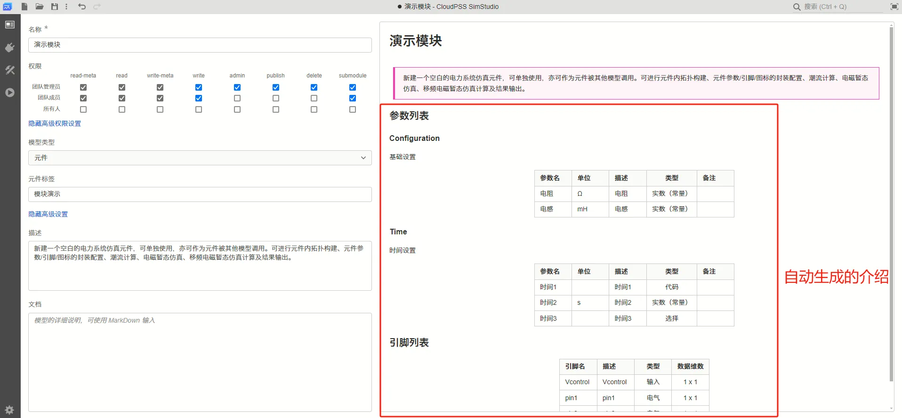

本文档介绍封装元件/模块的保存操作，必要的步骤包括[配置 RID](#配置-rid)和 [配置元件标签](#元件标签)两步，此外可以按需求 [填写其它信息](#其他信息描述文档等)。

## 配置 RID

点击[工具栏](../../../40-workbench/10-toolbar/index.md)中的[保存](../../../40-workbench/10-toolbar/index.md#保存)或[另存为](../../../40-workbench/10-toolbar/index.md#另存为)按钮，将会弹出保存选项配置窗口，如下图所示。


这里必须进行配置的是**资源ID栏**，用户必须输入该个人空间或协作空间下**唯一的资源 ID** （即RID）。

资源 ID 是本模块以及本项目的唯一标识符，需要以字母开头，仅包含字母、数字、下划线 ```_```、横线 ```-```。

## 元件标签

元件标签的作用是对元件进行分类，只有填写了元件标签后，该元件才会在[模型库](../../../40-workbench/20-function-zone/30-design-tab/index.md#模型)中显示。

在图 1 所示的保存窗口，以及[总览标签页](../../../40-workbench/20-function-zone/10-summary-tab/index.md)中，均可以找到元件标签的配置栏。

元件标签可以填写中文。同元件标签的元件/模块将被置于模型库中的同一个栏目下，如下图所示。


## 其他信息（描述、文档等）

在封装模块时，将会根据参数列表和引脚列表的数据，自动生成参数和引脚的介绍，如下图所示。



此外，用户可以在[总览标签页](../../../40-workbench/20-function-zone/10-summary-tab/index.md)中填写额外的**描述**和**文档**，如图 3 的左下方所示。

**描述栏**填写元件的简要描述，会被显示在元件文档的最上方。可以用 markdown 格式输入。

**文档栏**填写元件的额外说明，会被显示在元件文档的最下方。可以用 markdown 格式输入。