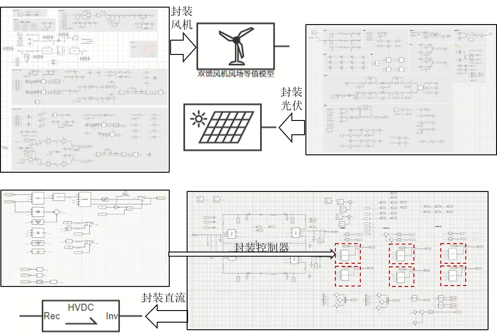
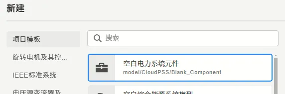
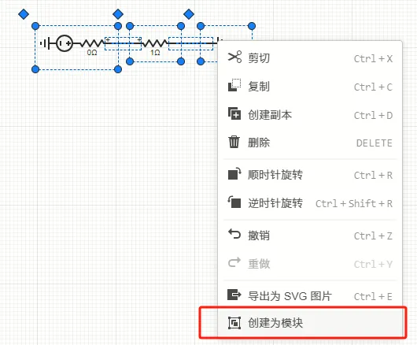
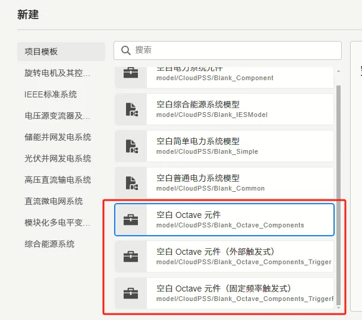

本节首先介绍 SimStudio 的模块封装功能，然后通过 X 个案例介绍模块封装的使用方法。该功能仅支持在 SimStudio 平台使用。

## 主要用途

CloudPSS支持模块化封装建模功能，可将若干复杂元件封装为一个“盒子”，其对外的图标、参数以及引脚均可自定义。模块封装可提高建模效率以及项目的可读性。

通过模块封装的功能，用户可自主构建和保存自定义的模型，模块封装功能的应用场景示例如下：

- 在大规模工程项目中，可能含有大量风机、光伏、直流等设备，每个设备均由多个分立元件构成。可采用模块封装的功能，将每种设备分别封装为一个模块，方便重复调用。
- 某工程项目含有大量元件，可读性较差，需要采用模块化设计的理念提高项目可读性。
- 您可能希望其它用户也能使用您创作的模型，并能自主决定他们是否能查看到内部细节。

## 模块封装流程

本节介绍模块封装的步骤。模块封装流程分为[模块构建](#模块构建编辑模块内部拓扑及参数)、[定义参数列表](#定义元件模块参数列表)、[定义引脚列表](#定义元件模块引脚列表)、[设计图标](#设计元件模块图标)、[配置调用权限](#配置元件模块调用权限)、[保存](#保存)六个步骤。可点击文档中的跳转链接查看更详细的说明。

### 模块构建（编辑模块内部拓扑及参数）

本节介绍模块的构建方法。在仿真计算中调用模块时，实际调用的是本节介绍的模块内部实现。

模块内部实现的构建方法包括[拓扑搭建](#采用拓扑搭建方法)、[代码实现](#采用代码octavepython实现)、[S-Function模型](#采用s-function元件模型实现)实现三种。

#### 采用拓扑搭建方法
用户可使用已有的Simstudio模型库元件，或其他的封装模型，通过拓扑连接的方式构建模块。

共有两种方法构造拓扑实现的模块：

- 从**新建空白电力系统元件**开始

    可以在Simstudio的工作台页面中，点击[新建](../../40-workbench/10-toolbar/index.md#新建)按钮，在弹出框中选择**空白电力系统元件**，创建空拓扑实现的模块。

    

    进一步，可以在[实现标签页](../../40-workbench/20-function-zone/30-design-tab/index.md)中进行[拓扑编辑](../../40-workbench/20-function-zone/30-design-tab/20-topology-editing/index.md)。

- 从已有待封装元件开始
    
    有时，用户已经搭建了一个仿真项目，此时想将项目的一部分元件封装为模块。此时可选中待封装的元件，右键选择**创建为模块**，并参考[项目保存相关文档](../../40-workbench/10-toolbar/index.md#另存为)在弹窗中填写对应的资源ID及名称即可。

    

#### 采用代码Octave、Python实现

可以在Simstudio的工作台页面中，点击[新建](../../40-workbench/10-toolbar/index.md#新建)按钮，在弹出框中选择**空白Octave元件**，创建Octave实现的模块；或者在弹出框中选择**空白Python元件**，创建Python实现的模块。

具体的Octave及Python元件的实现方法可参考[自定义Octave元件文档](../../../../20-emtlab/50-emts/50-user-defined/10-octave-control/index.md)以及[自定义Python元件文档](../../../../20-emtlab/50-emts/50-user-defined/20-python-control/index.md)

目前在公网平台 (www.cloudpss.net) 中，暂不支持自定义python元件。

#### 采用S-Function元件模型实现

S-Function元件的构建方法请参考[文档](../../../../20-emtlab/50-emts/50-user-defined/30-s-function-control/index.md)。

### 定义元件/模块参数列表

此步骤将定义待封装模块的参数列表，可根据需求自定义**参数名**、**参数数据类型**、**参数范围**等。

该参数列表可在模块内部被引用，详见[参数相关文档](../10-params-variables-pins/index.md#参数)。

而在该模块被调用时，用户可以自行配置参数的具体数值，如下图所示。

参数列表定义的具体步骤详见[定义元件/模块参数列表](./10-define-module-param-list/index.md)。

### 定义元件/模块引脚列表

此步骤将定义待封装模块的引脚列表，可根据需求自定义**引脚名**、**引脚类型**、**引脚维数**等。

引脚是模块内外区域交互的接口。本步骤的设置将定义模块内部实现与模块端口之间电气与控制的实际连接关系。

引脚列表定义的具体步骤详见[定义元件/模块引脚列表](./20-define-module-pin-list/index.md)。

### 设计元件/模块图标

此步骤将定义模块在调用时显示的图标样式，Simstudio提供可高度定制化的的图标设计接口。

图标设计的详细说明详见[设计元件/模块图标](./30-design-module-icon/index.md)；

一般情况下，出于规范性和使用便捷性考虑，在设计图标时请依据[SimStudio元件图标设计规范](./30-design-module-icon/70-simstudio-icon-guideline/index.md)进行设计。

### 配置元件/模块调用权限

此步骤将配置模块的调用权限。用户可根据需求，允许或拒绝其它用户使用元件、或查看模块内部细节。

模块调用权限的配置详见[配置元件/模块调用权限](./40-module-permission-config/index.md)。

### 保存

此步骤是模块构建的最后一步，用户可将模块保存至云空间中，供其它项目调用。

模块保存步骤的详细说明详见[保存](./50-save/index.md)。
