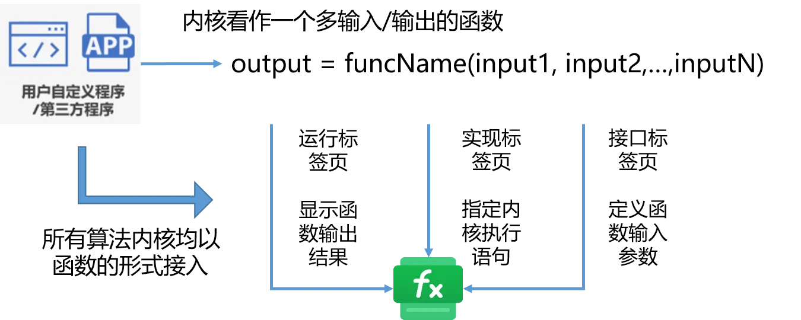

FuncStudio 函数工坊的核心功能是在 CloudPSS 云服务框架中集成**第三方计算内核**和**用户自定义算法内核**，扩展 CloudPSS 平台的功能边界，方便用户构建各类数字孪生计算后台。

FuncStudio 采用了“**函数化**”的设计思路，将用户自定义内核或第三方内核以函数的形式快捷、灵活地接入 CloudPSS，为复杂数字孪生应用的构建提供了调试部署、业务管理及计算调度的功能。

所谓的“函数化”是指任何第三方计算内核和用户自定义算法内核都能以一个具有**多输入/输出量的函数**集成到 FuncStudio 中，**每一个内核就是一个独立的函数项目**。

FuncStudio 目前支持以下两种内核集成方式：

+ 对于用户在自己本地计算资源（个人电脑）上开发和执行的自定义算法内核，提供本地接入方式，我们称之为
  **本地：自定义命令**实现类型的函数，用户只需在本地计算资源（个人电脑）中安装 FuncStudio 本地执行器，通过**建立函数项目**、**定义函数输入和输出参数格式**，**指定内核在本地执行的命令行语句**，即可将内核集成到 CloudPSS 云服务框架。

  

  :::info 本地接入方式
  对于本地接入方式，目前支持 Python 和 Matlab 语言编写的算法内核接入。
  :::

+ 对于用户自己开发但希望在 CloudPSS 云端服务器中执行的算法内核，提供云端接入方式，我们称之为**云端：JavaScript 模块**实现类型的函数，此时用户无需在本地安装 FuncStudio 本地执行器
  只需在网页版 FuncStudio 中**建立函数项目**、**定义函数输入和输出参数格式**，**在代码编辑区输入自己算法内核的代码**，即可将内核集成到 CloudPSS 云服务框。
  
  :::info 云端接入方式
  对于云端接入方式，目前支持 JavaScript 语言编写的算法内核接入。
  :::
