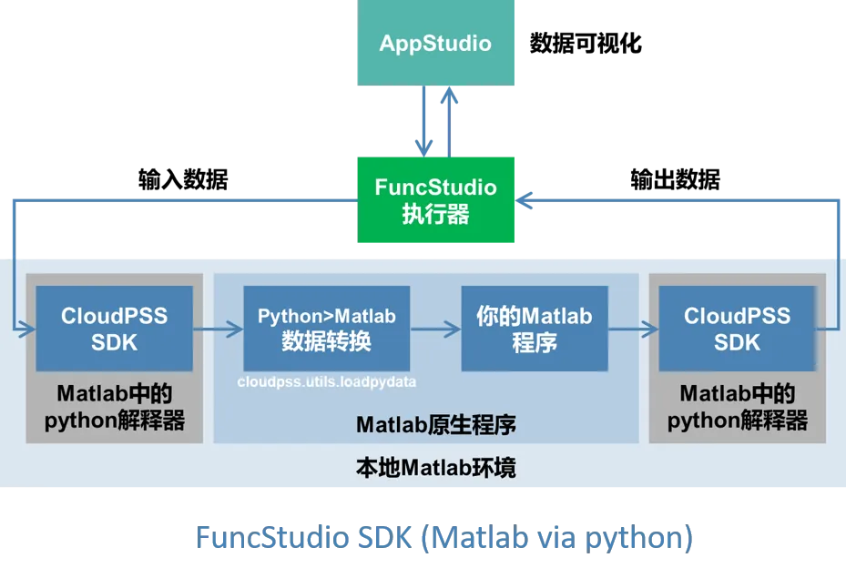
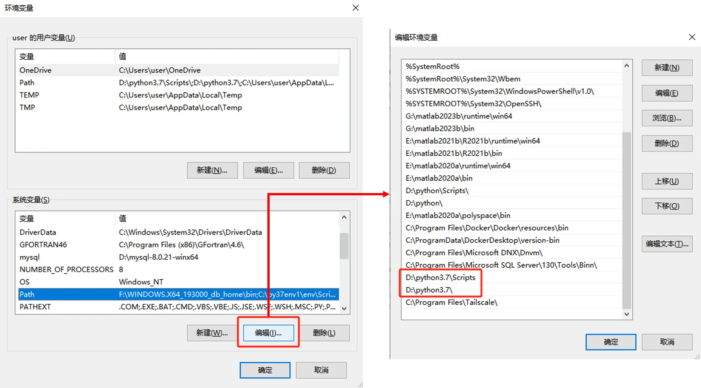
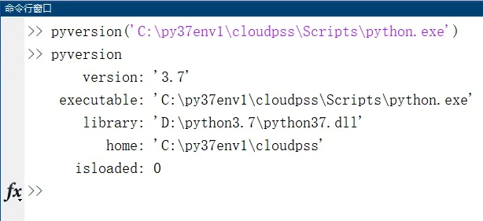
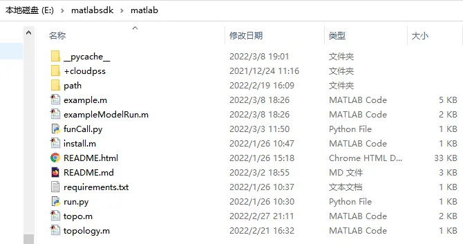

本节介绍在本地计算资源中配置 Matlab 环境的方法。

## 为什么要配置 Matlab 环境？

对于 Matlab 语言编写的内核，安装好 FuncStudio 本地执行器，[配置好本地 python 环境后](../20-python-env-config/index.md)，还需要**配置 Matlab 环境**。

因为用户在本地执行的算法内核程序，都需要借助 FuncStudio-SDK (CloudPSS-SDK的一个类)**给内核程序封装输入输出接口**后，才能接入本地执行器，如下图所示。



FuncStudio-SDK 包括从执行器中**获取函数输入参数值的接口**以及在执行器中**格式化输出计算结果的接口**。

Matlab-SDK 在Matlab中启动一个 Python解释器，并且在 Python 解释器里调用 Matlab 算法的一种特殊的 FuncStudio-SDK，本质仍然是 Python-SDK，因此在使用执行器接入 Matlab 内核时需要配置 Matlab 的 Python 环境并安装 Matlab-SDK。

:::warning
由于 Matlab-SDK 本质上是用 Python 实现的，因此首先需要保证 Matlab 版本和 Python 版本互相兼容！
:::

各版本 Matlab 支持的 Python 版本如下表所示。


由于 CloudPSS SDK 要求的 Python 版本为 3.7 及其以上，因此 Matlab 版本需要选择 R2019a 及其以上的版本，例如， 支持 **Matlab R2020a 和 Python 3.7** 的组合。

## 配置流程

### 添加系统环境变量

若以本地计算资源中配置的虚拟 Python 环境作为 Matlab 的 python 环境。

首先要保证构建的虚拟 Python 环境所依赖的基础版本 Python 执行器添加到了系统环境变量，如果没有，要手动添加。

### 配置 Matlab 的 Python 环境

在本地计算机中打开与 Python 版本相兼容的 Matlab，在 Matlab 命令行窗口中输入并执行如下格式的命令：

```matlab showLineNumbers
pyversion('Python 执行器地址')  
```
括号里面的参数就是需要配置给 Matlab 的 Python 环境地址，例如:

```matlab showLineNumbers
pyversion('C:\py37env1\cloudpss\Scripts\python.exe')  
```
这里将 Matlab 的 Python 环境指定为了新建的虚拟 Python 环境。

:::info
可以在 Matlab 命令行窗口中输入`pyversion`来验证 Matlab 的当前 Python 环境。
:::

### 安装 Matlab SDK

配置好 Matlab 的 Python 环境后，还需要安装 Matlab-SDK。直接访问[CloudPSS 下载中心](https://downloads.cloudpss.net/)来下载matlab-sdk的压缩包。


:::warning
下载好后，关键的一步在于需要将 Matlab-SDK 的压缩包**解压到自定义内核所在的目录**，也就是后续需要接入执行器的Matlab 程序文件所在的位置。
:::

### 安装依赖

最后，将 Matlab 的工作目录切换到 Matlab-SDK 目录下，可以看到里有一个 **install.m** 的文件。

在 Matlab 命令行窗口中输入`install`直接运行该文件来安装依赖库，等到依赖成功安装后 Matlab 的环境就配置好了。

:::info
- 在运行 install 文件安装依赖库的过程中需要检查是否报错，报错会导致依赖安装失败，最终造成函数在调试执行时报`No moudule named 'matlab'`的错误提示，需要依据提示排查解决错误确保依赖成功安装。
:::

## 案例

import Tabs from '@theme/Tabs';
import TabItem from '@theme/TabItem';

<Tabs>
<TabItem value="js" label="在本地计算机上配置 Matlab 环境">

1.添加系统环境变量
   
例如，构建的虚拟环境依赖的基础 Python 是 Python3.7, 因此需要把 Python3.7 的执行器和 Scripts 目录都添加到系统环境变量中。




2.配置 Matlab 的 Python 环境
   
打开 Matlab 的命令行窗口，输入并执行如下命令，将 Matlab 的 Python 环境指定为新建的虚拟环境，然后在命令行窗口中输入pyversion 来验证。

```matlab showLineNumbers
pyversion('C:\py37env1\cloudpss\Scripts\python.exe')  
```



3.安装 Matlab 的 SDK
   
直接访问[CloudPSS 下载中心](https://downloads.cloudpss.net/)来下载 Matlab-SDK 的压缩包，将 Matlab-SDK 的压缩包**解压到自定义内核所在的目录**。



4.安装依赖

将 Matlab 的工作目录切换到 Matlab-SDK 目录下，在 Matlab 中运行该文件来安装依赖库。


</TabItem>
</Tabs>

## 常见问题

推荐的 Python 和 Matlab 版本有哪些？

:   经过大量测试后，目前比较推荐使用的版本组合有以下五种：

    

运行 install 文件过程有哪些常见的报错? 该如何解决？
    
:   常见的问题有：

    - Matlab 和 Python 的版本不兼容，需要切换版本解决。
  
    - 对于低版本 Python（比如3.7或3.8），如果 setuptools 版本太高（比如67.6.1）可能导致运行 install 文件过程中出现如图所示的错误提示：
  
    

    此时可以将虚拟 Python 环境中的 setuptools 版本降低，比如 58.0.0 等低版本即可。

    pip install setuptools==58.0.0  -i https://pypi.tuna.tsinghua.edu.cn/simple 

    


能否切换 Matlab 版本使用？

:   如果电脑安装有其他版本的 Matlab，在切换版本使用时需要重新运行`install.m`文件来安装依赖。


