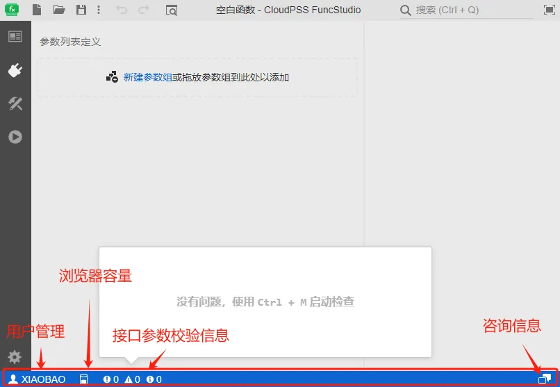
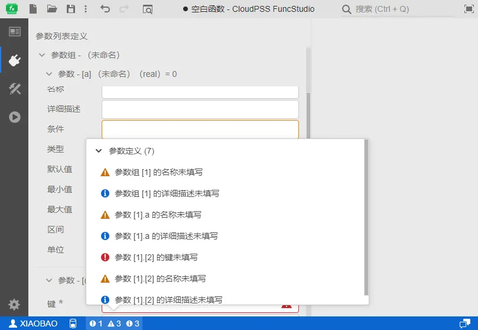

本节主要介绍 FuncStudio 工作台下方的状态栏功能。

## 功能定义

FuncStudio 最下端为状态栏，包含**用户管理**、**浏览器存储配额**、**接口参数校验信息**、**咨询信息**四种类型的功能。

## 功能说明

### 用户管理

点击用户管理图标，可以选择进入**个人中心**或**退出登录**当前用户账号。

### 浏览器存储配额

公网平台会显示当前账号的浏览器存储配额，浏览器存储配额是浏览器为Web应用程序提供的存储空间的限制。这个配额决定了Web应用能够在用户的浏览器中存储多少数据，对于提高用户体验和应用程序的离线体验具有重要意义。

### 接口参数校验

FuncStudio 内置了即时错误校验功能。用户在配置接口参数的同时，每一步操作完成的1s后，后台会同步对接口进行校验，并再状态栏的左下角实时指出错误和引导性文字，帮助用户修改参数。

### 咨询信息

可以通过**咨询信息**界面咨询技术人员有关CloudPSS相关问题，仅限公网平台使用。

### 内核执行进度

当开始调试或启动函数时，状态栏内会通过一个**进度环**显示函数内核的**当前执行进度**。

## 常见问题

接口参数校验必须全部通过才能执行函数吗？

:   接口参数校验信息栏中的错误信息必须全部消除才能执行函数。

函数的执行进度可以自定义吗？

:   可以通过 FuncStudio SDK 中提供的 progress 方法发送内核的当前执行进度。详见[FuncStudio SDK 帮助](../../../../80-sdk-python/70-api/20-function-execution/index.md)。