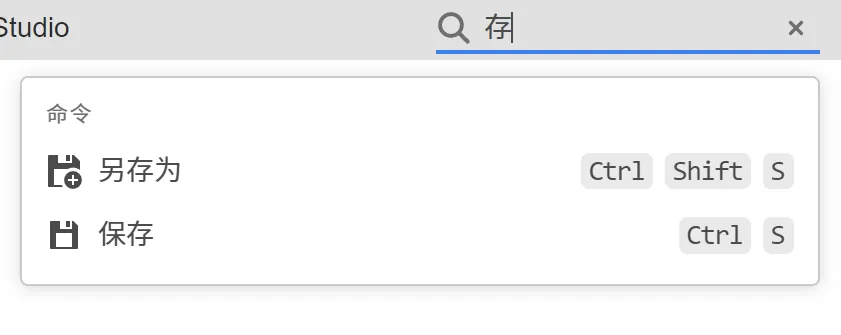
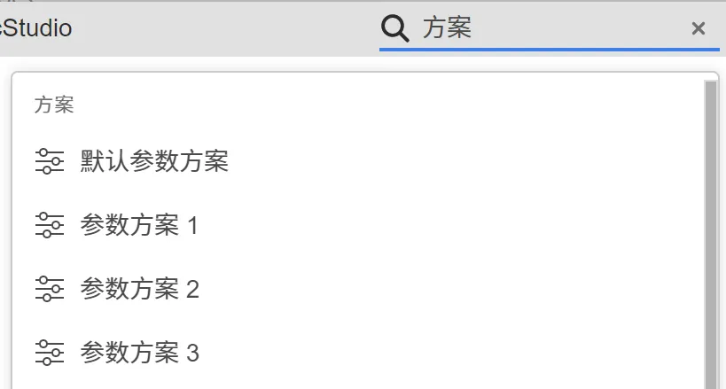
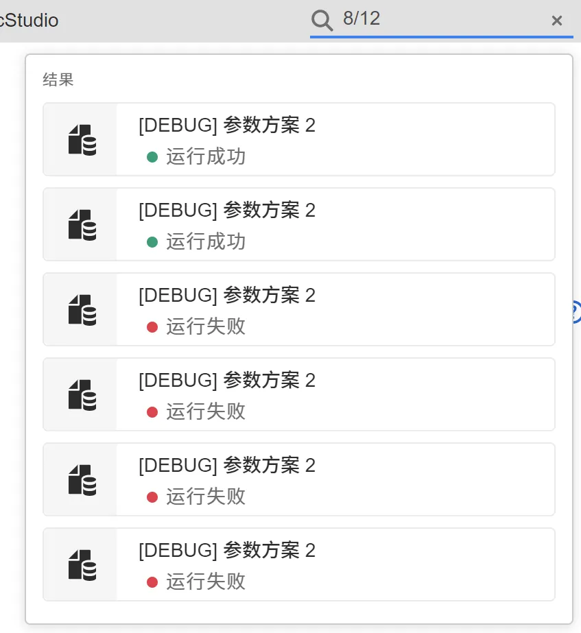

本节介绍 FuncStudio 的搜索功能，用户可以通过搜索栏快速检索定位感兴趣的内容。

## 命令

用户可以通过命令 ID 或名称对命令进行检索和执行。命令支持模糊匹配，例如输入“存”可以检索到“另存为”、“保存”命令。

## 方案

在[运行标签页](../20-function-zone/40-run-tab/index.md)，用户可通过名称对**参数方案**进行检索。

## 结果

在运行标签页，用户可通过计算结果名称、任务 ID、运行时间对计算结果进行检索。支持模糊匹配。

:::info[当前支持的搜索功能]
FuncStudio 的搜索栏当前只支持命令、方案、结果的搜索，关于接口参数的搜索后续会逐步支持，敬请期待！
:::
