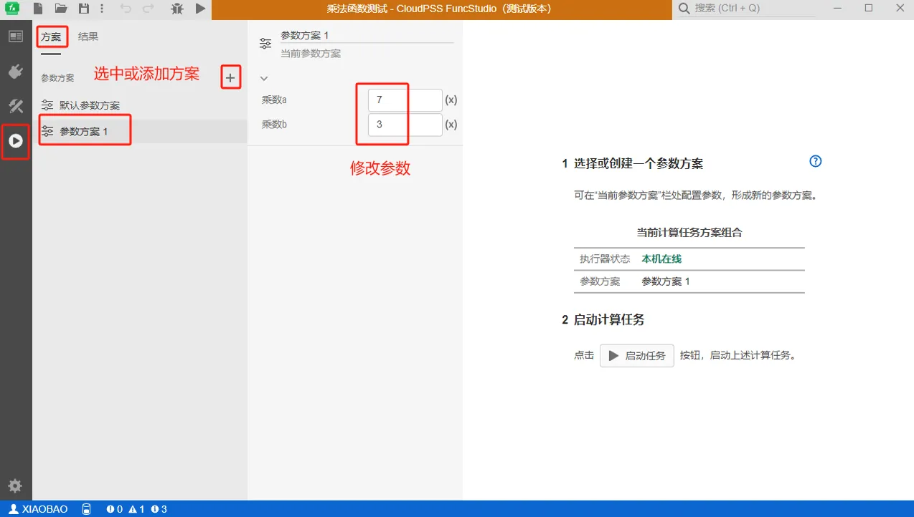
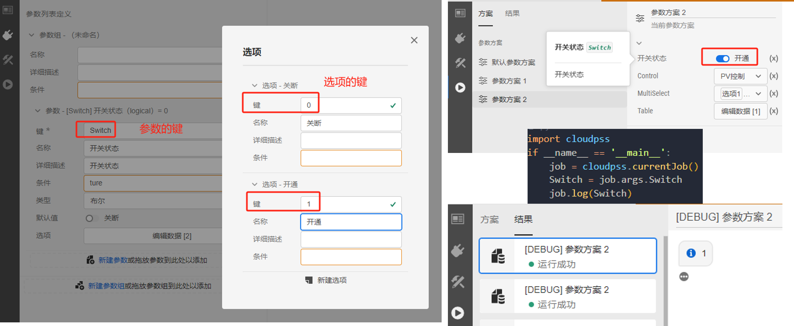
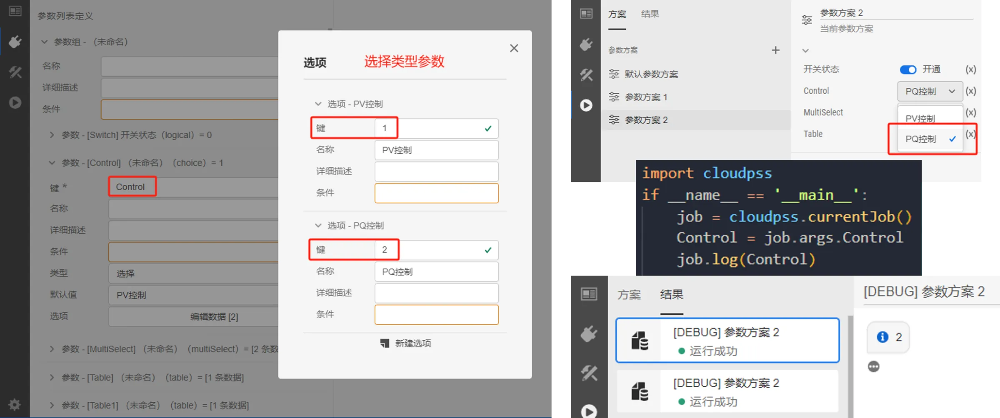
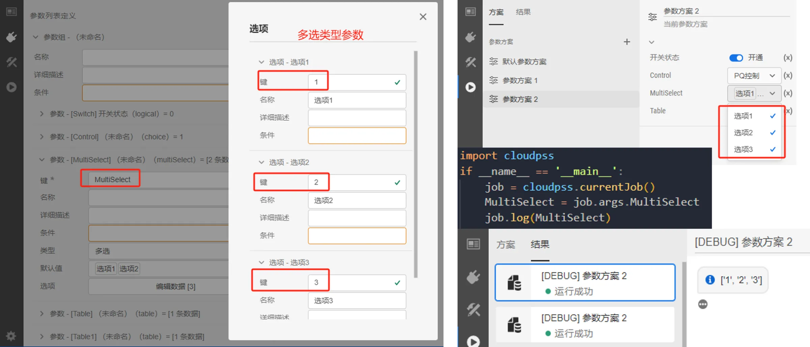
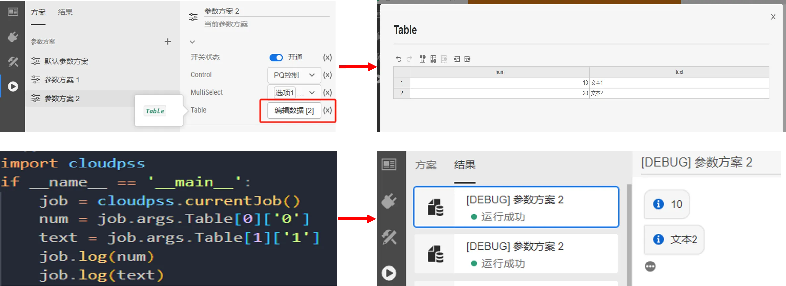
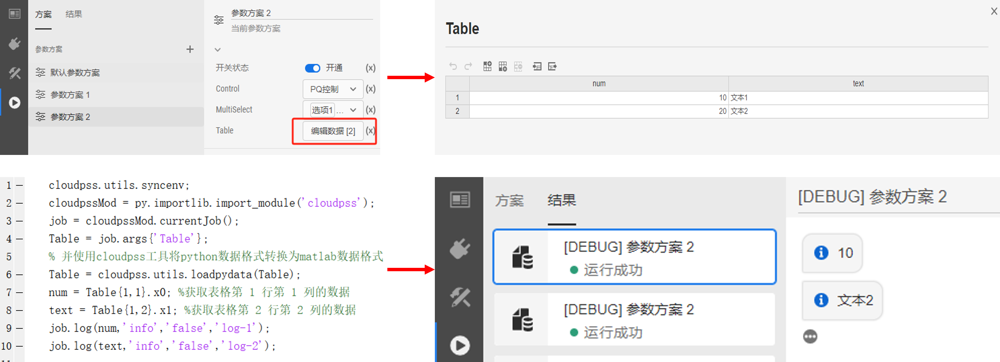
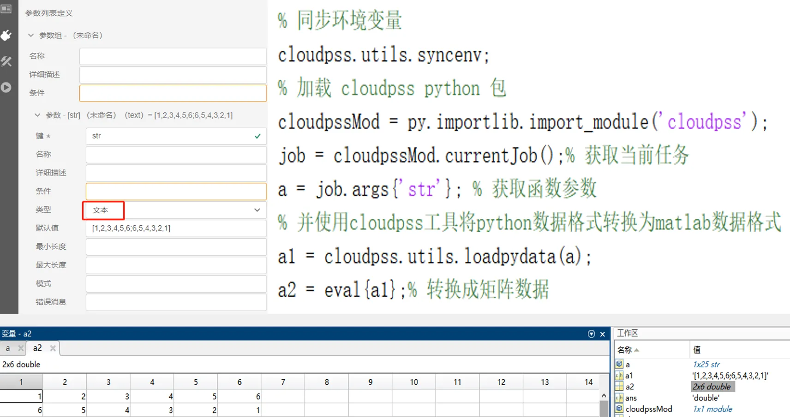
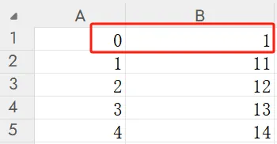

本节介绍 FuncStudio 函数参数的定义及引用功能。

## 主要用途

用于配置函数的外部接口，并且通过运行标签页的参数方案来更改算法内核的输入。

## 参数定义及引用流程

### 定义函数参数列表

用户可在 FuncStudio 接口标签页的参数列表内根据需求自定义参数名、参数数据类型、参数范围等。

参数列表被分为参数组-参数两个层级，两个层级为包含关系，即一个函数可含有若干参数组，每个参数组可含有若干参数。

XStudio 提供了统一的参数列表配置方法，支持实数、整数、文本、布尔、选择、多选、表格以及虚拟引脚 9 种类型参数的定义。

每种类型参数的定义详见 [参数列表定义](../../../20-simstudio/50-modeling/40-module-packaging/10-define-module-param-list/index.md)。

### 配置参数方案

定义好的参数列表后，运行标签页方案下的**默认参数方案**里面会将参数列表显示出来，用户可以选择或添加参数方案，通过修改当前方案下的参数值，**更改函数内核的输入**。



:::warning
- 当用户修改参数列表后（包括类型和默认值），已有的参数方案不会更新，需要手动修改；
  
- 添加新的参数方案会更新。
:::

### 函数内核中引用参数方案

配置好参数方案后，用户可在函数内核中利用 FuncStudio SDK 引用当前参数方案作为内核输入量进行计算。

**不同语言编写的内核引用参数方案的格式有所区别：**

import Tabs from '@theme/Tabs';
import TabItem from '@theme/TabItem';

<Tabs>
<TabItem value="python" label="本地 Python 内核">

对于 Python 内核通过 `args.键` 的接口获取。

```py showLineNumbers
import cloudpss  #导入安装好的CloudPSS-SDK
if __name__ == '__main__': 
    job = cloudpss.currentJob() #获取函数在当前参数方案下的计算任务实例
    a = job.args.a #利用 SDK 提供的 args 方法获取键为 a 的参数在当前方案下的值
    b = job.args.b #获取键为 b 在当前参数方案下的值
```

</TabItem>
<TabItem value="matlab" label="本地 Matlab 内核">

对于 Matlab 内核通过 `args.{'键'}` 的接口获取。

```matlab showLineNumbers
cloudpss.utils.syncenv; %同步环境变量
cloudpssMod = py.importlib.import_module('cloudpss'); %加载 CloudPSS-SDK
job = cloudpssMod.currentJob(); %获取函数在当前参数方案下的计算任务实例
a = job.args{'a'}; %利用 SDK 提供的 args 方法获取键为 a 的参数在当前方案下的值
b = job.args{'b'}; %获取键为 b 在当前参数方案下的值
```

</TabItem>
<TabItem value="js" label="云端 JavaScript 内核">

对于 JavaScript 通过 `args.键` 的方式获取。

```JavaScript showLineNumbers
export default async function* (args,signal,env) {
    yield "hello, "+args.name+"!" // #利用 SDK 提供的 args 方法获取键为 name 的参数在当前方案下的值
    yield "Good bye, "+args.name+"!"
}  
```
</TabItem>
</Tabs>

**不同类型的参数引用方式不同：**

<Tabs>

<TabItem value="bool" label="布尔/选择/多选">

对于布尔、选择和多选等选项类型的参数，直接通过键名引用到的是每个**选项的键**。

布尔类型的参数通过 `args.Switch` 获取的是选项的键，`1 或者 0`。



选择类型的参数通过 `args.Control` 获取的是选项的键，`1 或者 2`。



多选类型的参数通过 `args.MultiSelect` 获取的是选项的键，比如，多选“选项 1”、“选项 2”、“选项 3”
获取的值就是 `['1','2','3']`。



</TabItem>
<TabItem value="table" label="表格">

对于表格这种可能有多个值的参数，直接通过键引用到的是整个表格的数据。比如，表格中第 a 行 第 b 列的数据通过 `[a-1][b-1]` 的形式获取。


不同语言编写的内核引用表格参数的格式不同：

<!-- 分割线 -->
<Tabs>
<TabItem value="python" label="本地 Python 内核">

通过 `args.键[a-1]['b-1']` 的方式获取表格中第 a 行 第 b 列的数据。

```py showLineNumbers
import cloudpss  #导入安装好的CloudPSS-SDK
if __name__ == '__main__': 
    job = cloudpss.currentJob() #获取函数在当前参数方案下的计算任务实例
    num = job.args.Table[0]['0'] #获取表格第 1 行第 1 列的数据
    text = job.args.Table[1]['1'] #获取表格第 2 行第 2 列的数据
```



</TabItem>
<TabItem value="matlab" label="本地 Matlab 内核">

首先需要将 Pyhton 的 list 类型数据转换为 Matlab 的 cell 类型数据，然后通过 `{1,a}.xb-1` 的形式获取表格中第 a 行 第 b 列的数据。

```matlab showLineNumbers
cloudpss.utils.syncenv; %同步环境变量
cloudpssMod = py.importlib.import_module('cloudpss'); %加载 CloudPSS-SDK
job = cloudpssMod.currentJob(); %获取函数在当前参数方案下的计算任务实例
a = job.args{'Table'}; %利用 SDK 提供的 args 方法获取键为 Table 的参数在当前方案下的值
Table = cloudpss.utils.loadpydata(Table); % 并使用cloudpss工具将python数据格式转换为matlab数据格式
num = Table{1,1}.x0; %获取表格第 1 行第 1 列的数据
text = Table{1,2}.x1; %获取表格第 2 行第 2 列的数据
```


</TabItem>
<TabItem value="js" label="云端 JavaScript 内核">

通过 `args.键[a-1]['b-1']` 的方式获取。

```JavaScript showLineNumbers
export default async function* (args,signal,env) {
    yield args.Table[0]['0']
    yield args.Table[1]['1']
} 
```


</TabItem>
</Tabs>

<!-- 分割线 -->

</TabItem>
<TabItem value="normal" label="实数/整数/文本">

对于实数、整数、文本等普通类型的参数，直接通过参数键获取的是参数的值，比如：1.242；3，'文本'。

</TabItem>
</Tabs>


## 常见问题

对于 Matlab 内核中数组/矩阵/等类型输入参数该如何定义和引用？

:   - 首先，在参数列表中将数组/矩阵/等类型输入参数均定义为字符串类型；

    - 然后，在参数方案中该参数的值内输入数组/矩阵，例如 `[1,2,3,4,5,6;6,5,4,3,2,1]` 的矩阵；

    - 最后，在 Matlab 内核中通过 `args{'键'}` 获取数组或矩阵字符串 `'[1,2,3,4,5,6;6,5,4,3,2,1]'`，进一步可在 Matlab 里用使用 eval 方法。例如：`a = eval('[1,2,3,4,5,6;6,5,4,3,2,1]')` 转换成 2*6 的 double 型矩阵数据参与计算。

    

表格数据导入 csv 文件失败，该如何解决？

:   首先得保证 csv 文件格式和表格格式一致，然后需要在 csv 文件中添加首行作为每一列的编号。

    