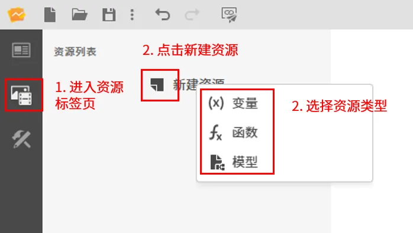
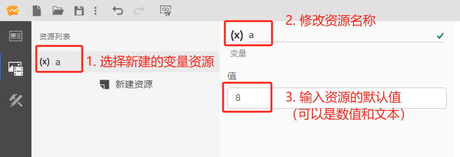
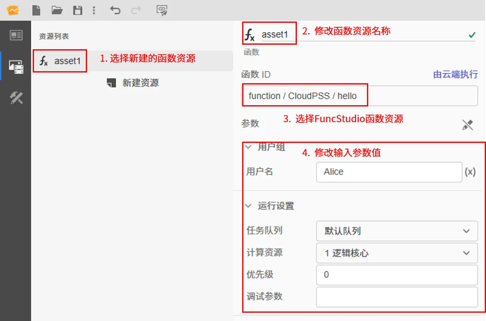
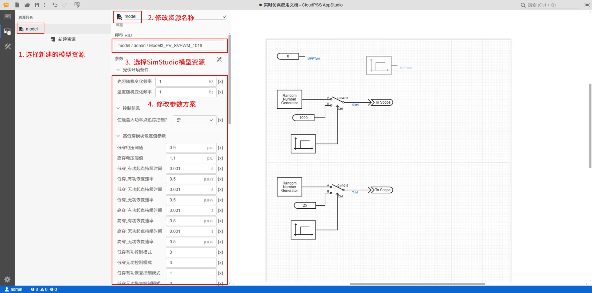

本节介绍 AppStudio 工作台功能区第二个资源标签页的功能。

## 功能定义

资源标签页用于添加构建应用时需要使用的资源，包括**静态资源**、**函数资源**和**模型资源**。

## 页面功能

### 新建资源

在资源创建区点击**新建资源**按钮，在资源类型对话框中选择新建的资源类型，可以添加如下三种资源：

- 静态变量资源
- FuncStudio 中的函数资源
- SimStudio 中的模型资源

选择好资源类型后，点击确定添加相应的资源。

### 配置资源
  
#### 变量资源

- 点击创建好的变量资源
- 修改变量资源名称
- 输入变量资源默认值，支持数值和文本 

变量资源作为全局变量，在场景标签页的控件属性中通过`$变量名称.value`形式的表达式被引用和修改。

#### 函数资源

- 点击创建好的函数资源
- 修改函数资源名称
- 点击函数 RID 选择器，选择需要绑定的函数资源，支持搜索
- 选择好后会自动加载出该函数的在线状态和参数列表
- 在参数列表中可以修改函数输入参数的值，点击重置参数按钮，可以将参数重置为默认值

:::tip
- 除了可以选择自己的函数项目外，还可以选择当前平台中所有权限为可执行的函数。
- 只有在线的函数才能被调用，在线的函数能看到其执行位置的信息。
:::

函数资源主要用于给应用添加 FuncStudio 中的函数项目，方便用户将函数的输入输出数据与 AppStudio 交互面板上的控件数据和事件绑定，调用函数资源获取计算结果。

可采用如下表达式对函数资源进行：

- `$函数名称.value`获取函数运行后的结果

- `$函数名称.args`获取函数的输入参数

- `$函数名称.running`获取函数的运行状态

- `$函数名称.progress`发送函数执行进度

- `$函数名称.status`获取函数上次运行状态

- `$函数名称.job.id`获取函数当前执行任务的`id`

- `$函数名称.start()`开始执行函数

- `$函数名称.terminate()`终止函数的执行

#### 模型资源

- 点击创建好的模型资源
- 修改模型资源名称
- 点击模型 RID 选择器，选择需要绑定的模型资源，支持搜索
- 选择好后会自动加载出该模型的参数列表
- 在参数列表中可以修改参数值，点击重置参数按钮，可以将参数重置为默认值

:::tip
- 除了可以选择自己的模型项目外，还可以选择当前平台中所有权限为公开的模型。
:::

模型资源主要用于给应用添加 SimStudio 中的实时仿真模型，方便用户将实时仿真模型的虚拟输入输出数据与 AppStudio 上的实时仿真控件进行绑定，快速构建实时仿真应用。

实时仿真模型资源的创建和调用详见[实时仿真应用](../../../70-case-study/50-emt-rt-apps/index.md)。