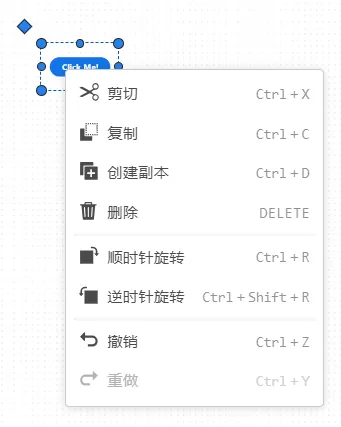
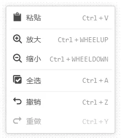

### 功能定义

用户可将控件库中的控件拖拽至场景中，进行控件属性配置，从而构建出交互面板和数据可视化面板。

## 功能说明

### 常见编辑操作

选中场景中的控件点击鼠标右键后可以选择如下的基础编辑操作，也可通过快捷键实现。

#### 剪切

剪切场景中的选中的控件，支持选中多个控件进行剪切。

#### 复制

复制场景中的选中的控件，支持选中多个控件进行复制。

#### 创建副本

创建场景中的选中的控件，支持选中多个控件创建副本。

#### 删除

删除场景中的选中的控件，支持选中多个控件进行删除。

#### 顺/逆时针旋转

顺/逆时针旋转选中的控件 90°，支持选中多个控件进行旋转。也可以长按控件左上方的菱形图案对控件进行旋转。

#### 撤销/重做

撤回/返回上一步操作。

不选中控件，在场景空白处点击鼠标右键后可以选择如下的基础编辑操作，也可通过快捷键实现。

#### 粘贴

点击场景空白处，粘贴剪切/复制的控件。支持同平台应用间跨网页复制/粘贴。跨网页复制/粘贴可以将单个或多个控件粘贴到不同的算例中（即，不同的网页）。

#### 放大/缩小
放大或缩小场景的视图比例。也可以按住`ctrl`键，利用鼠标滚轮来缩放视图。同时也可以用按住`ctrl`键 + 鼠标右键，拖动鼠标来平移视图。

#### 全选

全选场景控件。