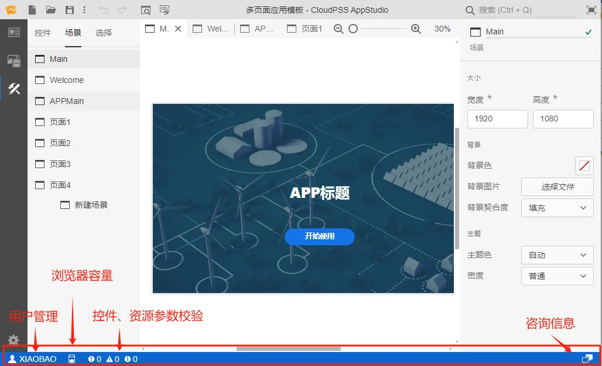

本节主要介绍 AppStudio 工作台下方的状态栏功能。

## 功能定义

AppStudio 最下端为状态栏，包含用户管理、浏览器存储配额、应用校验信息、咨询信息四种类型的信息图标。

## 功能说明

### 用户管理

点击用户管理图标，可以选择进入**个人中心**或**退出登录**当前用户账号。

### 浏览器存储配额

公网平台会显示当前账号的浏览器存储配额。

### 应用校验信息

AppStudio 内置了即时错误校验功能。用户在搭建应用的同时，每一步操作完成的1s后，后台会同步对资源、场景、控件进行校验，并再状态栏的左下角实时指出错误和引导性文字，帮助用户修改。

### 咨询信息

可以通过**咨询信息**界面咨询技术人员有关CloudPSS相关问题，仅限公网平台使用。

## 常见问题

应用校验必须全部通过才能预览或发布应用吗？

:   校验不通过不影响应用的预览或发布，但是会导致控件失效，应用调试不通过。因此，建议用户将校验信息栏中的错误
    信息全部消除后再预览应用。