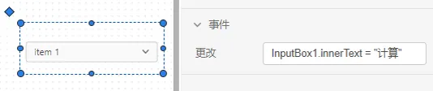
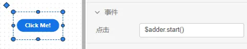
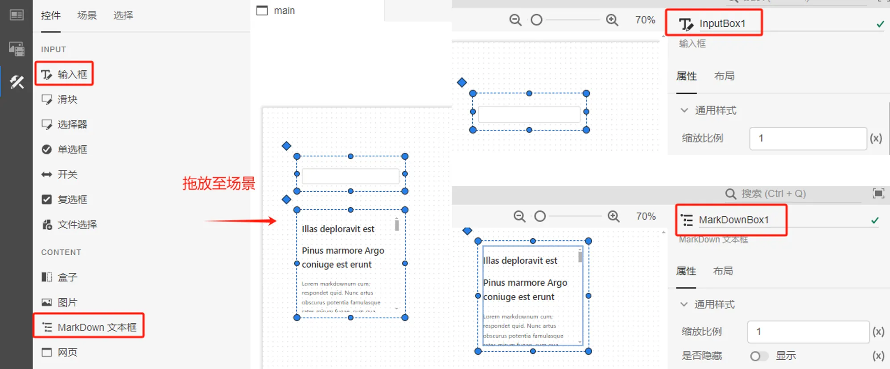
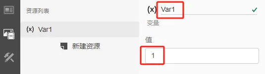
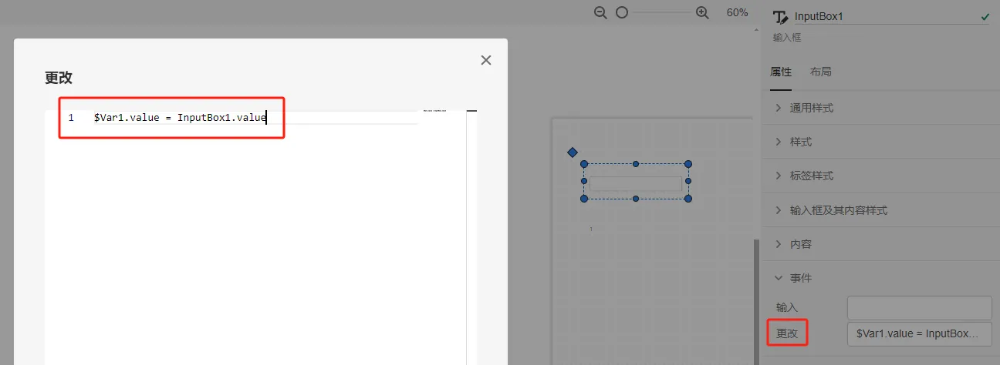
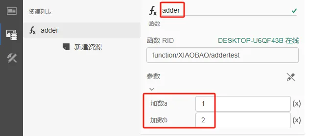
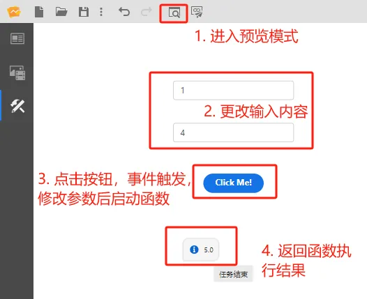

本节介绍 AppStudio 的事件触发机制。

## 功能定义

AppStudio 的 INPUT、CONTENT、ACTION 类控件支持输入、点击、更改、切换等可交互的操作事件；

事件触发机制是指：当这些事件触发后，开始执行事件属性栏内的表达式，实现控件赋值、回调资源数据等功能。

## 功能说明

### 事件类型

#### 输入

输入框控件支持的事件类型，当用户进行输入操作时就会触发的事件，只要在输入框内输入了内容，就会触发，开始执行事件属性栏里的表达式。

#### 更改

INPUT 类型控件支持的事件类型，当内容更改，并且控件失去焦点后触发的事件，例如选择器的更改事件，当选项更改并且焦点移除后（或按 `Enter` 键），就会触发，开始执行事件属性栏里的表达式。

#### 点击

ACTION 类型控件支持的事件类型，当用户点击控件时就会触发的事件，例如按钮的点击事件，当点击按钮后，就会触发，开始执行事件属性栏里的表达式。

#### 切换

操作按钮控件支持的事件类型，当操作按钮选中状态发送变化后触发的事件，使用时要开启自动切换。

### 利用事件触发机制实现的功能

#### 控件赋值

在事件属性栏内输入给控件属性赋值的表达式，控件的样式、内容、事件属性都可以通过表达式来赋值。

例如，通过更改输入框的值，来实现 Markdown 文本框值属性的更新。

首先，在场景标签页中的控件列表中选择一个输入框控件和一个 Markdown 文本框控件放置到场景中，并分别命名为 InputBox1 和 MarkdownBox1；

然后，在输入框的更改事件属性栏中输入 `MarkdownBox1.srcdoc = InputBox1.value` 的表达式，表示更改事件触发后将输入框的当前值赋给 Markdown 文本框；

最后，进入预览模式，在输入框中输入内容，当输入内容更改后， Markdown 文本框的内容也相应发生变化。

#### 变量资源赋值 
  
在事件属性栏内输入修改变量资源值的表达式。例如，通过更改输入框的值，实现变量资源的更新。

首先，在资源标签中添加一个名为 `Var1`，值为 1 的变量资源;

然后，在场景标签页中的控件列表中选择一个输入框控件和一个 Markdown 文本框控件放置到场景中，并分别命名为 InputBox1 和 MarkdownBox1；

接着，在 Markdown 文本框的值属性栏中输入 `MarkdownBox1.scrdoc = $Var1.value` 的表达式，表示将变量资源当前值赋给 Markdown 文本框；

并且，在输入框的更改事件属性栏中输入 `$Var1.value = InputBox1.value` 的表达式，表示更改事件触发后将输入框的当前值赋给变量资源；

最后，进入预览模式，在输入框中输入内容，当输入内容更改后， 变量资源的值发生变化导致 Markdown 文本框的内容也相应发生变化。

#### 函数资源回调 

- 启动或结束函数资源
  
  在事件属性栏内输入启动或结束函数资源的表达式。

  `$函数名称.start()`→启动函数任务

  `$函数名称.terminate()`→终止函数任务

- 函数资源输入参数赋值
  
  在事件属性栏内输入修改函数资源输入参数的表达式。

  例如，通过更改输入框的值，修改函数资源的参数方案并启动函数。

  首先，在资源标签中添加一个名为 `adder` 有两个输入参数键为 `a` 和 `b` 的加法函数资源;

  

  然后，在场景标签页中的控件列表中选择两个输入框控件，并分别命名为 InputBox1 和InputBox2，同时添加一个按钮控件和一个运行结果控件，在运行结果控件的**结果 ID** 属性中输入 `$adder.job.id` 的表达式，用于展示函数资源的输出结果。

  

  接着，按钮的**点击**事件属性栏中依次输入 `$adder.args.a = InputBox1.value`、`$adder.args.b = InputBox2.value` 和 `$adder.start()` 这三个表达式；表示点击事件触发后将输入框的当前值赋给函数资源的输入参数，然后启动函数；

  :::info
  事件属性栏支持输入多条表达式，表达式之间用分号隔开。
  :::

  

  最后，进入预览模式，在输入框中输入内容，当输入内容更改后， 函数的输参数发生变化，点击按钮后启动函数，运行结果控件中会返回当前参数下函数的执行结果。

  

## 常见问题

事件属性中的多条表达式同时执行的吗？

:  不是，是按先后顺序依次执行的。