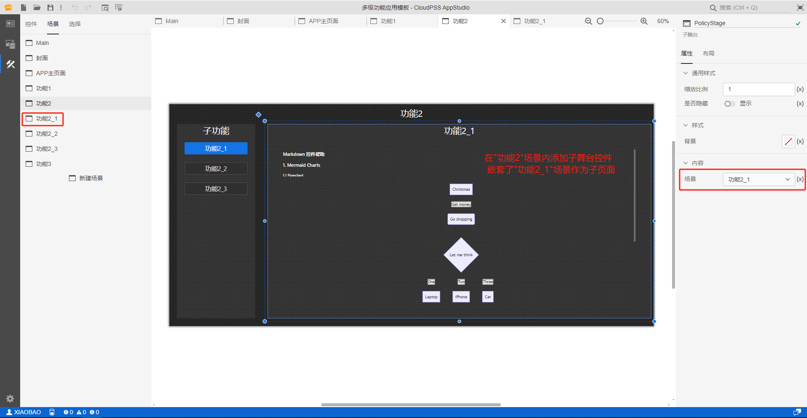
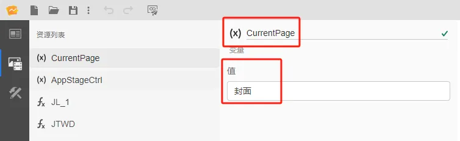
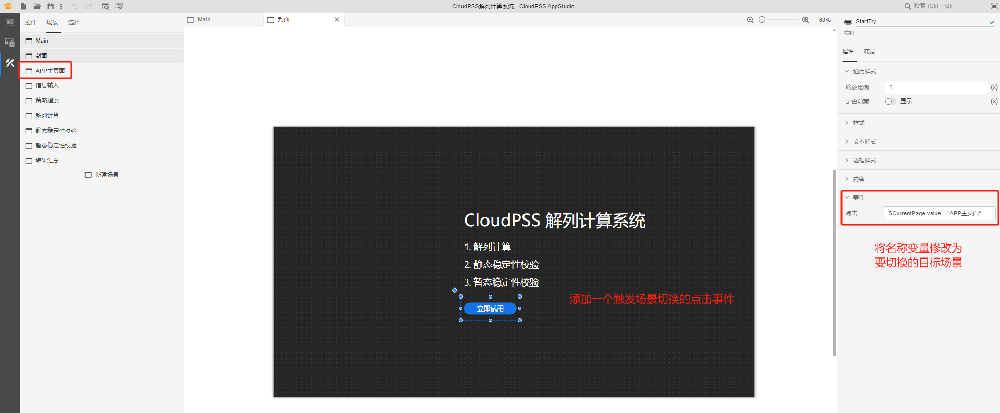

本节首先介绍 AppStudio 的场景嵌套功能，然后通过 1 个案例介绍场景嵌套功能的使用方法。

## 功能定义

当用户需要构建一个含多个子页面的复杂应用时，考虑到美观和便捷性，可通过添加场景将每个页面放置到不同的场景中，每个子页面是一个独立的场景。在预览模式下，只会展示场景列表中最顶端的场景（main 场景），此时需要通过场景嵌套功能实现多场景间的切换。

## 功能说明

### 场景嵌套

AppStudio 提供的**子舞台**控件可以用于在当前场景内展示其他场景，具备场景嵌套的功能。

只需在子舞台控件的场景属性内输入需要嵌入的场景标签名称，即可将该场景显示在子舞台控件内；

- 编辑模式下只能显示场景，不能在子舞台中编辑场景中的控件；

- 预览模式下，可以在子舞台中操作该场景中的可交互控件。

### 场景切换实现流程

- 添加变量资源，作为场景切换的名称变量，值为默认展示的场景名称，即应用的封面；

  

- 在 main 场景中添加子舞台控件，将场景属性绑定为名称变量的值；

  

- 配置场景切换事件的属性，当场景切换事件触发后，将名称变量的值修改为切换的目标场景名称。

  

## 案例

### 使用场景嵌套功能实现场景切换

## 常见问题

当前场景中如何引用子舞台场景中的控件属性吗？

:   当前场景中无法直接引用子舞台场景中的控件属性，可以通过添加中间变量资源实现间接引用。