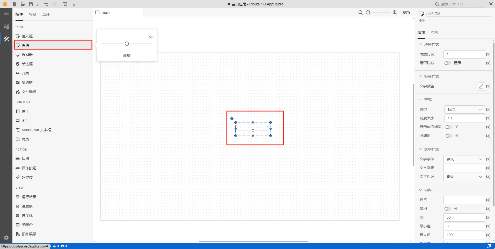

本节主要介绍 **AppStudio** 控件库里的滑块控件。

## 属性

**CloudPSS** 提供了一套统一的控件属性参数

### 通用样式

import CommonStyle from '../../60-grid/_common-style.md'

<CommonStyle />

### 标签样式

| 参数名 | 键值 (key) | 单位 | 备注 | 类型 | 描述 |
| :--- | :--- | :--- | :--: | :--- | :--- |
| 文字颜色 | `style/--spectrum-alias-label-text-color` |  | 选择文字颜色 | 颜色选择器 | 点击文字颜色，弹出颜色选择器自定义颜色 |

### 样式

| 参数名 | 键值 (key) | 单位 | 备注 | 类型 | 描述 |
| :--- | :--- | :--- | :--: | :--- | :--- |
| 类型 | `variant` |  | 选择样式类型 | 选择 | 样式类型：标准、填充、刻度、斜坡 |
| 刻度大小 | `tickStep` |  | 输入刻度大小 | 常量 | 刻度大小，默认为 10 |
| 显示刻度标签 | `tickLabels` |  | 显示刻度标签 | 开关 | 显示刻度标签，默认为关 |
| 可编辑 | `editable` |  | 选择是否可编辑 | 开关 | 是否开启滑块进度编辑，默认为关 |

### 文字样式

| 参数名 | 键值 (key) | 单位 | 备注 | 类型 | 描述 |
| :--- | :--- | :--- | :--: | :--- | :--- |
| 文字字体 | `style/font-family` |  | 选择文字字体 | 选择 | 文字字体样式，字体类型包括：默认、宋体、黑体、楷体、微软雅黑、Georgia、Palatino Linotype、Times New Roman、Arial、Arial Black、Verdana、Courier New、Trebuchet MS |
| 文字间距 | `style/letter-spacing` | `px`  | 输入文字间距 | 常量 | 显示文字间距 |
| 文字粗细 | `style/font-weight` |   | 选择文字粗细 | 选择 | 文字粗细：默认、100、200、300、400、500、600、700、800、900、1000 |

### 内容

| 参数名 | 键值 (key) | 单位 | 备注 | 类型 | 描述 |
| :--- | :--- | :--- | :--: | :--- | :--- |
| 标签 | `innerText` |  | 输入内容标签 | 常量 | 滑块控件文字标签 |
| 禁用 | `disabled` |  | 禁用开关 | 开关 | 禁用选择**开**或者**关**，开启后控件禁止点击和交互，默认为**关** |
| 值 | `value` |  | 滑块默认值 | 常量 | 滑块默认值，默认为 50 |
| 最小值 | `min` |  | 滑块默认值 | 常量 | 块的滑动范围最小值，默认为 0 |
| 最大值 | `max` |  | 滑块默认值 | 常量 | 滑块的滑动范围最大值，默认为 100 |
| 步进值 | `step` |  | 滑块默认值 | 常量 | 滑块的滑动步长，默认为 1 |

### 事件

| 参数名 | 键值 (key) | 单位 | 备注 | 类型 | 描述 |
| :--- | :--- | :--- | :--: | :--- | :--- |
| 输入 | `@input` |  | 输入时触发事件 | 函数 | 采用输入方式触发，只要控件内容发生变化，控件的值就会实时更新  |
| 更改 | `@change` |  | 输入结束时触发事件 | 函数 | 采用更新方式触发，失去焦点后控件的值才会更新 |

## 案例介绍

### 颜色选择器类型

import ColorPicker from '../../60-grid/_color-picker.md'

<ColorPicker />

## 常见问题

import Fx from '../../60-grid/_expression.md'

<Fx />

import Event from '../../60-grid/_event.md'

<Event />
