本节主要介绍 **AppStudio** 控件库里的选择器控件。

该控件的主要作用包括：

- 作为 FuncStudio 函数资源的输入接口，用于给**函数传参**；
- 作为 EMTLab 模型资源实时电磁暂态仿真任务（只适用于实时仿真器）的输入接口，用于**修改虚拟输入端口的值**。

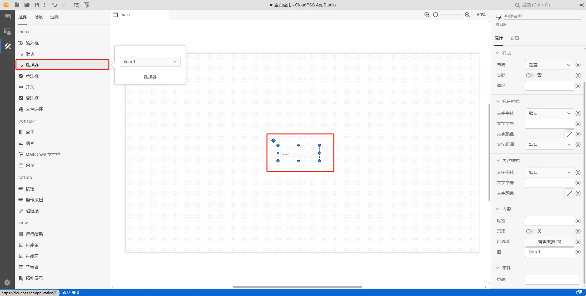

## 属性

**CloudPSS** 提供了一套统一的控件属性参数

### 通用样式

import CommonStyle from '../../60-grid/_common-style.md'

<CommonStyle />

### 样式

| 参数名 | 键值 (key) | 单位 | 备注 | 类型 | 描述 |
| :--- | :--- | :--- | :--: | :--- | :--- |
| 布局 | `layout` |  | 选择控件布局 | 选择 | 垂直或者水平布局，默认为垂直 |
| 安静 | `quiet` |  | 选择是否安静 | 选择 | 选择**是**或者**否**，默认为**否**状态 |
| 高度 | `style/--spectrum-picker-m-height` |  | 输入选择器高度 | 常量 | 选择器高度 |

### 标签样式

| 参数名 | 键值 (key) | 单位 | 备注 | 类型 | 描述 |
| :--- | :--- | :--- | :--: | :--- | :--- |
| 文字字体 | `style/font-family` |  | 选择文字字体 | 选择 | 标签文字字体样式，字体类型包括：默认、宋体、黑体、楷体、微软雅黑、Georgia、Palatino Linotype、Times New Roman、Arial、Arial Black、Verdana、Courier New、Trebuchet MS |
| 文字字号 | `style/--spectrum-global-dimension-font-size-100` |  | 输入文字字号 | 常量 | 输入文字字号 |
| 文字颜色 | `style/--spectrum-alias-label-text-color` |  | 选择文字颜色 | 颜色选择器 | 点击文字颜色，弹出颜色选择器自定义颜色 |
| 文字粗细 | `style/--spectrum-alias-body-text-font-weight` |  | 选择文字粗细 | 选择 | 选择标签文字粗细，默认、100、200、300、400、500、600、700、800、900、1000 |

### 内容样式

| 参数名 | 键值 (key) | 单位 | 备注 | 类型 | 描述 |
| :--- | :--- | :--- | :--: | :--- | :--- |
| 文字字体 | `style/--spectrum-alias-body-text-font-family` |  | 选择文字字体 | 选择 | 输入框内容文字字体样式，字体类型包括：默认、宋体、黑体、楷体、微软雅黑、Georgia、Palatino Linotype、Times New Roman、Arial、Arial Black、Verdana、Courier New、Trebuchet MS |
| 文字字号 | `style/--spectrum-picker-m-text-size` |  | 输入文字字号 | 常量 | 输入文字字号 |
| 文字颜色 | `style/--spectrum-picker-m-text-color` |  | 选择文字颜色 | 颜色选择器 | 点击文字颜色，弹出颜色选择器自定义颜色 |

### 内容

| 参数名 | 键值 (key) | 单位 | 备注 | 类型 | 描述 |
| :--- | :--- | :--- | :--: | :--- | :--- |
| 标签 | `label` |  | 输入内容标签 | 常量 | 选择器控件文字标签 |
| 禁用 | `disabled` |  | 禁用开关 | 开关 | 禁用选择**开**或者**关**，开启后控件禁止点击和交互，默认为**关** |
| 可选项 | `items` |  | 选择器控件可选项表格 | 表格 | 点击编辑数据，弹出可选项表格进行编辑，上方的图标从左到右依次是： **撤销(<kbd>Ctrl</kbd> <kbd>Z</kbd>)** 、**重做(<kbd>Ctrl</kbd>  <kbd>Y</kbd>)**、**在上方插入行(<kbd>Ctrl</kbd> <kbd>I</kbd>)**、**在下方插入行(<kbd>Ctrl</kbd> <kbd>Alt</kbd> <kbd>I</kbd>)** 、**导入 CSV**、**导出 CSV** |
| 值 | `value` |  | 选择器控件值 | 常量 | 选择器默认值，默认为 item 1 |

#### 可选项

从左到右，依次是撤销（`Ctrl` `Z`），重做（`Ctrl` `Y`），在上方插入行（`Ctrl` `I`），在下方插入行（`Ctrl` `Alt` `I`），删除行（`Ctrl` `D`），导入 CSV，导出 CSV

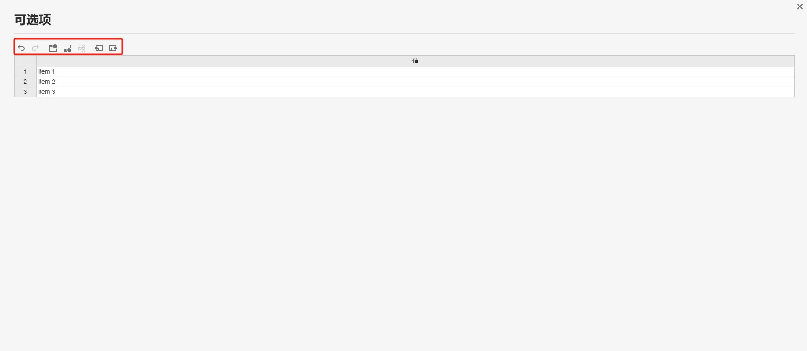

### 事件

| 参数名 | 键值 (key) | 单位 | 备注 | 类型 | 描述 |
| :--- | :--- | :--- | :--: | :--- | :--- |
| 更改 | `@change` |  | 输入结束时触发事件 | 函数 | 采用更新方式触发，失去焦点后控件的值才会更新 |

## 向导

AppStudio 为选择器控件配置了向导功能，选中选择器控件，在右侧参数配置区上方点击**向导**图标进入向导界面。

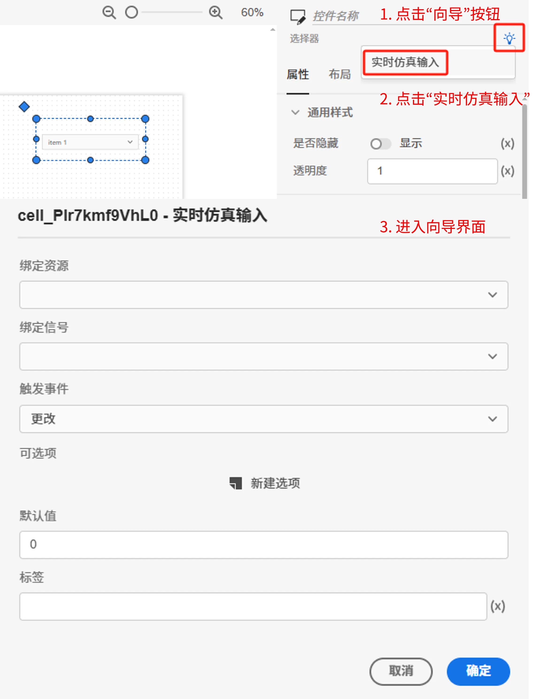

用于引导用户快速配置控件属性，与实时仿真任务的数字量多值信号的输入功能灵活绑定，常用于切换不同类型的故障输入信号；系统会将向导中设置的方案按照特定的表达式**自动写入**选择器控件的属性框中，支持快速构建自定义实时态监控应用。支持如下属性的配置：

| 属性配置 | 类型 | 功能描述 |
| :--- | :--- | :--- |
| 绑定资源 | 选择 | 选择资源标签页内添加的模型资源 |
| 绑定信号 | 选择 | 选择模型资源中数字量多值信号输入通道 |
| 触发事件 | 选择 | `更改`：输入结束，失去控件焦点时触发 |
| 可选项 | 键值对 | 添加多个可选项及其对应的输入信号值 |
| 最小值 | 常量（实数）| 输入默认输入信号值，默认为 0|
| 标签 | 常量（实数）| 选择器标签 |

## 案例介绍

import Tabs from '@theme/Tabs';
import TabItem from '@theme/TabItem';

<Tabs>
<TabItem value="case1" label="典型应用">

1. 创建一个选择器控件，在右侧的属性配置区内给选择器命名为 A

2. 创建静态资源 asset1，值设置为 `item 2`
   
3. 将输入框 A 的内容/值属性切换到 fx 表达式模式，设置为 `$asset1.value`

4. 点击工具栏的预览快捷按钮（或者 <kbd>Ctrl</kbd> <kbd>P</kbd>），进入预览模式，在预览模式下修改选择器 A 的值

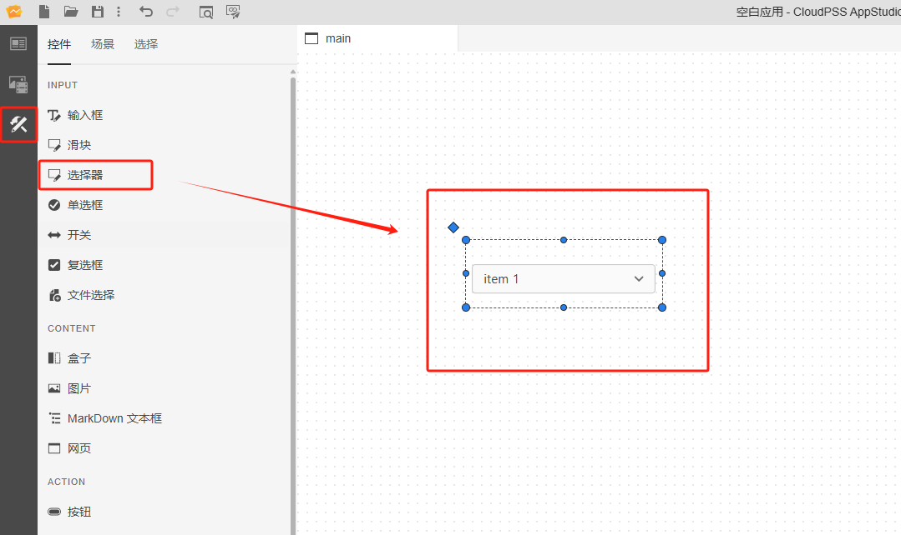

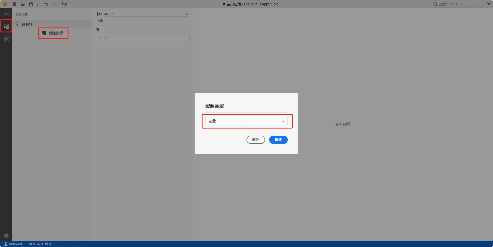

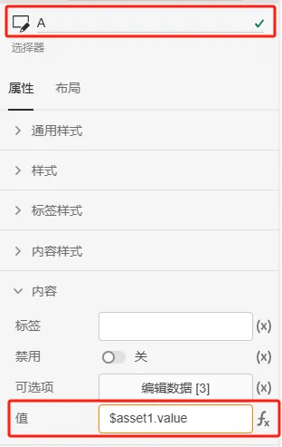

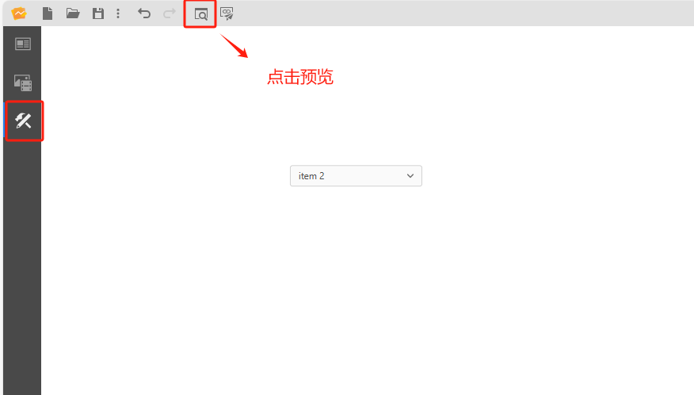

:::tip 典型应用使用详情

查看 [AppStudio 应用工坊快速入门](../../../20-quick-start/10-simple-apps/index.md)

:::

</TabItem>

<TabItem value="case2" label="接入 FuncStudio 函数">

1. 创建一个选择器，在右侧的属性配置区内给选择器命名为 A

2. 创建函数资源 asset2，选择资源类型为函数

3. 配置函数资源 asset2，点击**选择资源**，绑定 `rid` 为 `function/Maxwell/demo` 的示例函数，示例函数存在两个参数 `a` 和 `b`

4. 鼠标选中选择器 A 的事件/更改属性栏，按下 <kbd>Ctrl</kbd> 输入 `$asset2.args.a = A.value; $asset2.start()`

5. 点击工具栏的预览快捷按钮（或者 <kbd>Ctrl</kbd> <kbd>P</kbd>），进入预览模式，在预览模式下修改选择器 A 的值

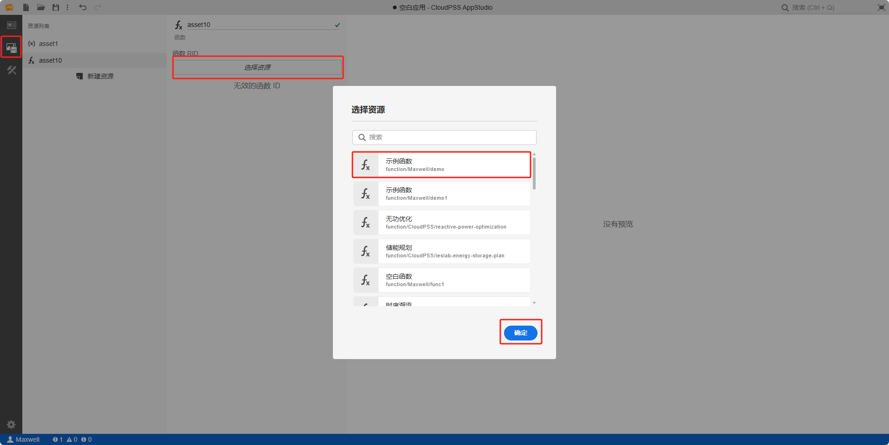

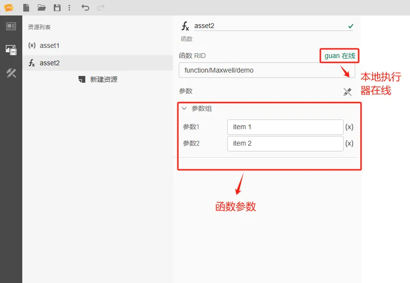

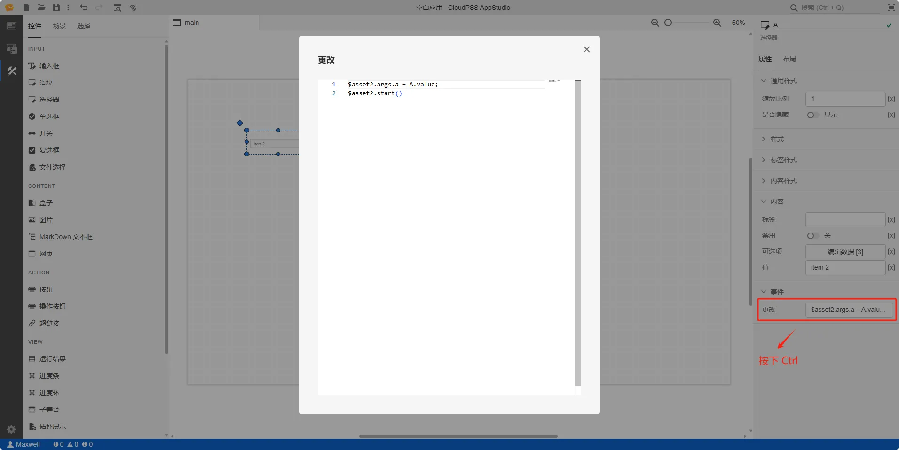

:::tip FuncStudio 函数使用详情

查看 [FuncStudio 函数工坊使用指南](../../../../30-funcstudio/10-user-guide/index.md)

:::

</TabItem>

<TabItem value="case3" label="实时仿真输入向导配置">

<!-- 滑块控件提供**向导**功能，会将向导中设置的方案按照特定的表达式**自动写入**滑块控件的属性输入框中，帮助用户快速将实时仿真模型的虚拟输入输出端口值与滑块的值进行绑定。 -->

<!-- 滑块控件除了可以作为 FuncStudio 函数资源的输入输出控件外，也能作为 EMTLab 中实时电磁暂态仿真任务的输入输出控件，用于控制虚拟输入端口的值和接收虚拟输出端口的值。 -->

1. 在资源标签页内添加需要进行实时仿真的 SimStudio 模型资源，具体的模型资源添加方法参见[资源标签页](../../../40-workbench/20-function-zone/20-asset-tab/index.md)。

1. 可通过向导功能进行**实时仿真输入**参数的设置：
   
- 可选中选择器元件，在右侧参数配置区上方点击向导图标进入向导界面。

<!--  -->

- 点击**绑定资源**选择器，选项中会自动加载出所有函数资源和模型资源，选择需要进行实时仿真的 SimStudio 模型资源；

- 选中模型资源后，**绑定信号**选择器的选项中会自动加载出该模型的所有虚拟输入端口名称，选择需要绑定的端口名称；
  
- 选择触发方式：更改（采用输入方式触发，只要控件内容发生变化，控件的值就会实时更新）；

- 新建数字量多值信号的选项，及其对应的输入信号值；
  
- 填写选择器标签；
  
- 点击向导界面的确定按钮后，会将向导中设置的方案按照特定的表达式写入选择器控件的属性框中。
<!-- 对于熟练使用表达式的用户，也可以参照表达式自己配置 -->

进入预览模式，通过切换选项实时下发不同选项的输入信号值指令。

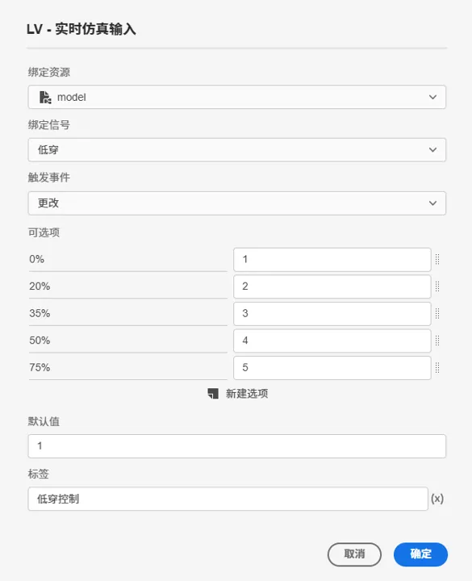

<!--  -->

<!--  -->

<!-- 对于输出信号，进入预览模式，即可在仿真过程中通过滑块实时显示所绑定的虚拟输出端口的值。

 -->

具体的操作流程参见[实时仿真案例](../../../70-case-study/50-emt-rt-apps/index.md)。

  <!--  -->

</TabItem>
</Tabs>

## 常见问题

import Fx from '../../60-grid/_expression.md'

<Fx />

import Event from '../../60-grid/_event.md'

<Event />