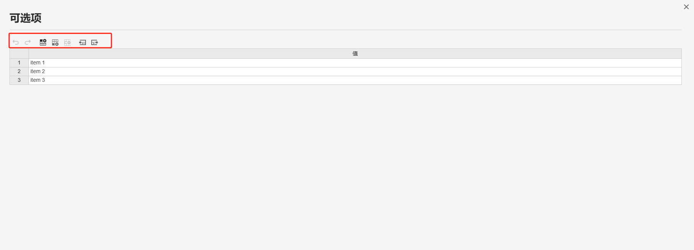

本节主要介绍 **AppStudio** 控件库里的单选框控件。

## 属性

**CloudPSS** 提供了一套统一的控件属性参数

### 通用样式

import CommonStyle from '../../60-grid/_common-style.md'

<CommonStyle />

### 样式

| 参数名 | 键值 (key) | 单位 | 备注 | 类型 | 描述 |
| :--- | :--- | :--- | :--: | :--- | :--- |
| 布局 | `layout` |  | 选择控件布局 | 选择 | 垂直或者水平布局，默认为垂直 |
| 安静 | `quiet` |  | 选择是否安静 | 选择 | 选择**是**或者**否**，默认为**否**状态 |
| 高度 | `style/--spectrum-picker-m-height` |  | 输入单选框控件高度 | 常量 | 单选框控件高度 |

### 标签样式

| 参数名 | 键值 (key) | 单位 | 备注 | 类型 | 描述 |
| :--- | :--- | :--- | :--: | :--- | :--- |
| 文字字号 | `style/--spectrum-global-dimension-font-size-100` |  | 输入文字字号 | 常量 | 输入文字字号 |
| 文字颜色 | `style/--spectrum-alias-label-text-color` |  | 选择文字颜色 | 颜色选择器 | 点击文字颜色，弹出颜色选择器自定义颜色 |
| 文字粗细 | `style/--spectrum-alias-body-text-font-weight` |  | 选择文字粗细 | 选择 | 选择标签文字粗细，默认、100、200、300、400、500、600、700、800、900、1000 |

### 选项文字样式

| 参数名 | 键值 (key) | 单位 | 备注 | 类型 | 描述 |
| :--- | :--- | :--- | :--: | :--- | :--- |
| 文字字号 | `style/--spectrum-radio-m-text-size` |  | 输入文字字号 | 常量 | 输入文字字号 |
| 文字颜色 | `style/--spectrum-radio-m-text-color` |  | 选择文字颜色 | 颜色选择器 | 点击文字颜色，弹出颜色选择器自定义颜色 |
| 文字粗细 | `style/--spectrum-radio-m-font-weight` |  | 选择文字粗细 | 选择 | 选项文字粗细，默认、100、200、300、400、500、600、700、800、900、1000，默认为 400 |

### 圆环样式

| 参数名 | 键值 (key) | 单位 | 备注 | 类型 | 描述 |
| :--- | :--- | :--- | :--: | :--- | :--- |
| 默认颜色 | `style/--spectrum-radio-m-circle-border-color` |  | 圆环默认颜色 | 颜色选择器 | 点击默认颜色，弹出颜色选择器自定义圆环默认颜色 |
| 按下颜色 | `style/--spectrum-radio-m-circle-border-color-down` |  | 圆环按下颜色 | 颜色选择器 | 点击按下颜色，弹出颜色选择器自定义圆环按下颜色 |
| 悬浮颜色 | `style/--spectrum-radio-m-circle-border-color-hover` |  | 圆环悬浮颜色 | 颜色选择器 | 点击悬浮颜色，弹出颜色选择器自定义圆环悬浮颜色 |
| 选中颜色 | `style/--spectrum-radio-m-circle-border-color-selected` |  | 圆环选中颜色 | 颜色选择器 | 点击选中颜色，弹出颜色选择器自定义圆环选中颜色 |
| 选中按下颜色 | `style/--spectrum-radio-m-emphasized-circle-border-color-selected-down` |  | 圆环选中颜色 | 颜色选择器 | 点击选中按下颜色，弹出颜色选择器自定义圆环选中按下颜色 |
| 选中悬浮颜色 | `style/--spectrum-radio-m-emphasized-circle-border-color-selected-hover` |  | 圆环选中颜色 | 颜色选择器 | 点击选中悬浮颜色，弹出颜色选择器自定义圆环选中悬浮颜色 |
| 外圆直径 | `style/--spectrum-radio-m-circle-diameter` |  | 圆环外圆直径 | 常量 | 圆环外圆直径 |
| 选中内圆直径 | `style/--spectrum-radio-m-circle-dot-size` |  | 选中内圆直径 | 常量 | 选中内圆直径 |
| 未选中圆环宽度 | `style/--spectrum-radio-m-circle-border-size` |  | 未选中圆环宽度| 常量 | 未选中圆环宽度 |

### 内容

| 参数名 | 键值 (key) | 单位 | 备注 | 类型 | 描述 |
| :--- | :--- | :--- | :--: | :--- | :--- |
| 标签 | `label` |  | 控件内容标签 | 常量 | 单选框控件文字标签 |
| 禁用 | `disabled` |  | 禁用开关 | 开关 | 禁用选择**开**或者**关**，开启后控件禁止点击和交互，默认为**关** |
| 可选项 | `items` |  | 选择器控件可选项表格 | 表格 | 点击编辑数据，弹出可选项表格进行编辑，上方的图标从左到右依次是： **撤销(<kbd>Ctrl</kbd> + <kbd>Z</kbd>)** 、**重做(<kbd>Ctrl</kbd> + <kbd>Y</kbd>)**、**在上方插入行(<kbd>Ctrl</kbd>> + <kbd>I</kbd>)**、**在下方插入行(<kbd>Ctrl</kbd> + <kbd>Alt</kbd> + <kbd>I</kbd>)** 、**导入 CSV**、**导出 CSV** |
| 值 | `value` |  | 单选框控件内容值 | 常量 | 单选框控件默认值，默认为 item 1 |

### 事件

| 参数名 | 键值 (key) | 单位 | 备注 | 类型 | 描述 |
| :--- | :--- | :--- | :--: | :--- | :--- |
| 更改 | `@change` |  | 输入结束时触发事件 | 函数 | 采用更新方式触发，失去焦点后控件的值才会更新 |

## 案例介绍

### 颜色选择器类型

import ColorPicker from '../../60-grid/_color-picker.md'

<ColorPicker />

### 可选项

## 常见问题

import Fx from '../../60-grid/_expression.md'

<Fx />

import Event from '../../60-grid/_event.md'

<Event />