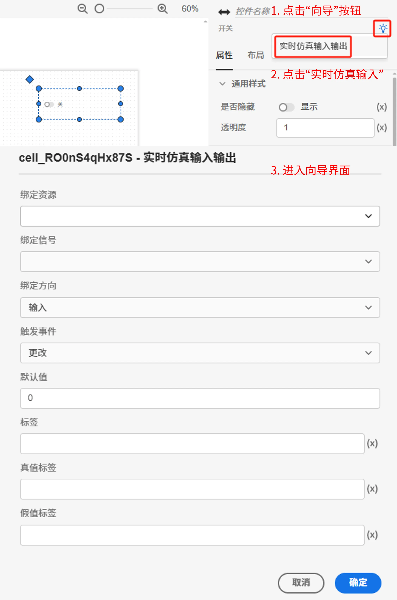
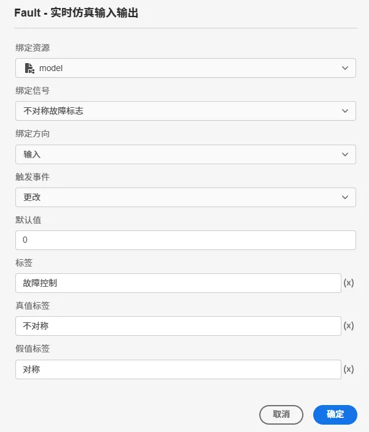
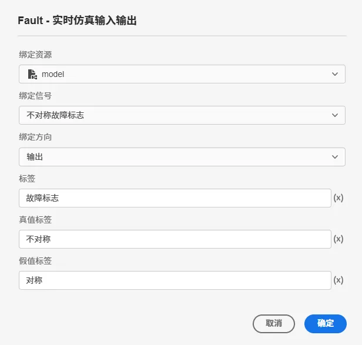

本节主要介绍 **AppStudio** 控件库里的开关控件。

该控件的主要作用包括：

- 作为 FuncStudio 函数资源的输入输出接口，用于给**函数传参**或**接收输出结果**；
- 作为 EMTLab 模型资源实时电磁暂态仿真任务（只适用于实时仿真器）的输入输出接口，用于**修改虚拟输入端口的值**或**接收虚拟输出端口的值**。

## 属性

**CloudPSS** 提供了一套统一的控件属性参数

### 通用样式

import CommonStyle from '../../60-grid/_common-style.md'

<CommonStyle />

### 样式

| 参数名 | 键值 (key) | 单位 | 备注 | 类型 | 描述 |
| :--- | :--- | :--- | :--: | :--- | :--- |
| 文字字体 | `style/font-family` |  | 选择文字字体 | 选择 | 标签文字字体样式，字体类型包括：默认、宋体、黑体、楷体、微软雅黑、Georgia、Palatino Linotype、Times New Roman、Arial、Arial Black、Verdana、Courier New、Trebuchet MS |
| 布局 | `layout` |  | 选择控件布局 | 选择 | 垂直或者水平布局，默认为垂直 |

### 标签样式

| 参数名 | 键值 (key) | 单位 | 备注 | 类型 | 描述 |
| :--- | :--- | :--- | :--: | :--- | :--- |
| 文字字号 | `style/--spectrum-global-dimension-font-size-100` |  | 输入文字字号 | 常量 | 输入文字字号 |
| 文字颜色 | `style/--spectrum-alias-label-text-color` |  | 选择文字颜色 | 颜色选择器 | 点击文字颜色，弹出颜色选择器自定义颜色 |
| 文字粗细 | `style/--spectrum-alias-body-text-font-weight` |  | 选择文字粗细 | 选择 | 选择标签文字粗细，默认、100、200、300、400、500、600、700、800、900、1000 |

### 开关文字样式

| 参数名 | 键值 (key) | 单位 | 备注 | 类型 | 描述 |
| :--- | :--- | :--- | :--: | :--- | :--- |
| 文字字号 | `style/--spectrum-switch-m-text-size` |  | 输入文字字号 | 常量 | 输入文字字号 |
| 默认颜色 | `style/--spectrum-switch-m-text-color` |  | 开关默认颜色 | 颜色选择器 | 点击默认颜色，弹出颜色选择器自定义开关默认颜色 |
| 按下颜色 | `style/--spectrum-switch-m-text-color-down` |  | 开关按下颜色 | 颜色选择器 | 点击按下颜色，弹出颜色选择器自定义开关按下颜色 |
| 悬浮颜色 | `style/--spectrum-switch-m-text-color-hover` |  | 开关悬浮颜色 | 颜色选择器 | 点击悬浮颜色，弹出颜色选择器自定义开关悬浮颜色 |

### 开关样式

| 参数名 | 键值 (key) | 单位 | 备注 | 类型 | 描述 |
| :--- | :--- | :--- | :--: | :--- | :--- |
| 假值导轨颜色 | `style/--spectrum-switch-m-track-color` |  | 假值导轨颜色 | 颜色选择器 | 点击悬浮颜色，弹出颜色选择器自定义假值导轨颜色 |
| 真值导轨颜色 | `style/--spectrum-switch-m-emphasized-track-color-selected` |  | 真值导轨颜色 | 颜色选择器 | 点击悬浮颜色，弹出颜色选择器自定义真值导轨颜色 |
| 假值导轨交互颜色 | `style/--spectrum-switch-m-emphasized-track-color-selected-hover` |  | 假值导轨交互颜色 | 颜色选择器 | 点击悬浮颜色，弹出颜色选择器自定义假值导轨交互颜色 |

### 内容

| 参数名 | 键值 (key) | 单位 | 备注 | 类型 | 描述 |
| :--- | :--- | :--- | :--: | :--- | :--- |
| 标签 | `label` |  | 内容标签 | 常量 | 开关控件文字标签 |
| 禁用 | `disabled` |  | 禁用开关 | 开关 | 禁用选择**开**或者**关**，开启后控件禁止点击和交互，默认为**关** |
| 真值标签 | `trueText` |  | 真值标签 | 常量 | 真值标签 |
| 假值标签 | `falseText` |  | 假值标签 | 常量 | 假值标签 |
| 值 | `value` |  | 开关控件值 | 开关 | 开关控件默认值，默认为**关** |

### 事件

| 参数名 | 键值 (key) | 单位 | 备注 | 类型 | 描述 |
| :--- | :--- | :--- | :--: | :--- | :--- |
| 更改 | `@change` |  | 输入结束时触发事件 | 函数 | 采用更新方式触发，失去焦点后控件的值才会更新 |

## 向导

AppStudio 为开关控件配置了向导功能，选中开关控件，在右侧参数配置区上方点击**向导**图标进入向导界面。

用于引导用户快速配置控件属性，与实时仿真任务的数字量二值输入、输出信号的监控功能灵活绑定，系统会将向导中设置的方案按照特定的表达式**自动写入**开关控件的属性框中，支持快速构建自定义实时态监控应用。支持如下属性的配置：

| 属性配置 | 类型 | 功能描述 |
| :--- | :--- | :--- |
| 绑定资源 | 选择 | 选择资源标签页内添加的模型资源 |
| 绑定信号 | 选择 | 绑定方向为`输入`时，选择模型资源中输入通道；绑定方向为`输出`时，选择模型资源中输出通道 |
| 绑定方向 | 选择 | `输入`：作为实时仿真的数字量二值信号输入控件；`输出`：作为实时仿真的数字量二值信号输出控件，此时开关为只读 |
| 触发事件 | 选择 | 仅当绑定方向为`输入`时可选。`更改`：输入结束，失去控件焦点时触发 |
| 默认值 | 常量（实数） | 开关控件默认值，默认为 0，**关** |
| 真值标签 | 常量 | 真值标签 |
| 假值标签 | 常量 | 假值标签 |

## 案例介绍

import Tabs from '@theme/Tabs';
import TabItem from '@theme/TabItem';

<Tabs>
<TabItem value="case1" label="典型应用">

1. 创建一个开关控件，在右侧的属性配置区内给开关命名为 A

2. 创建静态资源 asset1，值设置为 `false`
   
3. 将输入框 A 的内容/值属性切换到 fx 表达式模式，设置为 `$asset1.value`

4. 点击工具栏的预览快捷按钮（或者 <kbd>Ctrl</kbd> <kbd>P</kbd>），进入预览模式，在预览模式下修改开关 A 的值

:::tip 典型应用使用详情

查看 [AppStudio 应用工坊快速入门](../../../20-quick-start/10-simple-apps/index.md)

:::

</TabItem>

<TabItem value="case2" label="接入 FuncStudio 函数">

1. 创建一个开关，在右侧的属性配置区内给开关命名为 A

2. 创建函数资源 asset2，选择资源类型为函数

3. 配置函数资源 asset2，点击**选择资源**，绑定 `rid` 为 `function/Maxwell/demo` 的示例函数，示例函数存在一个参数 `a`

4. 鼠标选中开关 A 的事件/更改属性栏，按下 <kbd>Ctrl</kbd> 输入 `$asset2.args.a = A.value; $asset2.start()`

5. 点击工具栏的预览快捷按钮（或者 <kbd>Ctrl</kbd> <kbd>P</kbd>），进入预览模式，在预览模式下修改开关 A 的值

:::tip FuncStudio 函数使用详情

查看 [FuncStudio 函数工坊使用指南](../../../../30-funcstudio/10-user-guide/index.md)

:::

</TabItem>

<TabItem value="case3" label="实时仿真输入输出向导配置">

1. 在资源标签页内添加需要进行实时仿真的 SimStudio 模型资源，具体的模型资源添加方法参见[资源标签页](../../../40-workbench/20-function-zone/20-asset-tab/index.md)。

2. 可通过向导功能进行**实时仿真输入输出**的属性配置
   
- 选中开关控件，在右侧参数配置区上方点击向导图标进入向导界面

<!--  -->

- 点击**绑定资源**选择器，选项中会自动加载出所有函数资源和模型资源，选择需要进行实时仿真的 SimStudio 模型资源；

- 选中模型资源后，**绑定信号**选择器的选项中会自动加载出该模型的所有虚拟输入端口和虚拟输出端口名称，选择需要绑定的端口名称；
  
- 如果选择了虚拟输入端口，则将**绑定方向**选择器配置为输入，如果选择了虚拟输出端口，则将**绑定方向**选择器配置为输出；

- 对于虚拟输入端口，可以选择触发方式：更改（采用输入方式触发，只要控件内容发生变化，控件的值就会实时更新）或者输入（采用更新方式触发，失去焦点后控件的值才会更新）；
  
- 点击向导界面的确定按钮后，会将向导中设置的方案按照特定的表达式写入开关控件的属性框中。
<!-- 对于熟练使用表达式的用户，也可以参照表达式自己配置 -->

对于输入信号，进入预览模式，通过切换选项，实时下发不同选项的0、1数字量输入信号

<!-- 通过修改输入框的值即可在实时仿真过程中实时控制所绑定的虚拟输入端口的值。 -->

<!--  -->

对于输出信号，进入预览模式，即可在仿真过程中通过开关实时显示所绑定的0、1数字量输出信号的值。

<!--  -->

具体的操作流程参见[实时仿真案例](../../../70-case-study/50-emt-rt-apps/index.md)。

  <!--  -->

</TabItem>
</Tabs>

## 常见问题

import Fx from '../../60-grid/_expression.md'

<Fx />

import Event from '../../60-grid/_event.md'

<Event />