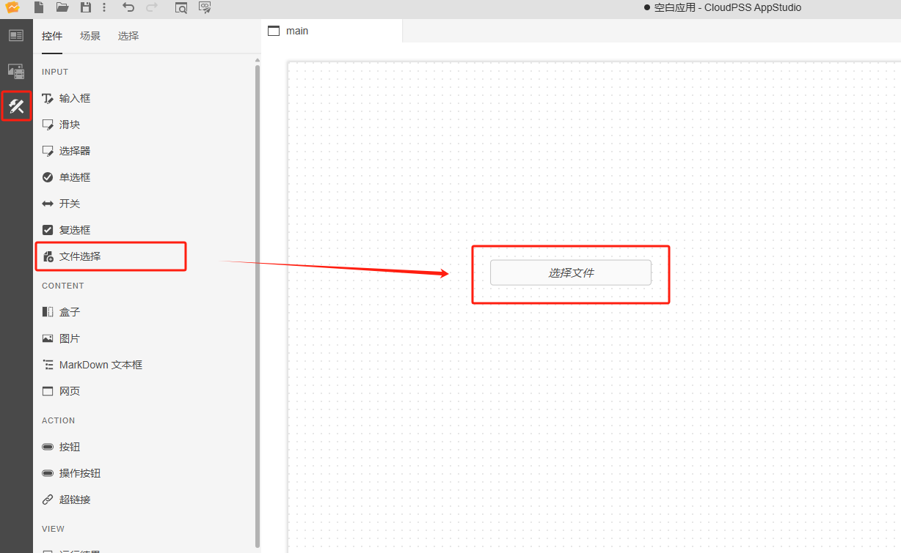
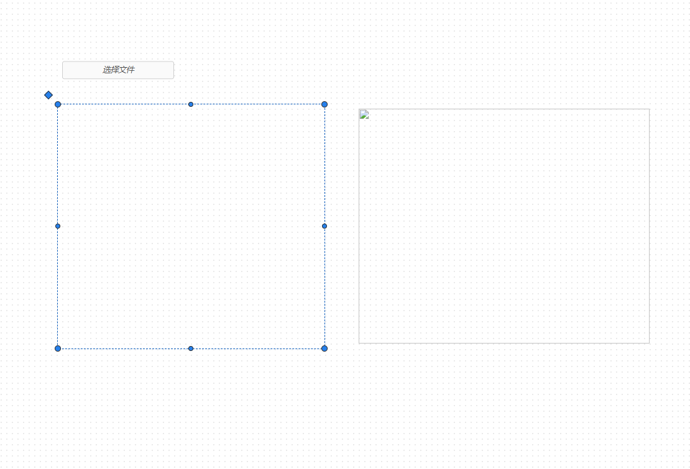
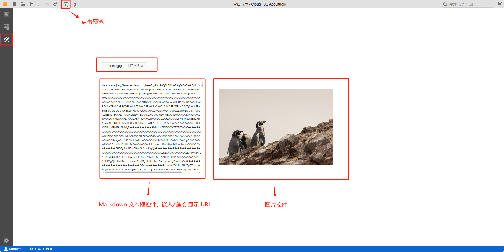
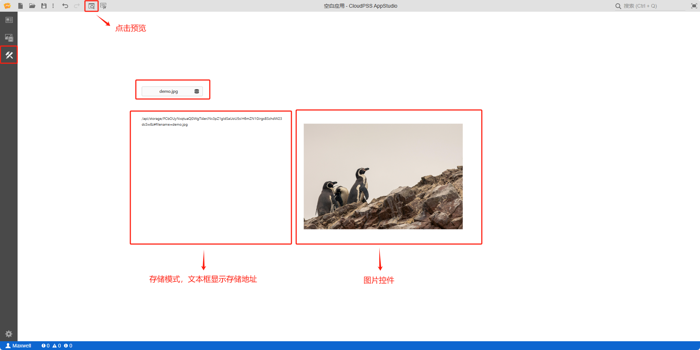
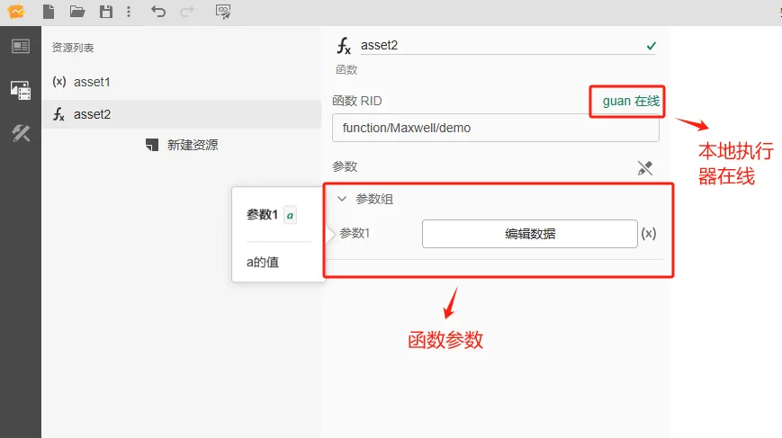
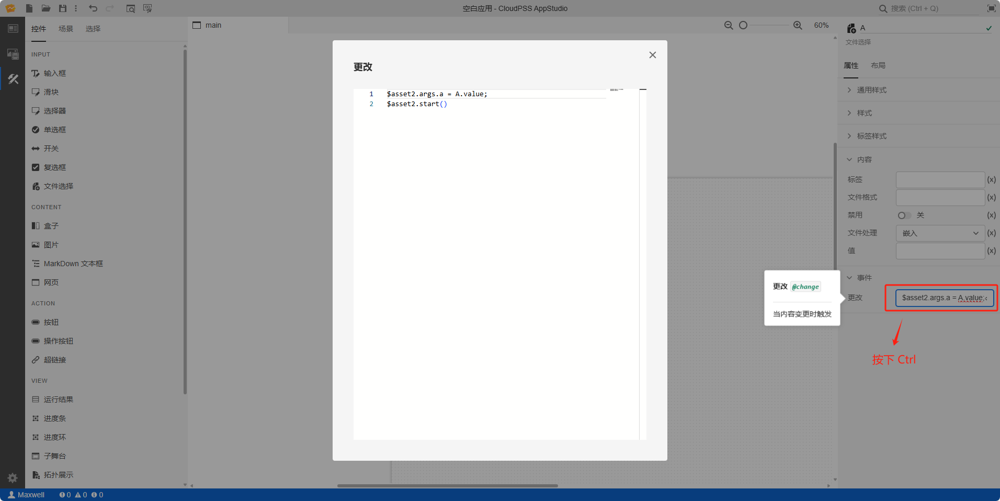
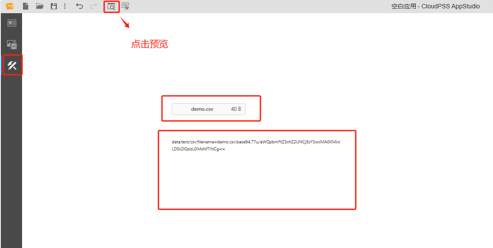

本节主要介绍 **AppStudio** 控件库里的文件选择控件。

## 属性

**CloudPSS** 提供了一套统一的控件属性参数

### 通用样式

import CommonStyle from '../../60-grid/_common-style.md'

<CommonStyle />

### 样式

| 参数名 | 键值 (key) | 单位 | 备注 | 类型 | 描述 |
| :--- | :--- | :--- | :--: | :--- | :--- |
| 布局 | `layout` |  | 选择控件布局 | 选择 | 垂直或者水平布局，默认为垂直 |
| 安静 | `quiet` |  | 选择是否安静 | 选择 | 选择**是**或者**否**，默认为**否**状态 |

### 标签样式

| 参数名 | 键值 (key) | 单位 | 备注 | 类型 | 描述 |
| :--- | :--- | :--- | :--: | :--- | :--- |
| 文字字体 | `style/font-family` |  | 选择文字字体 | 选择 | 标签文字字体样式，字体类型包括：默认、宋体、黑体、楷体、微软雅黑、Georgia、Palatino Linotype、Times New Roman、Arial、Arial Black、Verdana、Courier New、Trebuchet MS |
| 文字字号 | `style/--spectrum-global-dimension-font-size-100` |  | 输入文字字号 | 常量 | 输入文字字号 |
| 文字颜色 | `style/--spectrum-alias-label-text-color` |  | 选择文字颜色 | 颜色选择器 | 点击文字颜色，弹出颜色选择器自定义颜色 |
| 文字粗细 | `style/--spectrum-alias-body-text-font-weight` |  | 选择文字粗细 | 选择 | 选择标签文字粗细，默认、100、200、300、400、500、600、700、800、900、1000 |

### 内容

| 参数名 | 键值 (key) | 单位 | 备注 | 类型 | 描述 |
| :--- | :--- | :--- | :--: | :--- | :--- |
| 标签 | `label` |  | 内容标签 | 常量 | 输入框控件文字标签 |
| 文件格式 | `accept` |  | 文件格式 | 字符串 | 逗号分隔的拓展名列表 |
| 禁用 | `disabled` |  | 禁用开关 | 开关 | 禁用选择**开**或者**关**，开启后控件禁止点击和交互，默认为**关** |
| 文件处理 | `preference` |  | 首选的文件处理方式 | 常量 | **嵌入**：将文件嵌入输入数据中；**存储**：将文件上传到 CloudPSS 存储服务器；**链接**：以外部链接的形式引用文件。默认为**嵌入** |
| 值 | `value` |  | 文件选择控件默认内容 | Data URL / 字符串 |  文件选择控件默认内容。 **嵌入**和**链接**格式形如 `data:[<mediatype>][;base64],<data>`；**存储**格式形如 `api/storage/...` |

### 事件

| 参数名 | 键值 (key) | 单位 | 备注 | 类型 | 描述 |
| :--- | :--- | :--- | :--: | :--- | :--- |
| 更改 | `@change` |  | 输入结束时触发事件 | 函数 | 采用更新方式触发，失去焦点后控件的值才会更新 |

## 案例介绍

### 上传一张 jpg 格式的图片

1. 创建一个文件选择控件，在右侧的属性配置区内给文件选择命名为 A

2. 创建一个 Markdown 文本框控件用来显示上传的文件的 url 或者存储地址，在右侧的属性配置区内给文件选择命名为 B，将 B 的内容/值属性切换到 fx 表达式模式，设置为 `A.value`

3. 创建一个图片控件用来显示图片，在右侧的属性配置区内给文件选择命名为 C， 将 C 的内容/值属性切换到 fx 表达式模式，设置为 `A.value`

4. 点击工具栏的预览快捷按钮(或者 <kbd>Ctrl</kbd> + <kbd>P</kbd> )，进入预览模式，在预览模式下上传文件

### 上传 CSV 文件，接入 FuncStudio 函数调用

1. 创建一个文件选择控件，在右侧的属性配置区内给文件选择命名为 A

2. 创建函数资源 asset2，选择资源类型为函数

3. 配置函数资源 asset2，点击`选择资源`，绑定 `rid` 为 `function/Maxwell/demo` 的示例函数，示例函数存在一个参数 `a`

4. 鼠标选中文件选择 A 的事件/更改属性栏，按下<kbd> Ctrl </kbd> 输入 `$asset2.args.a = A.value; $asset2.start()`

5. 点击工具栏的预览快捷按钮(或者 <kbd>Ctrl</kbd> + <kbd>P</kbd> )，进入预览模式，在预览模式下上传文件

:::tip 典型应用使用详情

查看 [AppStudio 应用工坊快速入门](../../../20-quick-start/10-simple-apps/index.md)

:::

## 常见问题

上传的文件是否有格式限制？

:   无格式限制

上传的文件是否有数据大小限制？

:   有数据大小限制，默认限制为 32 MB

import Fx from '../../60-grid/_expression.md'

<Fx />

import Event from '../../60-grid/_event.md'

<Event />