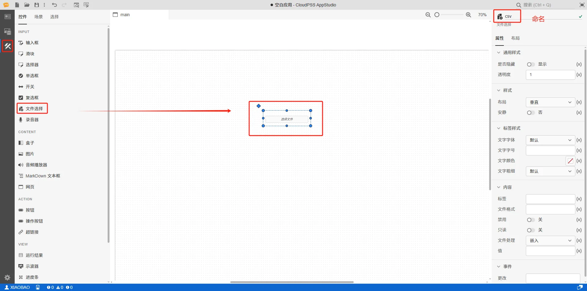
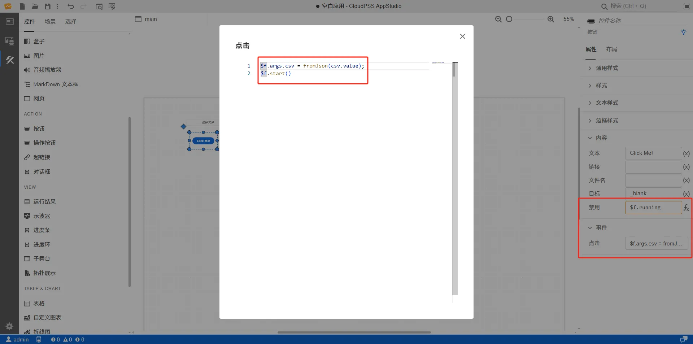

本节主要介绍 **AppStudio** 控件库里的文件选择控件。


## 属性

**CloudPSS** 提供了一套统一的控件属性参数

### 通用样式

import CommonStyle from '../../60-grid/_common-style.md'

<CommonStyle />

### 样式

| 参数名 | 键值 (key) | 单位 | 备注 | 类型 | 描述 |
| :--- | :--- | :--- | :--: | :--- | :--- |
| 布局 | `layout` |  | 选择控件布局 | 选择 | 垂直或者水平布局，默认为垂直 |
| 安静 | `quiet` |  | 选择是否安静 | 选择 | 选择**是**或者**否**，默认为**否**状态 |

### 标签样式

| 参数名 | 键值 (key) | 单位 | 备注 | 类型 | 描述 |
| :--- | :--- | :--- | :--: | :--- | :--- |
| 文字字体 | `style/font-family` |  | 选择文字字体 | 选择 | 标签文字字体样式，字体类型包括：默认、宋体、黑体、楷体、微软雅黑、Georgia、Palatino Linotype、Times New Roman、Arial、Arial Black、Verdana、Courier New、Trebuchet MS |
| 文字字号 | `style/--spectrum-global-dimension-font-size-100` |  | 输入文字字号 | 常量 | 输入文字字号 |
| 文字颜色 | `style/--spectrum-alias-label-text-color` |  | 选择文字颜色 | 颜色选择器 | 点击文字颜色，弹出颜色选择器自定义颜色 |
| 文字粗细 | `style/--spectrum-alias-body-text-font-weight` |  | 选择文字粗细 | 选择 | 选择标签文字粗细，默认、100、200、300、400、500、600、700、800、900、1000 |

### 内容

| 参数名 | 键值 (key) | 单位 | 备注 | 类型 | 描述 |
| :--- | :--- | :--- | :--: | :--- | :--- |
| 标签 | `label` |  | 内容标签 | 常量 | 输入框控件文字标签 |
| 文件格式 | `accept` |  | 文件格式 | 字符串 | 逗号分隔的拓展名列表 |
| 禁用 | `disabled` |  | 禁用开关 | 开关 | 禁用选择**开**或者**关**，开启后控件禁止点击和交互，默认为**关** |
| 文件处理 | `preference` |  | 首选的文件处理方式 | 常量 | **嵌入**：将文件嵌入输入数据中；**存储**：将文件上传到 CloudPSS 存储服务器；**链接**：以外部链接的形式引用文件。默认为**嵌入** |
| 值 | `value` |  | 文件选择控件默认内容 | Data URL / 字符串 |  文件选择控件默认内容。 **嵌入**和**链接**格式形如 `data:[<mediatype>][;base64],<data>`；**存储**格式形如 `api/storage/...` |


### 事件

| 参数名 | 键值 (key) | 单位 | 备注 | 类型 | 描述 |
| :--- | :--- | :--- | :--: | :--- | :--- |
| 更改 | `@change` |  | 输入结束时触发事件 | 函数 | 采用更新方式触发，失去焦点后控件的值才会更新 |

## 案例介绍

### 上传一张 jpg 格式的图片

1. 创建一个文件选择控件，在右侧的属性配置区内给文件选择命名为 A

2. 创建一个 Markdown 文本框控件用来显示上传的文件的 url 或者存储地址，在右侧的属性配置区内给文件选择命名为 B，将 B 的内容/值属性切换到 fx 表达式模式，设置为 `A.value`。详情查看 [MarkDown 文本框控件](../../20-content/30-markdown-text-box/index.md)

3. 创建一个图片控件用来显示图片，在右侧的属性配置区内给文件选择命名为 C， 将 C 的内容/值属性切换到 fx 表达式模式，设置为 `A.value`。详情查看[图片控件](../../20-content/20-image/index.md)


4. 点击工具栏的预览快捷按钮(或者 <kbd>Ctrl</kbd> + <kbd>P</kbd> )，进入预览模式，在预览模式下上传文件


:::tip 典型应用使用详情

查看 [AppStudio 应用工坊快速入门](../../../20-quick-start/10-simple-apps/index.md)

:::


### 上传 CSV 文件，接入 FuncStudio 函数调用

1. 创建一个文件选择控件，在右侧的属性配置区内给文件选择命名为 csv
   


1. 创建函数资源，选择资源类型为函数，配置函数资源名称为 f，点击`选择资源`，绑定一个解析 base64编码的 python 内核函数，该函数存在一个参数 `csv`用于接收文件的值


该 python 内核的功能是解析 csv文件的 base64编码和后利用 plot 方法绘制曲线，完整代码如下所示：

```py showLineNumbers
import cloudpss
import base64
import pandas as pd
from io import StringIO

if __name__ == "__main__":
    job = cloudpss.currentJob()
    # 原始 base64 字符串（含 data URI 前缀）
    csv = job.args.csv
    job.log(csv, key='log-1')
    # 去除 data URI 前缀
    base64_str = csv.split(",")[1]
    # 解码为原始 CSV 字符串
    decoded_bytes = base64.b64decode(base64_str)
    csv_text = decoded_bytes.decode("utf-8")
    # 使用 StringIO 转为文件对象
    csv_buffer = StringIO(csv_text)
    # 读取为 DataFrame
    df = pd.read_csv(csv_buffer, header=None)
    col0 = df.iloc[:, 0]  # 第一列
    col1 = df.iloc[:, 1]  # 第二列
    t = {
        "name":"时序曲线",
        "type":"scatter",
        "x": col0.tolist(),
        "y": col1.tolist()
    }
    job.plot([t], title='时序曲线', key='plot-1')
```


1. 创建一个按钮，用于启动选择资源 f，鼠标选中按钮控件的事件/更改属性栏，按下<kbd> Ctrl </kbd> 输入 `$f.args.csv = fromJson(csv.value);$f.start()`表达式
   


1. 创建两个运行结果框分别用于显示 csv 文件的 base64 编码和解析后利用 plot 方法绘制的曲线
   


1. 点击工具栏的预览快捷按钮(或者 <kbd>Ctrl</kbd> + <kbd>P</kbd> )，进入预览模式，在预览模式下上传文件


:::tip FuncStudio 函数使用详情

查看 [FuncStudio 函数工坊使用指南](../../../../30-funcstudio/10-user-guide/index.md)

:::


## 常见问题


上传的文件是否有格式限制？

:   无格式限制


上传的文件是否有数据大小限制？

:   有数据大小限制，默认限制为 32 MB


import Fx from '../../60-grid/_expression.md'

<Fx />


import Event from '../../60-grid/_event.md'

<Event />