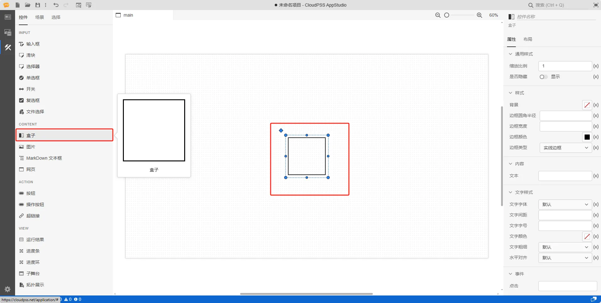

本节主要介绍 **AppStudio** 控件库里的盒子控件。

## 属性

**CloudPSS** 提供了一套统一的控件属性参数

### 通用样式

import CommonStyle from '../../60-grid/_common-style.md'

<CommonStyle />

### 样式

| 参数名 | 键值 (key) | 单位 | 备注 | 类型 | 描述 |
| :--- | :--- | :--- | :--: | :--- | :--- |
| 背景 | `style/background` |  | 样式背景 | 颜色选择器 | 点击文字颜色，弹出颜色选择器自定义背景颜色 |
| 边框圆角半径 | `style/border-radius` | `px`、`cm`、`em`、`rem` | 输入边框圆角半径 | 常量 | 输入边框圆角半径 |
| 边框宽度 | `style/border-width` | `px`、`cm`、`em`、`rem` | 输入边框宽度 | 常量 | 输入边框宽度 |
| 边框颜色 | `style/border-color` |  | 边框颜色 | 颜色选择器 | 点击文字颜色，弹出颜色选择器自定义边框颜色 |
| 边框类型 | `style/border-style` |  | 边框类型 | 选择 | 边框类型分为：默认、无边框、虚线边框、实线边框、双重边框、3 D 沟槽边框、3 D 脊边框、3 D 突出边框、3 D 嵌入边框，默认为实线边框 |

### 内容

| 参数名 | 键值 (key) | 单位 | 备注 | 类型 | 描述 |
| :--- | :--- | :--- | :--: | :--- | :--- |
| 文本 | `innerText` |  | 盒子控件文本内容 | 常量 | 盒子控件文本内容 |

### 文字样式

| 参数名 | 键值 (key) | 单位 | 备注 | 类型 | 描述 |
| :--- | :--- | :--- | :--: | :--- | :--- |
| 文字字体 | `style/font-family` |  | 选择文字字体 | 选择 | 文字字体样式，字体类型包括：默认、宋体、黑体、楷体、微软雅黑、Georgia、Palatino Linotype、Times New Roman、Arial、Arial Black、Verdana、Courier New、Trebuchet MS |
| 文字间距 | `style/letter-spacing` |  | 输入文字间距 | 常量 | 文字间距 |
| 文字字号 | `style/font-size` |  | 输入文字字号 | 常量 | 输入文字字号 |
| 文字颜色 | `style/color` |  | 选择文字颜色 | 颜色选择器 | 点击文字颜色，弹出颜色选择器自定义颜色 |
| 文字粗细 | `style/font-weight` |  | 选择文字粗细 | 选择 | 选择文字粗细，默认、100、200、300、400、500、600、700、800、900、1000 |
| 水平对齐 | `style/text-align` |  | 选择文字水平对齐方式 | 选择 | 水平对齐方式：默认、居中、靠右 |

### 事件

| 参数名 | 键值 (key) | 单位 | 备注 | 类型 | 描述 |
| :--- | :--- | :--- | :--: | :--- | :--- |
| 点击 | `@click` |  | 当点击时触发 | 函数 | 采用点击方式触发函数 |

<!-- ## 案例介绍 -->

## 常见问题

import Fx from '../../60-grid/_expression.md'

<Fx />

import Event from '../../60-grid/_event.md'

<Event />
