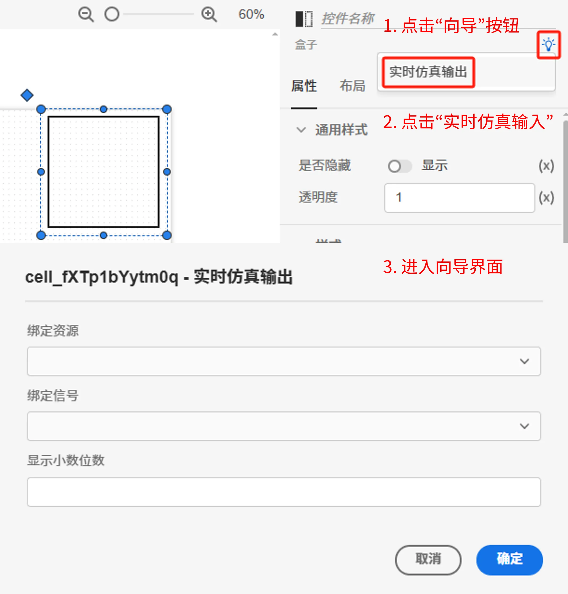

本节主要介绍 **AppStudio** 控件库里的盒子控件。

该控件的主要作用包括：

- 作为 FuncStudio 函数资源的输出接口，用于**接收函数输出结果**；
- 作为 EMTLab 模型资源实时电磁暂态仿真任务（只适用于实时仿真器）的输出接口，用于**接收虚拟输出端口的值**。

## 属性

**CloudPSS** 提供了一套统一的控件属性参数

### 通用样式

import CommonStyle from '../../60-grid/_common-style.md'

<CommonStyle />

### 样式

| 参数名 | 键值 (key) | 单位 | 备注 | 类型 | 描述 |
| :--- | :--- | :--- | :--: | :--- | :--- |
| 背景 | `style/background` |  | 样式背景 | 颜色选择器 | 点击文字颜色，弹出颜色选择器自定义背景颜色 |
| 边框圆角半径 | `style/border-radius` | px、cm、em、rem | 输入边框圆角半径 | 常量 | 输入边框圆角半径 |
| 边框宽度 | `style/border-width` | px、cm、em、rem | 输入边框宽度 | 常量 | 输入边框宽度 |
| 边框颜色 | `style/border-color` |  | 边框颜色 | 颜色选择器 | 点击文字颜色，弹出颜色选择器自定义边框颜色 |
| 边框类型 | `style/border-style` |  | 边框类型 | 选择 | 边框类型分为：默认、无边框、虚线边框、实线边框、双重边框、3D 沟槽边框、3D 脊边框、3D 突出边框、3D 嵌入边框，默认为实线边框 |

### 内容

| 参数名 | 键值 (key) | 单位 | 备注 | 类型 | 描述 |
| :--- | :--- | :--- | :--: | :--- | :--- |
| 文本 | `innerText` |  | 盒子控件文本内容 | 常量 | 盒子控件文本内容 |

### 文字样式

| 参数名 | 键值 (key) | 单位 | 备注 | 类型 | 描述 |
| :--- | :--- | :--- | :--: | :--- | :--- |
| 文字字体 | `style/font-family` |  | 选择文字字体 | 选择 | 文字字体样式，字体类型包括：默认、宋体、黑体、楷体、微软雅黑、Georgia、Palatino Linotype、Times New Roman、Arial、Arial Black、Verdana、Courier New、Trebuchet MS |
| 文字间距 | `style/letter-spacing` |  | 输入文字间距 | 常量 | 文字间距 |
| 文字字号 | `style/font-size` |  | 输入文字字号 | 常量 | 输入文字字号 |
| 文字颜色 | `style/color` |  | 选择文字颜色 | 颜色选择器 | 点击文字颜色，弹出颜色选择器自定义颜色 |
| 文字粗细 | `style/font-weight` |  | 选择文字粗细 | 选择 | 选择文字粗细，默认、100、200、300、400、500、600、700、800、900、1000 |
| 水平对齐 | `style/text-align` |  | 选择文字水平对齐方式 | 选择 | 水平对齐方式：默认、居中、靠右 |

### 事件

| 参数名 | 键值 (key) | 单位 | 备注 | 类型 | 描述 |
| :--- | :--- | :--- | :--: | :--- | :--- |
| 点击 | `@click` |  | 当点击时触发 | 函数 | 采用点击方式触发函数 |

## 向导

AppStudio 为盒子控件配置了向导功能，选中盒子控件，在右侧参数配置区上方点击**向导**图标进入向导界面。

用于引导用户快速配置控件属性，与实时仿真任务的输出信号的监控功能灵活绑定，系统会将向导中设置的方案按照特定的表达式**自动写入**盒子控件的属性框中，支持快速构建自定义实时态监控应用。支持如下属性的配置：

| 属性配置 | 类型 | 功能描述 |
| :--- | :--- | :--- |
| 绑定资源 | 选择 | 选择资源标签页内添加的模型资源 |
| 绑定信号 | 选择 | 选择模型资源中输出通道 |
| 显示小数位数 | 常量（实数） | 显示小数位数 |

## 案例介绍

import Tabs from '@theme/Tabs';
import TabItem from '@theme/TabItem';

<Tabs>
<TabItem value="case1" label="实时仿真输出向导配置">

1. 在资源标签页内添加需要进行实时仿真的 SimStudio 模型资源，具体的模型资源添加方法参见[资源标签页](../../../40-workbench/20-function-zone/20-asset-tab/index.md)。

2. 可通过向导功能进行**实时仿真输出**的属性配置
   
- 选中盒子控件，在右侧参数配置区上方点击向导图标进入向导界面

<!--  -->

- 点击**绑定资源**选择器，选项中会自动加载出所有函数资源和模型资源，选择需要进行实时仿真的 SimStudio 模型资源；

- 选中模型资源后，**绑定信号**选择器的选项中会自动加载出该模型的所有虚拟输出端口名称，选择需要绑定的端口名称；

- 填写小数位数;
  
- 点击向导界面的确定按钮后，会将向导中设置的方案按照特定的表达式写入盒子控件的属性框中。
  
<!-- 对于熟练使用表达式的用户，也可以参照表达式自己配置 -->

<!-- 对于输入信号，进入预览模式，通过切换选项，实时下发不同选项的0、1数字量输入信号 -->

<!-- 通过修改输入框的值即可在实时仿真过程中实时控制所绑定的虚拟输入端口的值。 -->

<!--  -->

<!--  -->

进入预览模式，即可在仿真过程中通过盒子实时显示所绑定输出信号的值。

<!--  -->

具体的操作流程参见[实时仿真案例](../../../70-case-study/50-emt-rt-apps/index.md)。

  <!--  -->

</TabItem>
</Tabs>

<!-- ### 颜色选择器类型

import ColorPicker from '../../60-grid/_color-picker.md' -->

<!-- <ColorPicker /> -->

## 常见问题

import Fx from '../../60-grid/_expression.md'

<Fx />

import Event from '../../60-grid/_event.md'

<Event />
