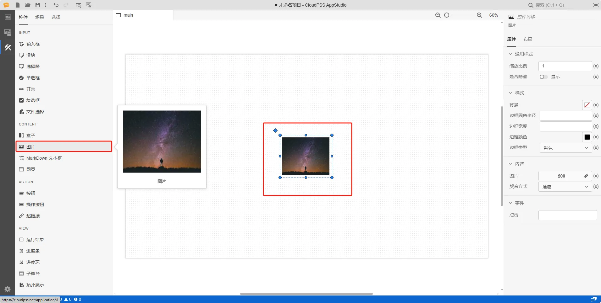
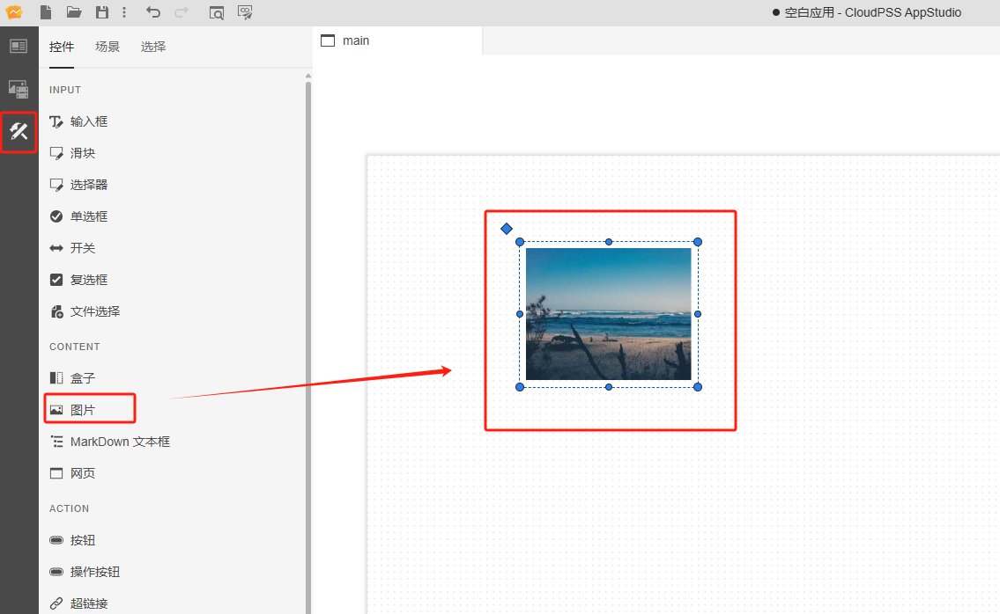
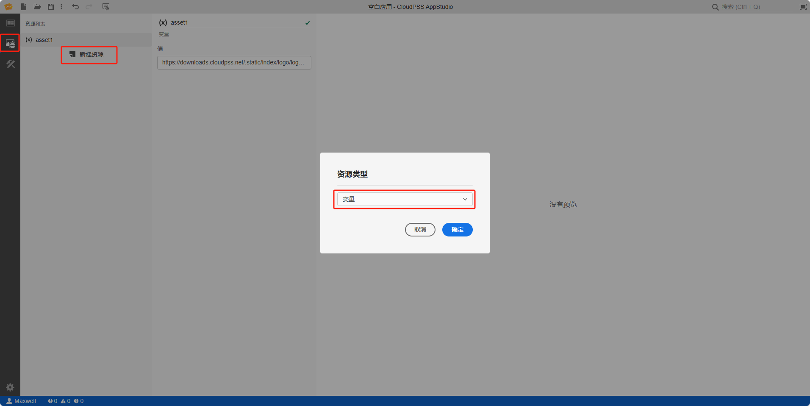
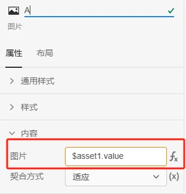
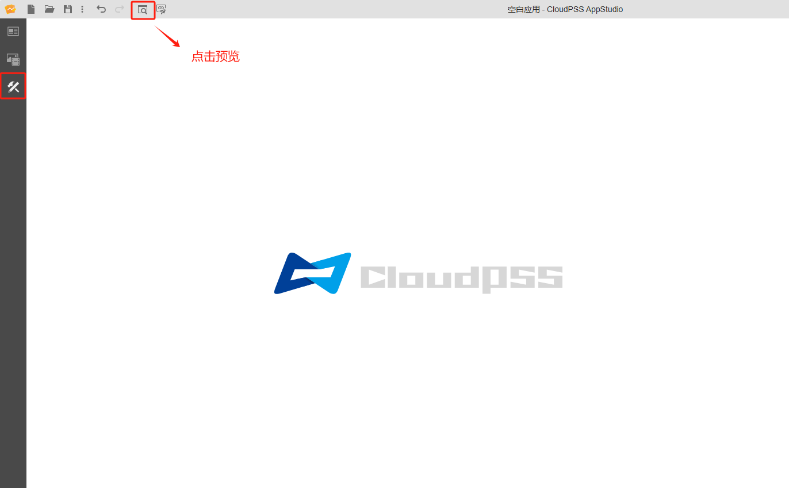

本节主要介绍 **AppStudio** 控件库里的图片控件。

## 属性

**CloudPSS** 提供了一套统一的控件属性参数

### 通用样式

import CommonStyle from '../../60-grid/_common-style.md'

<CommonStyle />

### 样式

| 参数名 | 键值 (key) | 单位 | 备注 | 类型 | 描述 |
| :--- | :--- | :--- | :--: | :--- | :--- |
| 背景 | `style/background` |  | 样式背景 | 颜色选择器 | 点击文字颜色，弹出颜色选择器自定义背景颜色 |
| 边框圆角半径 | `style/border-radius` | `px`、`cm`、`em`、`rem` | 输入边框圆角半径 | 常量 | 输入边框圆角半径 |
| 边框宽度 | `style/border-width` | `px`、`cm`、`em`、`rem` | 输入边框宽度 | 常量 | 输入边框宽度 |
| 边框颜色 | `style/border-color` |  | 边框颜色 | 颜色选择器 | 点击文字颜色，弹出颜色选择器自定义边框颜色 |
| 边框类型 | `style/border-style` |  | 边框类型 | 选择 | 边框类型分为：默认、无边框、虚线边框、实线边框、双重边框、3 D 沟槽边框、3 D 脊边框、3 D 突出边框、3 D 嵌入边框，默认为实线边框 |

### 内容

| 参数名 | 键值 (key) | 单位 | 备注 | 类型 | 描述 |
| :--- | :--- | :--- | :--: | :--- | :--- |
| 图片 | `src` |  | 上传文件控件/图片链接 | 上传文件控件/链接 | 默认模式为上传文件控件 |
| 契合方式 | `style/object-fit` |  | 图片填充契合方式 | 选择 | 契合方式分为：填充、适应、拉伸、居中、适应/居中，默认为适应 |

### 事件

| 参数名 | 键值 (key) | 单位 | 备注 | 类型 | 描述 |
| :--- | :--- | :--- | :--: | :--- | :--- |
| 点击 | `@click` |  | 当点击时触发 | 函数 | 采用点击方式触发函数 |

## 案例介绍

### 典型应用

1. 创建一个图片控件，在右侧的属性配置区内给图片命名为 A

2. 创建静态资源 asset1，值设置为 `/api/storage/PCbOUyNxqtuaQGWgTi4erJNx3pZ1gldSaUoU5sIH6mZN1GirgsBSchdW23dcSw8z#filename=demo.jpg`
   
3. 将输入框 A 的内容/值属性切换到 fx 表达式模式，设置为 `$asset1.value`

4. 点击工具栏的预览快捷按钮(或者 <kbd>Ctrl</kbd> + <kbd>P</kbd> )，进入预览模式，在预览模式下显示图片 A 的内容

:::tip 典型应用使用详情

查看 [AppStudio 应用工坊快速入门](../../../20-quick-start/10-simple-apps/index.md)

:::

## 常见问题

import Fx from '../../60-grid/_expression.md'

<Fx />

import Event from '../../60-grid/_event.md'

<Event />
