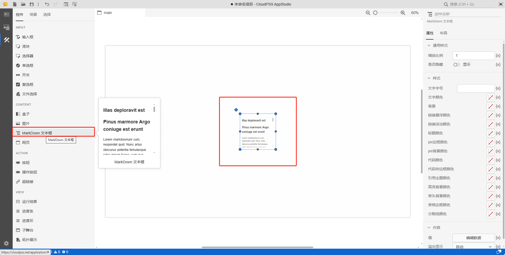
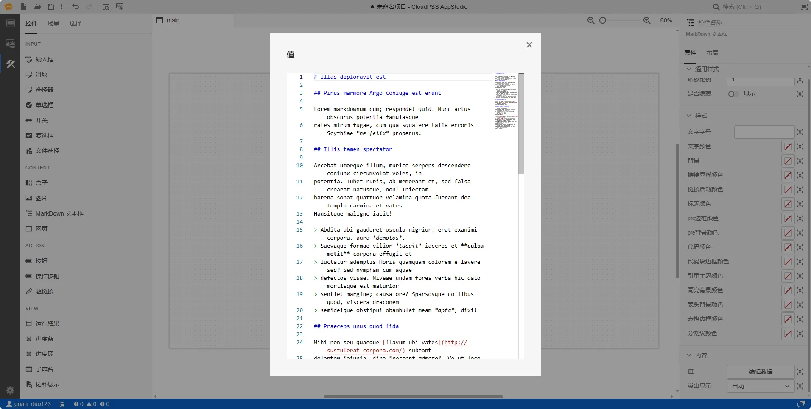

本节主要介绍 AppStudio 控件库里的 MarkDown 文本框控件。

## 属性

**CloudPSS** 提供了一套统一的控件属性参数

### 通用样式

import CommonStyle from '../../60-grid/_common-style.md'

<CommonStyle />

### 样式

| 参数名 | 键值 (key) | 单位 | 备注 | 类型 | 描述 |
| :--- | :--- | :--- | :--: | :--- | :--- |
| 文字字号 | `style/font-size` |  | 输入文字字号 | 常量 | 输入文字字号 |
| 文字颜色 | `style/color` |  | 选择文字颜色 | 颜色选择器 | 点击文字颜色，弹出颜色选择器自定义颜色 |
| 背景 | `style/background` |  | 样式背景 | 颜色选择器 | 点击文字颜色，弹出颜色选择器自定义背景颜色 |
| 链接悬浮颜色 | `style/--cwe-markdown-link-hover-color` |  | 链接悬浮颜色 | 颜色选择器 | 点击文字颜色，弹出颜色选择器自定义链接悬浮颜色 |
| 链接活动颜色 | `style/--cwe-markdown-link-active-color` |  | 链接活动颜色 | 颜色选择器 | 点击文字颜色，弹出颜色选择器自定义链接活动颜色 |
| 标题颜色 | `style/--cwe-markdown-header-color` |  | 标题颜色 | 颜色选择器 | 点击文字颜色，弹出颜色选择器自定义标题颜色 |
| pre边框颜色 | `style/--cwe-markdown-pre-border-color` |  | pre边框颜色 | 颜色选择器 | 点击文字颜色，弹出颜色选择器自定义pre边框颜色 |
| pre背景颜色 | `style/--cwe-markdown-pre-background-color` |  | pre背景颜色 | 颜色选择器 | 点击文字颜色，弹出颜色选择器自定义pre背景颜色 |
| 代码颜色 | `style/--cwe-markdown-code-color` |  | 代码颜色 | 颜色选择器 | 点击文字颜色，弹出颜色选择器自定义代码颜色 |
| 代码块边框颜色 | `style/--cwe-markdown-code-border-color` |  | 代码块边框颜色 | 颜色选择器 | 点击文字颜色，弹出颜色选择器自定义代码块边框颜色 |
| 引用主题颜色 | `style/--cwe-markdown-blockquote-theme-color` |  | 引用主题颜色 | 颜色选择器 | 点击文字颜色，弹出颜色选择器自定义引用主题颜色 |
| 高亮背景颜色 | `style/--cwe-markdown-mark-background-color` |  | 高亮背景颜色 | 颜色选择器 | 点击文字颜色，弹出颜色选择器自定义高亮背景颜色 |
| 表头背景颜色 | `style/--cwe-markdown-table-header-background-color` |  | 表头背景颜色 | 颜色选择器 | 点击文字颜色，弹出颜色选择器自定义表头背景颜色 |
| 表格边框颜色 | `style/--cwe-markdown-table-header-border-color` |  | 表格边框颜色 | 颜色选择器 | 点击文字颜色，弹出颜色选择器自定义表格边框颜色 |
| 分割线颜色 | `style/--cwe-markdown-divider-color` |  | 分割线颜色 | 颜色选择器 | 点击文字颜色，弹出颜色选择器自定义分割线颜色 |

### 内容

| 参数名 | 键值 (key) | 单位 | 备注 | 类型 | 描述 |
| :--- | :--- | :--- | :--: | :--- | :--- |
| 值 | `srcdoc` |  | Markdown 文本框控件内容 | 表格 | 点击**编辑数据**按钮，弹出 Markdown 文本框控件内容表格 |
| 溢出显示 | `style/overflow` |  | Markdown 文本框控件溢出显示方式 | 选择 | 文本溢出显示方式分为：自动、滚动、可见、隐藏，默认为自动 |

## 案例介绍

### 颜色选择器类型

import ColorPicker from '../../60-grid/_color-picker.md'

<ColorPicker />

### Markdown 文本框控件内容

## 常见问题

import Fx from '../../60-grid/_expression.md'

<Fx />

import Event from '../../60-grid/_event.md'

<Event />