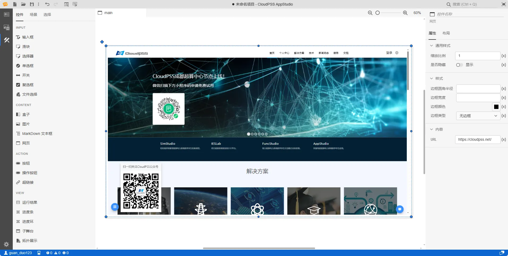

本节主要介绍 AppStudio 控件库里的网页控件。

## 属性

**CloudPSS** 提供了一套统一的控件属性参数

### 通用样式

import CommonStyle from '../../60-grid/_common-style.md'

<CommonStyle />

### 样式

| 参数名 | 键值 (key) | 单位 | 备注 | 类型 | 描述 |
| :--- | :--- | :--- | :--: | :--- | :--- |
| 边框圆角半径 | `style/border-radius` | `px`、`cm`、`em`、`rem` | 输入边框圆角半径 | 常量 | 输入边框圆角半径 |
| 边框宽度 | `style/border-width` | `px`、`cm`、`em`、`rem` | 输入边框宽度 | 常量 | 输入边框宽度 |
| 边框颜色 | `style/border-color` |  | 边框颜色 | 颜色选择器 | 点击文字颜色，弹出颜色选择器自定义边框颜色 |
| 边框类型 | `style/border-style` |  | 边框类型 | 选择 | 边框类型分为：默认、无边框、虚线边框、实线边框、双重边框、3 D 沟槽边框、3 D 脊边框、3 D 突出边框、3 D 嵌入边框，默认为实线边框 |

### 内容

| 参数名 | 键值 (key) | 单位 | 备注 | 类型 | 描述 |
| :--- | :--- | :--- | :--: | :--- | :--- |
| URL | `src` |  | 输入网页链接 | 常量 | 输入网页链接，例如：https://cloudpss.net |

## 案例介绍

### 颜色选择器类型

import ColorPicker from '../../60-grid/_color-picker.md'

<ColorPicker />

### 嵌套一个网页

1. 在 URL 中输入 `https://cloudpss.net/` 链接地址，调整一下页面大小，如下图所示

2. 点击预览，或者快捷键 <kbd>Ctrl</kbd> + <kbd>P</kbd>

## 常见问题

import Fx from '../../60-grid/_expression.md'

<Fx />

import Event from '../../60-grid/_event.md'

<Event />