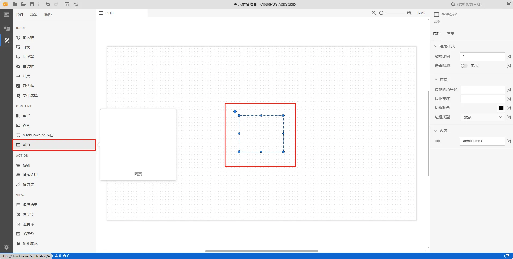
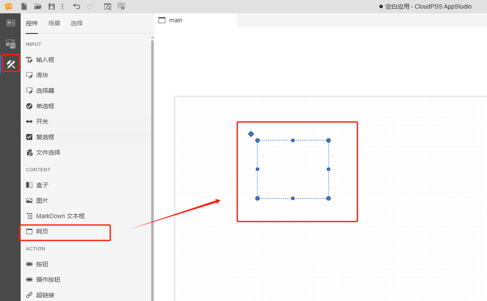
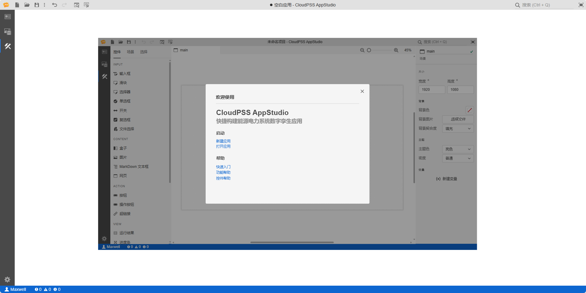

本节主要介绍 AppStudio 控件库里的网页控件。

## 属性

**CloudPSS** 提供了一套统一的控件属性参数

### 通用样式

import CommonStyle from '../../60-grid/_common-style.md'

<CommonStyle />

### 样式

| 参数名 | 键值 (key) | 单位 | 备注 | 类型 | 描述 |
| :--- | :--- | :--- | :--: | :--- | :--- |
| 边框圆角半径 | `style/border-radius` | px、cm、em、rem
 | 输入边框圆角半径 | 常量 | 输入边框圆角半径 |
| 边框宽度 | `style/border-width` | px、cm、em、rem | 输入边框宽度 | 常量 | 输入边框宽度 |
| 边框颜色 | `style/border-color` |  | 边框颜色 | 颜色选择器 | 点击文字颜色，弹出颜色选择器自定义边框颜色 |
| 边框类型 | `style/border-style` |  | 边框类型 | 选择 | 边框类型分为：默认、无边框、虚线边框、实线边框、双重边框、3D 沟槽边框、3D 脊边框、3D 突出边框、3D 嵌入边框，默认为实线边框 |

### 内容

| 参数名 | 键值 (key) | 单位 | 备注 | 类型 | 描述 |
| :--- | :--- | :--- | :--: | :--- | :--- |
| URL | `src` |  | 输入网页链接 | 常量 | 输入网页链接，例如：https://cloudpss.net |

## 案例介绍

### 嵌套一个网页

1. 创建一个网页控件，在右侧的属性配置区内给网页命名为 A

2. 在 内容/URL 属性栏中输入 `www.cloudpss.net` 链接地址，调整一下页面大小，如下图所示

3. 点击工具栏的预览快捷按钮(或者 <kbd>Ctrl</kbd> + <kbd>P</kbd> )，进入预览模式，在预览模式下显示嵌套的网页

:::tip 典型应用使用详情

查看 [AppStudio 应用工坊快速入门](../../../20-quick-start/10-simple-apps/index.md)

:::

## 常见问题

import Fx from '../../60-grid/_expression.md'

<Fx />

import Event from '../../60-grid/_event.md'

<Event />