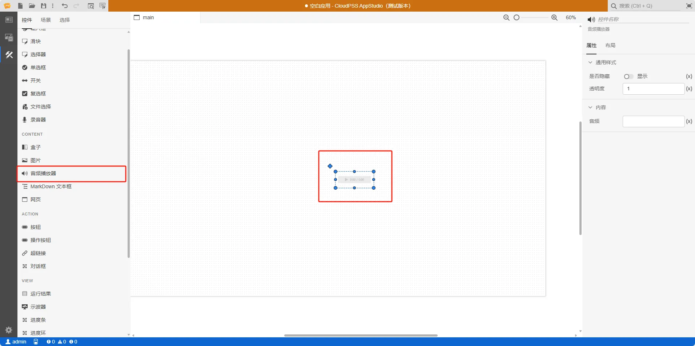
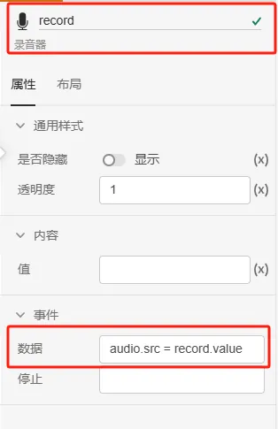

本节主要介绍 **AppStudio** 控件库里的音频播放器控件。

 :::warning

 音频播放器控件仅支持在启用 HTTPS 协议且拥有有效域名的网站上访问和使用

 ::: 

## 属性

**CloudPSS** 提供了一套统一的控件属性参数

### 通用样式

import CommonStyle from '../../60-grid/_common-style.md'

<CommonStyle />

### 内容

| 参数名 | 键值 (key) | 单位 | 备注 | 类型 | 描述 |
| :--- | :--- | :--- | :--: | :--- | :--- |
| 音频 | `src` |  | 要播放文件的 url | Data URL / 字符串 |  要播放文件的 url |

## 案例介绍

### 典型应用

1. 创建一个录音器控件，在右侧的属性配置区内给录音器控件命名为 record
   
2. 创建一个音频播放器控件，在右侧的属性配置区内给录音器控件命名为 audio

3. 将录音器控件 record 的事件/数据的值改为 `audio.src = record.value`

4. 点击工具栏的预览快捷按钮（或者 <kbd>Ctrl</kbd> <kbd>P</kbd>），进入预览模式。按住录音按钮录音，然后点击播放按钮播放音频

## 常见问题

import Fx from '../../60-grid/_expression.md'

<Fx />

import Event from '../../60-grid/_event.md'

<Event />