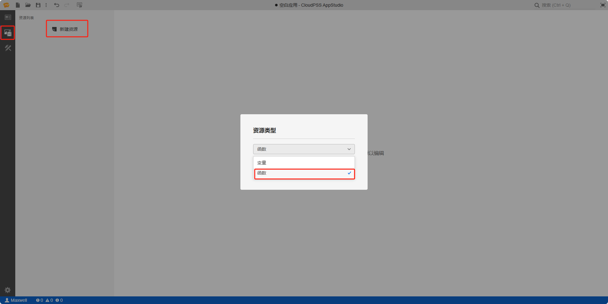
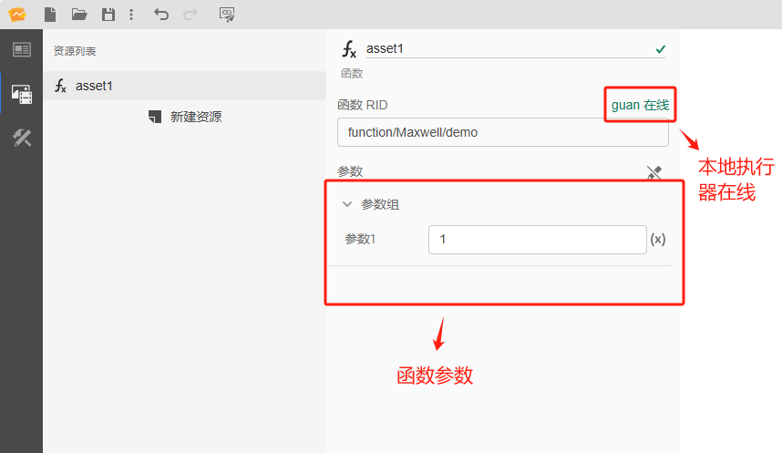
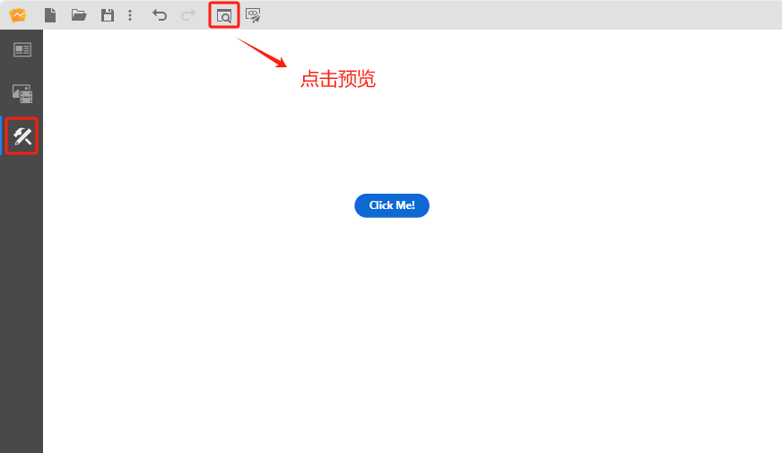
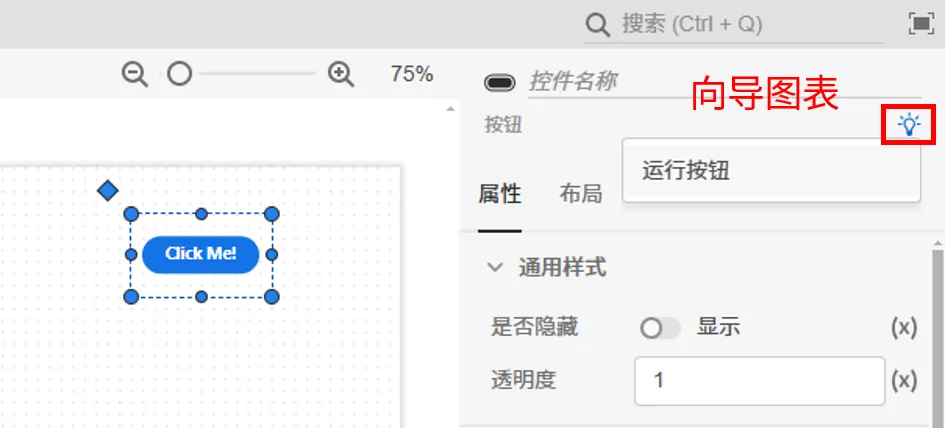
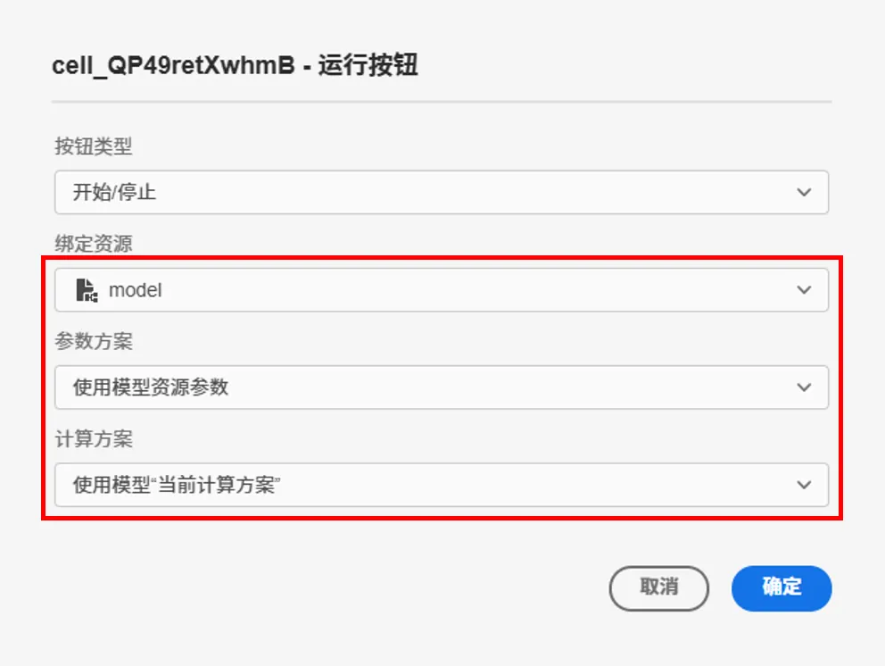
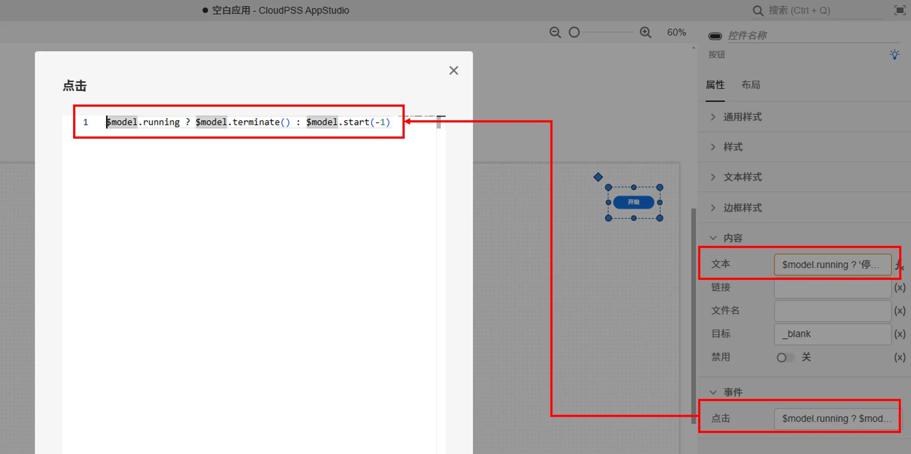

本节主要介绍 AppStudio 控件库里的按钮控件。

该控件的主要作用包括：

- 作为控制 FuncStudio 函数资源**开始/停止**的运行按钮；
- 作为控制 EMTLab 中实时电磁暂态仿真任务运行的按钮，支持实时仿真的**开始/停止、停止/恢复、开始/停止录波**等操作。

## 属性

**CloudPSS** 提供了一套统一的控件属性参数

### 通用样式

import CommonStyle from '../../60-grid/_common-style.md'

<CommonStyle />

### 样式

| 参数名 | 键值 (key) | 单位 | 备注 | 类型 | 描述 |
| :--- | :--- | :--- | :--: | :--- | :--- |
| 大小 | `size` |  | 选择样式大小 | 选择 | 样式大小：S、M、L、XL，默认为 M |
| 变体 | `variant` |  | 选择样式变体 | 选择 | 样式变体：CTA、主要、次要、否定，默认为 CTA |
| 安静 | `quiet` |  | 选择是否安静 | 选择 | 选择**是**或者**否**，默认为**否**状态 |

### 文本样式

| 参数名 | 键值 (key) | 单位 | 备注 | 类型 | 描述 |
| :--- | :--- | :--- | :--: | :--- | :--- |
| 文字字体 | `style/font-family` |  | 选择文字字体 | 选择 | 标签文字字体样式，字体类型包括：默认、宋体、黑体、楷体、微软雅黑、Georgia、Palatino Linotype、Times New Roman、Arial、Arial Black、Verdana、Courier New、Trebuchet MS |
| 文字间距 | `style/letter-spacing` |  | 输入文字间距 | 常量 | 文字间距 |
| 文字字号 | `style/font-size` |  | 输入文字字号 | 常量 | 输入文字字号 |
| 文字颜色 | `style/color` |  | 选择文字颜色 | 颜色选择器 | 点击文字颜色，弹出颜色选择器自定义颜色 |
| 文字粗细 | `style/font-weight` |  | 选择文字粗细 | 选择 | 选择标签文字粗细，默认、100、200、300、400、500、600、700、800、900、1000 |

### 边框样式

| 参数名 | 键值 (key) | 单位 | 备注 | 类型 | 描述 |
| :--- | :--- | :--- | :--: | :--- | :--- |
| 边框圆角半径 | `style/border-radius` | px、cm、em、rem | 输入边框圆角半径 | 常量 | 输入边框圆角半径 |
| 边框宽度 | `style/border-width` | px、cm、em、rem | 输入边框宽度 | 常量 | 输入边框宽度 |
| 边框颜色 | `style/border-color` |  | 输入框 | 常量 | 输入边框颜色 |
| 边框类型 | `style/border-style` |  | 边框类型 | 选择 | 边框类型分为：默认、无边框、虚线边框、实线边框、双重边框、3D 沟槽边框、3D 脊边框、3D 突出边框、3D 嵌入边框，默认为实线边框 |

### 内容

| 参数名 | 键值 (key) | 单位 | 备注 | 类型 | 描述 |
| :--- | :--- | :--- | :--: | :--- | :--- |
| 文本 | `innerText` |  | 按钮控件文本内容 | 常量 | 按钮控件文本内容，默认为：Click Me! |
| 链接 | `href` |  | 按钮控件链接 | 常量 | 按钮控件链接 |
| 文件名 | `download` |  | 下载文件的保存名称 | 常量 | 仅用作下载按钮时，下载文件的保存名称，默认为空 |
| 目标 | `target` |  | 超链接 | 常量 | 超链接打开的位置：`_blank` 表示在新窗口打开；`self` 表示在当前窗口打开；默认为 `_blank` |
| 禁用 | `disabled` |  | 禁用开关 | 开关 | 禁用选择**开**或者**关**，开启后控件禁止点击和交互，默认为**关** |

### 事件

| 参数名 | 键值 (key) | 单位 | 备注 | 类型 | 描述 |
| :--- | :--- | :--- | :--: | :--- | :--- |
| 点击 | `@click` |  | 当点击时触发 | 函数 | 采用点击方式触发函数 |

## 案例介绍

import Tabs from '@theme/Tabs';
import TabItem from '@theme/TabItem';

<Tabs>

<TabItem value="case1" label="接入 FuncStudio 函数">

1. 创建一个按钮控件，在右侧的属性配置区内给按钮命名为 A

2. 创建函数资源 asset1，选择资源类型为函数

3. 配置函数资源 asset1，点击`选择资源`，绑定 `rid` 为 `function/Maxwell/demo` 的示例函数

4. 鼠标选中按钮 A 的事件/点击属性栏，按下<kbd> Ctrl </kbd> 输入 `$asset1.start()`

5. 点击工具栏的预览快捷按钮(或者 <kbd>Ctrl</kbd> + <kbd>P</kbd> )，进入预览模式，点击按钮即可运行 `function/Maxwell/demo` 示例函数

:::tip FuncStudio 函数使用详情

查看 [FuncStudio 函数工坊使用指南](../../../../30-funcstudio/10-user-guide/index.md)

:::

</TabItem>

<TabItem value="case2" label="实时仿真输入输出">

按钮控件提供**向导**功能，会将向导中设置的方案按照特定的表达式**自动写入**按钮控件的属性输入框中，帮助用户快速实现实时仿真的**开始/停止、停止/恢复、开始/停止录波**等操作。

1. 在资源标签页内添加需要进行实时仿真的 SimStudio 模型资源，具体的模型资源添加方法参见[资源标签页](../../../40-workbench/20-function-zone/20-asset-tab/index.md)。

2. 可通过元件向导进行**运行按钮**参数的设置：
   
- 可选中按钮元件，在右侧参数配置区上方点击向导图标进入向导界面。

- 点击**绑定资源**选择器，选项中会自动加载出所有函数资源和模型资源，选择需要进行实时仿真的 SimStudio 模型资源，并选择该模型的参数方案和计算方案；

- 选中模型资源后，可以选择按钮的类型，支持如下的类型：

| 类型 | 描述 | 对应的表达式 |
| :---: | :---: | :--- | 
| 开始 | 点击后函数资源/实时仿真任务开始执行 | 禁用：`$model.running` 事件→点击：`$model.start(-1)` | 
| 停止 | 点击后函数资源/实时仿真任务结束执行 | 禁用：`not $model.running` 事件→点击：`$model.terminate()` |
| 开始/停止 | 首次点击后函数资源/实时仿真任务开始执行，按钮文本从“开始”变为“停止”；再次点击后函数资源/实时仿真任务结束执行，按钮文本从“停止”变为“开始”， | 文本：`$model.running ? '停止' : '开始'` 事件→点击：`$model.running ? $model.terminate() : $model.start(-1)`|
| 暂停 | 点击后实时仿真任务暂停执行 | 禁用：`not $model.running or not is($model.value.rt_state, "Object") or not $model.value.rt_state.monitoring` 事件→点击：`$model.send({"type": "monitoring", "state": false})` | 
| 恢复 | 点击后实时仿真任务恢复执行 | 禁用：`not $model.running or not is($model.value.rt_state, "Object") or $model.value.rt_state.monitoring` 事件→点击：`$model.send({"type": "monitoring", "state": true})` |
| 暂停/恢复 | 首次点击后实时仿真任务暂停执行，按钮文本从“暂停”变为“恢复”；再次点击后实时仿真任务恢复执行，按钮文本从“恢复”变为“暂停”， | 文本：`$model.running and is($model.value.rt_state, "Object") ? ($model.value.rt_state.monitoring ? "暂停" : "恢复") : "暂停"` 禁用：`not $model.running or not is($model.value.rt_state, "Object")` 事件→点击：`$model.send({"type": "monitoring", "state": not $model.value.rt_state.monitoring})`|
| 开始录波 | 点击后实时仿真任务开始录波 | 禁用：`not $model.running or $model.emtp.recording` 事件→点击：`$model.emtp.startRecording()` | 
| 停止录波 | 点击后实时仿真任务停止录波 | 禁用：`not $model.running or not $model.emtp.recording` 事件→点击：`$model.emtp.stopRecording()` |
| 开始/停止录波 | 首次点击后实时仿真任务开始录波，按钮文本从“录波”变为“停止”；再次点击后实时仿真任务录波结束，按钮文本从“停止”变为“录波” | 文本：`$model.running ? ($model.emtp.recording ? "停止录波" : "开始录波") : "录波"` 禁用：`not $model.running` 事件→点击：`$model.emtp.recording ? $model.emtp.stopRecording() : $model.emtp.startRecording()`|

- 点击向导界面的确定按钮后，会将向导中设置的方案按照特定的表达式写入按钮控件的属性中。

具体的操作流程参见[实时仿真案例](../../../70-case-study/50-emt-rt-apps/index.md)。

</TabItem>
</Tabs>

## 常见问题

import Fx from '../../60-grid/_expression.md'

<Fx />

import Event from '../../60-grid/_event.md'

<Event />