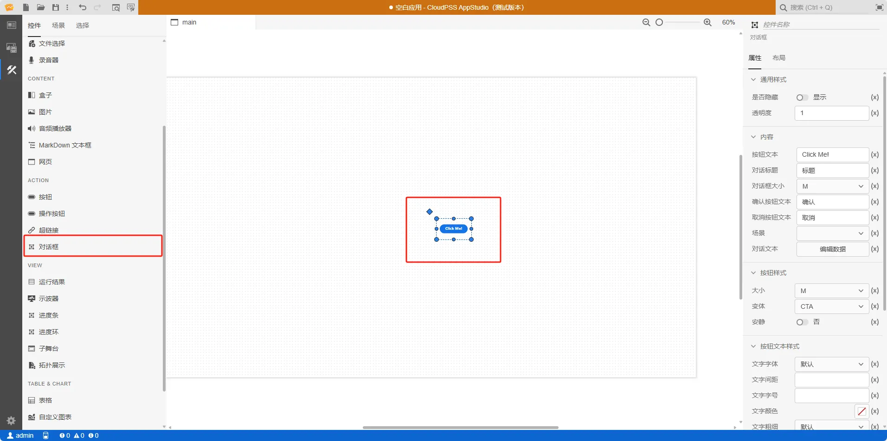
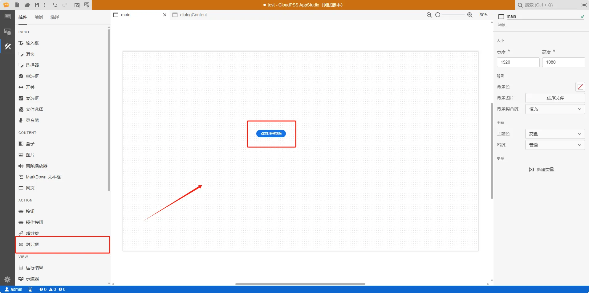
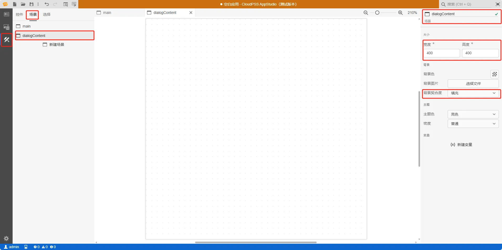
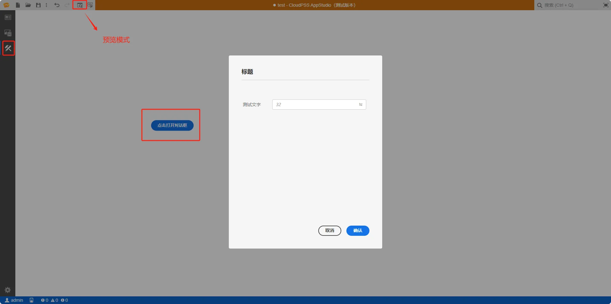

本节主要介绍 **AppStudio** 控件库里的对话框控件。

## 属性

**CloudPSS** 提供了一套统一的控件属性参数

### 通用样式

import CommonStyle from '../../60-grid/_common-style.md'

<CommonStyle />

### 内容

| 参数名 | 键值 (key) | 单位 | 备注 | 类型 | 描述 |
| :--- | :--- | :--- | :--: | :--- | :--- |
| 按钮文本 | `innerText` |  | 按钮文本 | 输入框 |  按钮文本，默认值 Click Me! |
| 对话标题 | `dialogTitle` |  | 对话标题 | 输入框 |  对话标题，默认值标题 |
| 对话框大小 | `dialogSize` |  | 对话框大小 | 选择框 |  对话框大小：S、M、L；默认为 M |
| 确认按钮文本 | `positiveText` |  | 确认按钮文本 | 输入框 |  确认按钮文本，默认为确认 |
| 取消按钮文本 | `negativeText` |  | 取消按钮文本 | 输入框 |  取消按钮文本，默认为取消 |
| 场景 | `key` |  | 场景 | 选择框 | 选择场景， 详情参见[场景](../../../40-workbench/20-function-zone/30-scene-tab/index.md) |
| 对话文本 | `srcDoc` |  | 对话文本 | 点击编辑数据 |  编辑对话控件弹出的文本内容 |

### 按钮样式

| 参数名 | 键值 (key) | 单位 | 备注 | 类型 | 描述 |
| :--- | :--- | :--- | :--: | :--- | :--- |
| 大小 | `size` |  | 对话框按钮大小 | 选择框 |  对话框按钮大小：S、M、L、XL；默认为 M  |
| 变体 | `variant` |  | 对话框按钮变体样式 | 选择框 | 对话框按钮变体样式：CTA、主要、次要、否定；默认为 CTA |
| 安静 | `quiet` |  | 对话框按钮安静样式 | 开关 | 对话框按钮安静样式：是、否；默认为否 |

### 按钮文本样式

| 参数名 | 键值 (key) | 单位 | 备注 | 类型 | 描述 |
| :--- | :--- | :--- | :--: | :--- | :--- |
| 文字字体 | `style/font-family` |  | 选择文字字体 | 选择 | 标签文字字体样式，字体类型包括：默认、宋体、黑体、楷体、微软雅黑、Georgia、Palatino Linotype、Times New Roman、Arial、Arial Black、Verdana、Courier New、Trebuchet MS |
| 文字间距 | `style/font-size` |  | 输入文字字号 | 常量 | 输入文字字号 |
| 文字字号 | `style/font-size` |  | 输入文字字号 | 常量 | 输入文字字号 |
| 文字颜色 | `style/color` |  | 选择文字颜色 | 颜色选择器 | 点击文字颜色，弹出颜色选择器自定义颜色 |
| 文字粗细 | `style/font-weight` |  | 选择文字粗细 | 选择 | 选择按钮文本文字粗细，默认、100、200、300、400、500、600、700、800、900、1000 |

### 边框按钮样式

| 参数名 | 键值 (key) | 单位 | 备注 | 类型 | 描述 |
| :--- | :--- | :--- | :--: | :--- | :--- |
| 边框圆角半径 | `style/border-radius` |  | 输入边框圆角半径  | 常量 | 输入边框圆角半径 |
| 边框宽度 | `style/border-width` |  | 输入边框宽度  | 常量 | 输入边框宽度 |
| 边框颜色 | `style/border-color` |  | 输入边框颜色 | 常量 | 输入边框颜色 |
| 边框类型 | `style/border-style` |  | 选择边框类型 | 选择器 | 选择边框类型，边框类型分为：默认、无边框、虚线边框、实线边框、双重边框、3D 沟槽边框、3D 脊边框、3D 突出边框、3D 嵌入边框，默认为实线边框 |

### 事件

| 参数名 | 键值 (key) | 单位 | 备注 | 类型 | 描述 |
| :--- | :--- | :--- | :--: | :--- | :--- |
| 确定 | `@confirm` |  | 点击时触发  | 函数 | 当点对话框确定键触发 |
| 取消 | `@secondary` |  | 点击时触发  | 函数 | 当点对话框取消键触发 |
| 关闭 | `@close` |  | 关闭对话框  | 函数 | 关闭对话框触发 |

## 案例介绍

### 典型应用

1. 创建一个对话框控件，在右侧的属性配置区内给对话框控件命名为 record

2. 创建一个场景，将新场景命名为 dialogContent，配置改为宽度 `400`，高度 `400`，背景契合度改为`填充`
   
3. 在 dialogContent 场景内，新建一个输入框控件 A，修改配置如下

4. 返回 main 默认场景，修改对话框控件内容/场景选择框，选择 dialogContent 场景

5. 点击工具栏的预览快捷按钮（或者 <kbd>Ctrl</kbd> <kbd>P</kbd>），进入预览模式。点击对话框控件按钮，弹出对话框显示内容。

## 常见问题

import Fx from '../../60-grid/_expression.md'

<Fx />

import Event from '../../60-grid/_event.md'

<Event />
