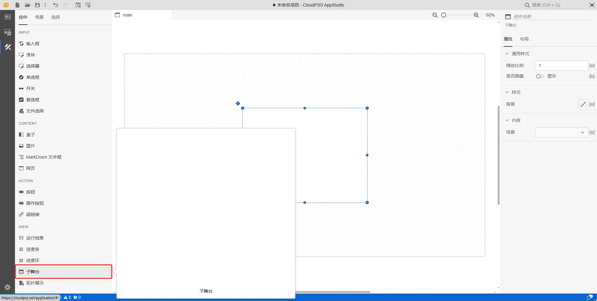
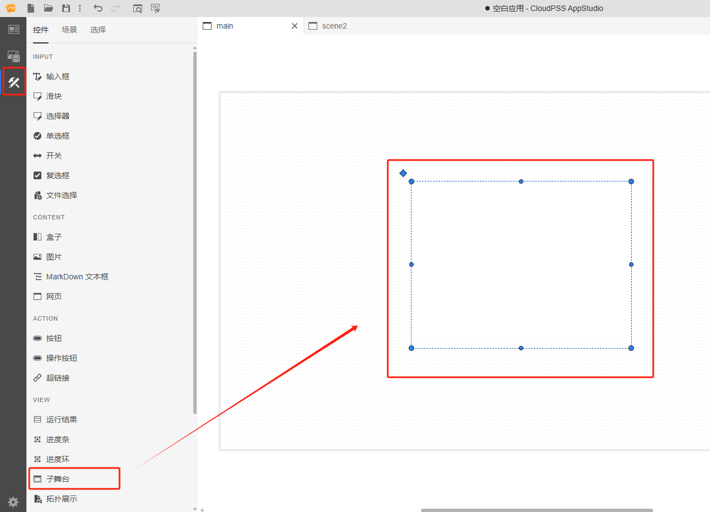
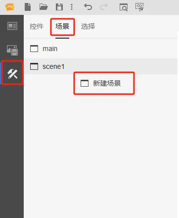
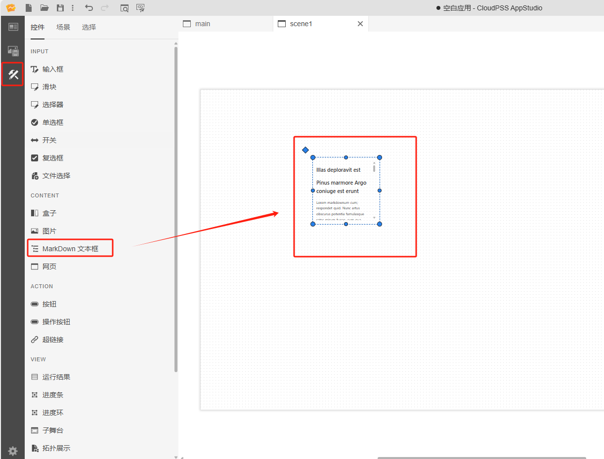
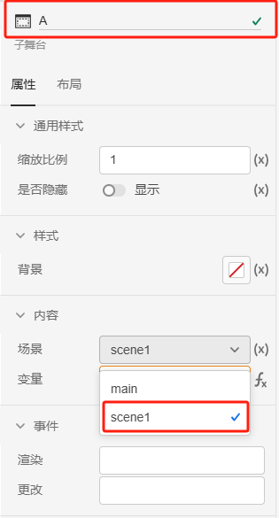
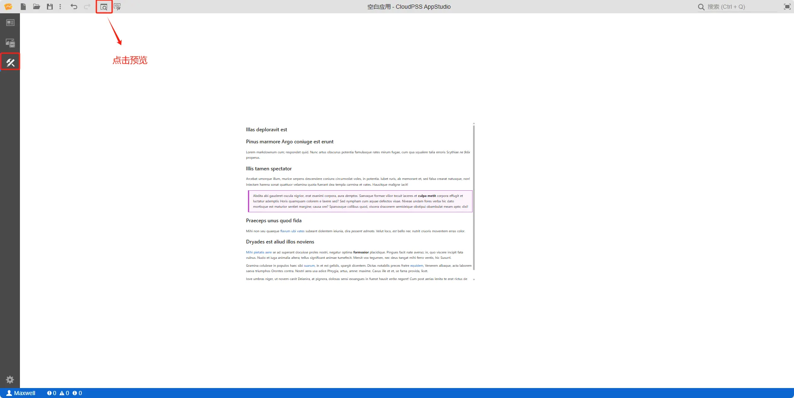

本节主要介绍 AppStudio 控件库里的子舞台控件。

## 属性

**CloudPSS** 提供了一套统一的控件属性参数

### 通用样式

import CommonStyle from '../../60-grid/_common-style.md'

<CommonStyle />

### 样式

| 参数名 | 键值 (key) | 单位 | 备注 | 类型 | 描述 |
| :--- | :--- | :--- | :--: | :--- | :--- |
| 背景 | `background` |  | 显示背景 | 颜色选择器 | 点击背景颜色，弹出颜色选择器自定义背景颜色，同时允许用户上传图片自定义背景 |

### 内容

| 参数名 | 键值 (key) | 单位 | 备注 | 类型 | 描述 |
| :--- | :--- | :--- | :--: | :--- | :--- |
| 场景 | `key` |   | 选择场景 | 选择 | 选择场景，默认为 main，场景详情参见 [场景标签页](../../../40-workbench/20-function-zone/30-scene-tab/index.md) |

## 案例介绍

### 嵌套场景

1. 主场景中创建一个子舞台控件，在右侧的属性配置区内给子舞台命名为 A

2. 创建一个新的场景，新场景中创建一个 MarkDown 文本框控件，在右侧的属性配置区内给子舞台命名为 B，调整下控件大小

3. 返回主场景配置子舞台控件，鼠标选中子舞台控件 A 的内容/场景属性栏，选择 `scene1`，调整下控件大小

:::tip 子舞台场景嵌套提示

详情查看 [AppStudio 场景嵌套介绍](../../../50-app-design/30-layered-scenes/index.md)

:::

## 常见问题

import Fx from '../../60-grid/_expression.md'

<Fx />

import Event from '../../60-grid/_event.md'

<Event />
