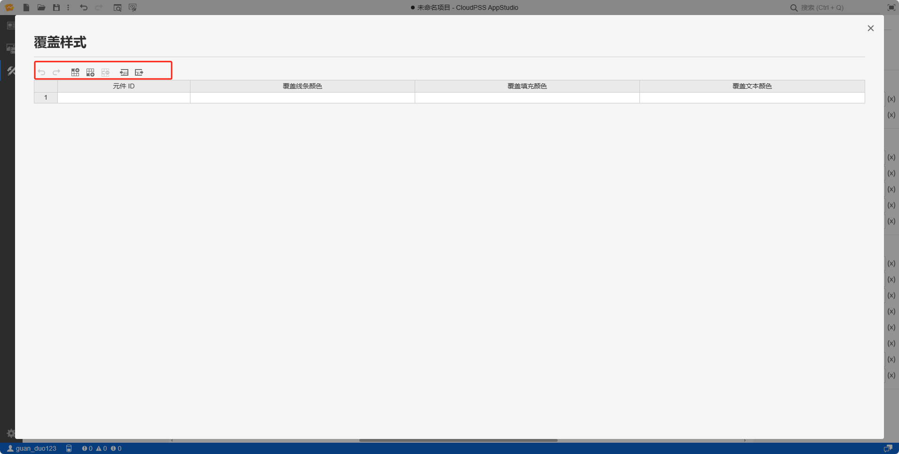

本节主要介绍 AppStudio 控件库里的拓扑展示控件。

## 属性

**CloudPSS** 提供了一套统一的控件属性参数

### 通用样式

import CommonStyle from '../../60-grid/_common-style.md'

<CommonStyle />

### 样式

| 参数名 | 键值 (key) | 单位 | 备注 | 类型 | 描述 |
| :--- | :--- | :--- | :--: | :--- | :--- |
| 背景 | `style/background` |  | 显示背景 | 颜色选择器 | 点击背景颜色，弹出颜色选择器自定义背景颜色，同时允许用户上传图片自定义背景 |
| 高亮颜色 | `style/--highlight` |  | 显示高亮颜色 | 颜色选择器 | 点击高亮颜色，弹出颜色选择器自定义高亮颜色，默认为 `yellow` |
| 高亮宽度 | `style/--highlight-width` | `px` | 显示高亮宽度 | 常量 | 显示高亮宽度，默认为 `3px` |
| 高亮虚线长度 | `style/--highlight-dasharray` | `px` | 显示高亮虚线长度 | 常量 | 高亮虚线长度，默认为 `5px 5px` |
| 高亮闪烁速度 | `style/--highlight-animation-duration` | `s` | 高亮闪烁速度 | 常量 | 高亮闪烁速度，默认为 `0.5s` |

### 内容

| 参数名 | 键值 (key) | 单位 | 备注 | 类型 | 描述 |
| :--- | :--- | :--- | :--: | :--- | :--- |
| 模型 RID | `rid` |   | 模型 RID | 字符串 | 模型 RID，格式为 `model/<owner>/<key>` |
| 图纸 | `canvas` |   | 图纸 key | 字符串 | 图纸 key，默认为 `canvas_0` |
| 缩放系数 | `zoom` |  | 控件内容缩放系数 | 常量 | 输入缩放系数数值，控件内容按照比例放大或者缩小，默认为 1 倍大小 |
| 只读 | `readonly` |  | 选择是否只读 | 开关 | 是否开启控件只读，默认为关，允许编辑 |
| 显示元件标签 | `showLabel` |  | 选择显示元件标签 | 开关 | 是否显示元件标签，默认为关，不显示 |
| 显示引脚标签 | `showPin` |  | 选择显示引脚标签 | 开关 | 是否显示引脚标签，默认为开，显示引脚标签 |
| 高亮 | `hightlight` |  | 高亮数据 | 表格 | 点击`编辑数据`，弹出表格自定义高亮数据 |
| 覆盖样式 | `overridenStyles` |  | 覆盖样式 | 表格 | 点击`编辑数据`，弹出表格自定义所需的覆盖样式 |

## 案例介绍

### 颜色选择器类型

import ColorPicker from '../../60-grid/_color-picker.md'

<ColorPicker />

### 覆盖样式

## 常见问题

import Fx from '../../60-grid/_expression.md'

<Fx />

import Event from '../../60-grid/_event.md'

<Event />