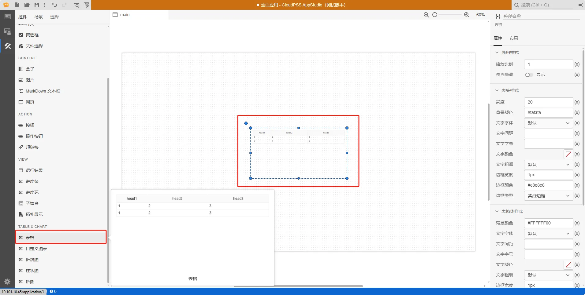
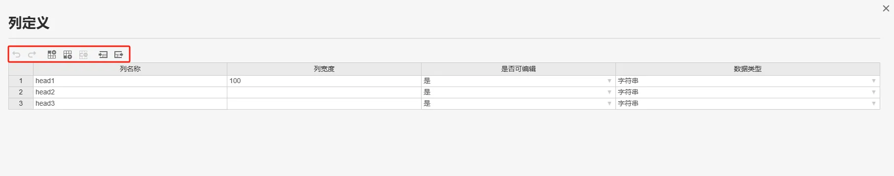
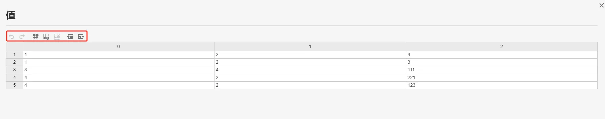
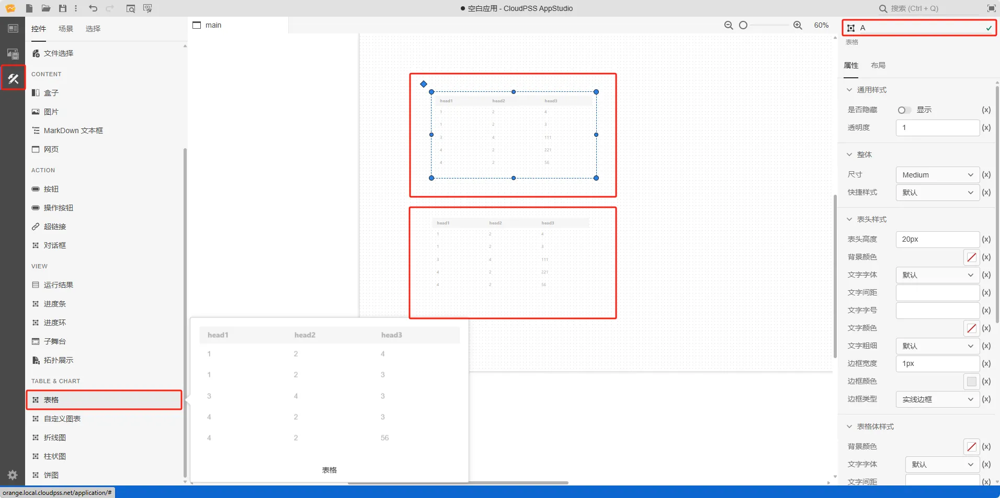
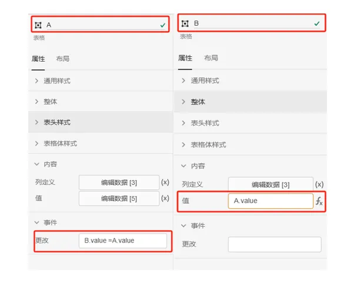
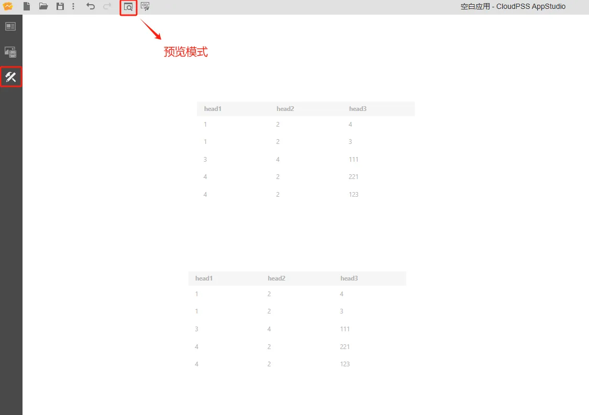

本节主要介绍 AppStudio 控件库里的表格控件。

## 属性

**CloudPSS** 提供了一套统一的控件属性参数

### 通用样式

import CommonStyle from '../../60-grid/_common-style.md'

<CommonStyle />

### 整体

| 参数名 | 键值 (key) | 单位 | 备注 | 类型 | 描述 |
| :--- | :--- | :--- | :--: | :--- | :--- |
| 尺寸 | `size` |  | 选择尺寸 | 选择 | 选择表格整体尺寸，尺寸类型包括： Small、Medium、Large、Extra Large，默认为 Medium |
| 快捷样式 | `quickStyle` |  | 选择快捷样式 | 选择 | 选择表格快捷样式，快捷样式类型包括： 默认、纯蓝、深色、黑橙、黑灰、白灰 |

### 表头样式

| 参数名 | 键值 (key) | 单位 | 备注 | 类型 | 描述 |
| :--- | :--- | :--- | :--: | :--- | :--- |
| 表头高度 | `style/--cwe-custom-table-head-height` | px | 表头高度 | 常量 | 输入表头高度，默认 20 px |
| 背景颜色 | `style/--cwe-custom-table-thead-background-color` |  | 选择背景颜色 | 颜色选择器 | 点击背景颜色，弹出颜色选择器自定义颜色 |
| 文字字体 | `style/--cwe-custom-table-head-font-family` |  | 选择文字字体 | 选择 | 文字字体样式，字体类型包括：默认、宋体、黑体、楷体、微软雅黑、Georgia、Palatino Linotype、Times New Roman、Arial、Arial Black、Verdana、Courier New、Trebuchet MS |
| 文字间距 | `style/--cwe-custom-table-head-letter-spacing` |  | 输入文字间距 | 常量 | 文字间距 |
| 文字字号 | `style/--cwe-custom-table-head-font-size` |  | 输入文字字号 | 常量 | 输入文字字号 |
| 文字颜色 | `style/--cwe-custom-table-head-color` |  | 选择文字颜色 | 颜色选择器 | 点击文字颜色，弹出颜色选择器自定义颜色 |
| 文字粗细 | `style/--cwe-custom-table-head-font-weight` |  | 选择文字粗细 | 选择 | 选择文字粗细，默认、100、200、300、400、500、600、700、800、900、1000 |
| 边框宽度 | `style/--cwe-custom-table-head-border-weight` | px | 边框宽度 | 常量 | 边框宽度，默认为 1px |
| 边框颜色 | `style/--cwe-custom-table-head-border-color` |  | 选择边框颜色 | 颜色选择器 | 点击边框颜色，弹出颜色选择器自定义颜色  |
| 边框类型 | `style/--cwe-custom-table-head-border-style` |   | 边框类型 | 选择 | 边框类型分为：默认、无边框、虚线边框、实线边框、双重边框、3D 沟槽边框、3D 脊边框、3D 突出边框、3D 嵌入边框，默认为实线边框 |

### 表格体样式

| 参数名 | 键值 (key) | 单位 | 备注 | 类型 | 描述 |
| :--- | :--- | :--- | :--: | :--- | :--- |
| 背景颜色 | `style/--cwe-custom-table-tbody-background-color` |  | 选择背景颜色 | 颜色选择器 | 点击背景颜色，弹出颜色选择器自定义颜色  |
| 文字字体 | `style/--cwe-custom-table-cell-font-family` |  | 选择文字字体 | 选择 | 文字字体样式，字体类型包括：默认、宋体、黑体、楷体、微软雅黑、Georgia、Palatino Linotype、Times New Roman、Arial、Arial Black、Verdana、Courier New、Trebuchet MS |
| 文字间距 | `style/--cwe-custom-table-cell-letter-spacing` |  | 输入文字间距 | 常量 | 文字间距 |
| 文字字号 | `style/--cwe-custom-table-cell-font-size` |  | 输入文字字号 | 常量 | 输入文字字号 |
| 文字颜色 | `style/--cwe-custom-table-cell-color` |  | 选择文字颜色 | 颜色选择器 | 点击文字颜色，弹出颜色选择器自定义颜色 |
| 文字粗细 | `style/--cwe-custom-table-cell-font-weight` |  | 选择文字粗细 | 选择 | 选择文字粗细，默认、100、200、300、400、500、600、700、800、900、1000 |
| 边框宽度 | `style/--cwe-custom-table-cell-border-weight` | px | 边框宽度 | 常量 | 边框宽度，默认为 1px |
| 边框颜色 | `style/--cwe-custom-table-cell-border-color` |  | 边框颜色 | 颜色选择器 | 点击边框颜色，弹出颜色选择器自定义颜色 |
| 边框类型 | `style/--cwe-custom-table-cell-border-style` |   | 边框类型 | 选择 | 边框类型分为：默认、无边框、虚线边框、实线边框、双重边框、3D 沟槽边框、3D 脊边框、3D 突出边框、3D 嵌入边框，默认为实线边框 |
| 奇数行背景颜色 | `style/--cwe-custom-table-tbody-odd-cell-background-color` |   | 选择奇数行背景颜色 | 颜色选择器 | 点击奇数行背景颜色，弹出颜色选择器自定义颜色 |
| 偶数行背景颜色 | `style/--cwe-custom-table-tbody-even-cell-background-color` |   | 选择偶数行背景颜色 | 颜色选择器 | 点击偶数行背景颜色，弹出颜色选择器自定义颜色 |

### 内容

| 参数名 | 键值 (key) | 单位 | 备注 | 类型 | 描述 |
| :--- | :--- | :--- | :--: | :--- | :--- |
| 列定义 | `head` |  | 列定义 | 表格 | 点击 `编辑数据`，弹出控件列定义内容表格 |
| 值 | `value` |  | 值 | 表格 | 点击 `编辑数据`，弹出控件值内容表格 |

### 事件

| 参数名 | 键值 (key) | 单位 | 备注 | 类型 | 描述 |
| :--- | :--- | :--- | :--: | :--- | :--- |
| 切换 | `@change` |  | 当输入结束时触发 | 函数 | 采用更新方式触发函数，当输入结束时触发 |

## 案例介绍

### 列定义

上方从左到右，依次是撤销（`Ctrl` `Z`），重做（`Ctrl` `Y`），在上方插入行（`Ctrl` `I`），在下方插入行（`Ctrl` `Alt` `I`），删除行（`Ctrl` `D`），导入 CSV，导出 CSV

下方显示的是表格控件列定义:
- 列名称
- 列宽度
- 是否可编辑：是或否；默认为否
- 数据类型：字符串、数字、布尔值；默认为字符串

### 表格值

上方从左到右，依次是撤销（`Ctrl` `Z`），重做（`Ctrl` `Y`），在上方插入行（`Ctrl` `I`），在下方插入行（`Ctrl` `Alt` `I`），删除行（`Ctrl` `D`），导入 CSV，导出 CSV

下方显示的是表格控件值:

### 典型应用

1. 创建两个表格，在右侧的属性配置区内给输入框命名为 A 和 B

2. 鼠标选中表格 A 的事件/更改属性栏，按下 <kbd>Ctrl</kbd> 输入 `B.value = A.value`

3. 将输入框 B 的内容/值属性栏切换到 fx 表达式模式，设置为 `A.value`

4. 鼠标选中表格 A 的内容/值属性栏，点击修改表格 A 的默认数据

5. 点击工具栏的预览快捷按钮（或者 <kbd>Ctrl</kbd> <kbd>P</kbd>），进入预览模式，在预览模式下观察表格 B 的值自动发生变化

## 常见问题

import Fx from '../../60-grid/_expression.md'

<Fx />

import Event from '../../60-grid/_event.md'

<Event />
