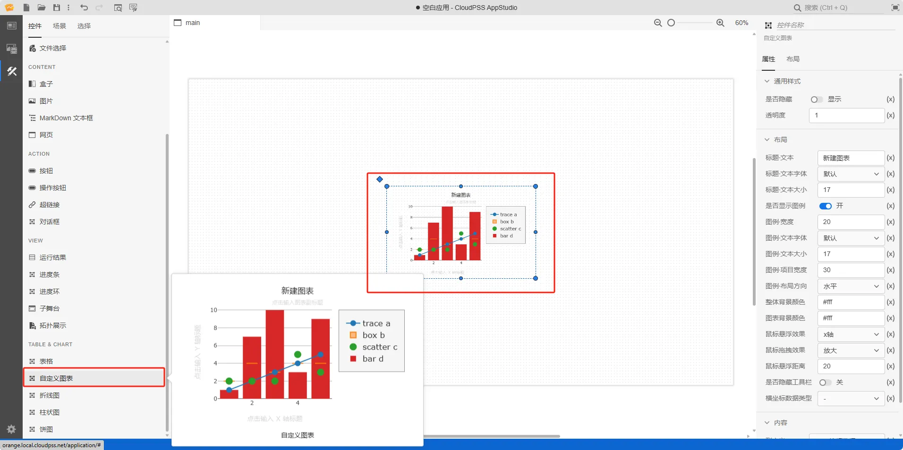
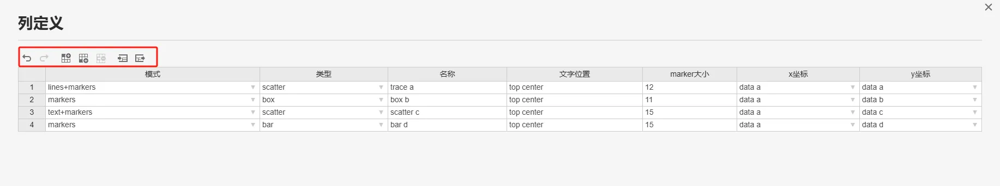
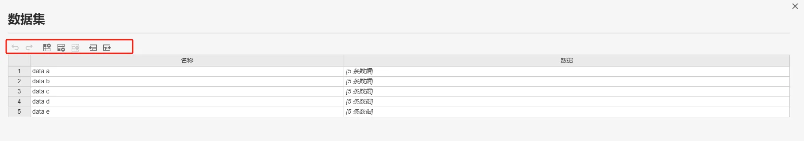
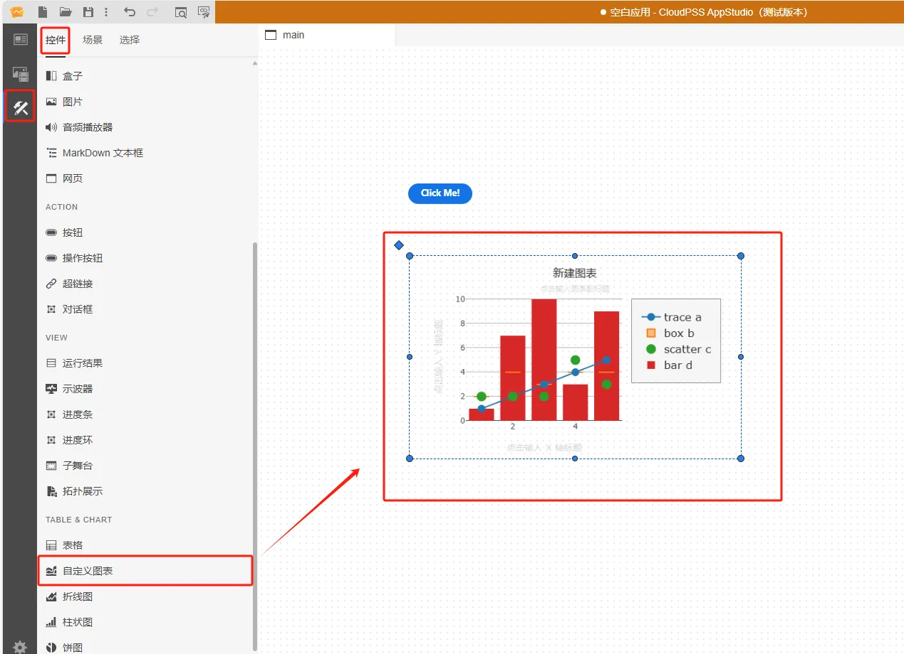
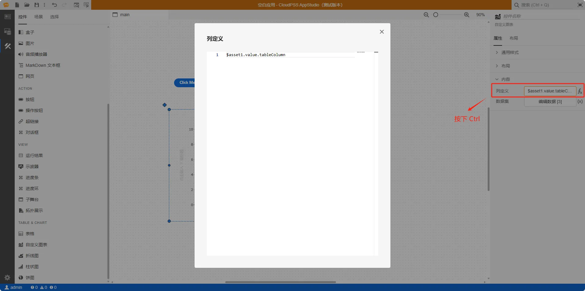
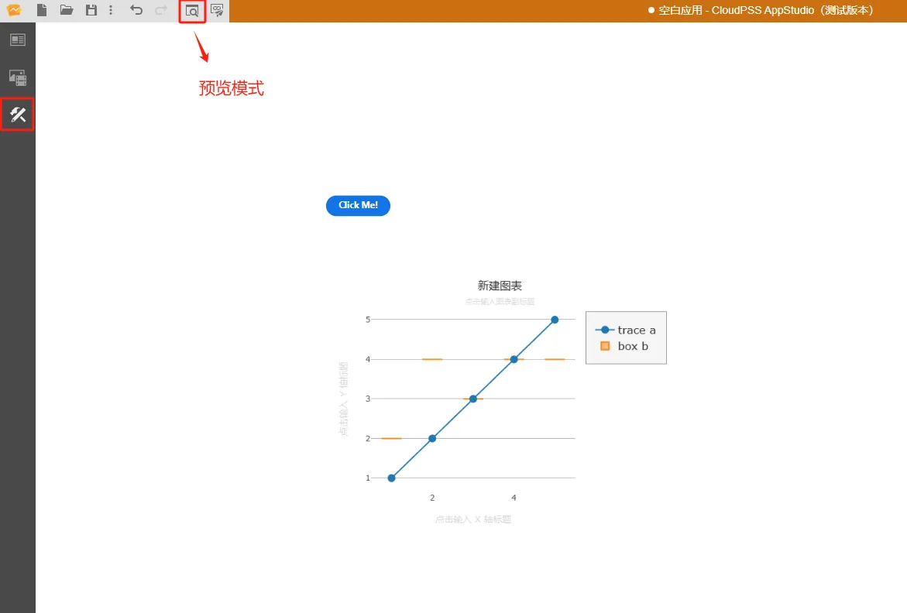

本节主要介绍 AppStudio 控件库里的自定义图表控件。

## 属性

**CloudPSS** 提供了一套统一的控件属性参数

### 通用样式

import CommonStyle from '../../60-grid/_common-style.md'

<CommonStyle />

### 布局

| 参数名 | 键值 (key) | 单位 | 备注 | 类型 | 描述 |
| :--- | :--- | :--- | :--: | :--- | :--- |
| 标题-文本 | `layoutConfig/title/text` |  | 控件标题内容 | 常量 | 图标标题，默认为 新建图表 |
| 标题-文本字体 | `layoutConfig/title/font/family` |  | 控件标题文本字体 | 选择 | 标题文字字体样式，字体类型包括：默认、宋体、黑体、楷体、微软雅黑、Georgia、Palatino Linotype、Times New Roman、Arial、Arial Black、Verdana、Courier New、Trebuchet MS |
| 标题-文本大小 | `layoutConfig/title/font/size` |  | 控件标题文本大小 | 常量 | 自定义图表标题文本大小，默认为 17 |
| 是否显示图例 | `layoutConfig/showLegend` |  | 是否显示图例开关 | 开关 | 是否显示图例开关，默认为 关 |
| 图例-宽度 | `layoutConfig/legend/borderwidth` |  | 控件图例宽度 | 常量 | 自定义图表图例宽度，默认为 20 |
| 图例-文本字体 | `layoutConfig/legend/font/family` |  | 控件图例文本字体 | 选择 | 图例文字字体样式，字体类型包括：默认、宋体、黑体、楷体、微软雅黑、Georgia、Palatino Linotype、Times New Roman、Arial、Arial Black、Verdana、Courier New、Trebuchet MS |
| 图例-文本大小 | `layoutConfig/legend/font/size` |  | 控件图例文本大小 | 常量 | 自定义图表标题文本大小，默认为 17 |
| 图例-项目宽度 | `layoutConfig/legend/itemwidth` |  | 控件图例项目宽度 | 常量 | 自定义图表图例项目宽度，默认为 30 |
| 图例-布局方向 | `layoutConfig/legend/orientation` |  | 控件图例布局方向 | 选择 | 自定义图表图例布局方向：水平、垂直；默认为 水平 |
| 整体背景颜色 | `style/--cwe-plot-background` |  | 控件整体背景颜色 | 常量 | 自定义图表整体背景颜色；默认为 #fff |
| 图表背景颜色 | `layoutConfig/plot_bgcolor` |  | 控件图表背景颜色 | 常量 | 图表背景颜色；默认为 #fff |
| 鼠标悬浮效果 | `layoutConfig/hovermode` |  | 控件鼠标悬浮效果 | 选择 | 自定义图表鼠标悬浮效果：x 轴、y 轴、靠近、x 轴统一显示、y 轴统一显示、关闭 ；默认为 x 轴 |
| 鼠标拖曳效果 | `layoutConfig/dragmodemode` |  | 控件鼠标拖曳效果 | 选择 | 自定义图表鼠标拖曳效果：放大、移动、框选、套索、画封闭路径、画开放路径、画线段、画矩形、画圆；默认为 放大 |
| 鼠标悬浮距离 | `layoutConfig/hoverdistance` |  | 控件鼠标悬浮距离 | 常量 | 自定义图表鼠标悬浮距离，默认为 20 |
| 是否隐藏工具栏 | `layoutConfig/displayModeBar` |  | 控件是否隐藏工具栏开关 | 开关 | 自定义图表是否隐藏工具栏开关，默认为 关 |
| 横坐标数据类型 | `layoutConfig/xaxis/type` |  | 控件横坐标数据类型 | 选择 | 自定义图表横坐标数据类型：-、liner、log、date、category、multicategory，默认为 - |

### 内容

| 参数名 | 键值 (key) | 单位 | 备注 | 类型 | 描述 |
| :--- | :--- | :--- | :--: | :--- | :--- |
| 列定义 | `column` |  | 列定义 | 表格 | 点击 `编辑数据`，弹出控件列定义内容表格 |
| 数据集 | `dataSet` |  | 数据集 | 表格 | 点击 `编辑数据`，弹出控件数据集内容表格 |

### 列定义

上方从左到右，依次是撤销（`Ctrl` `Z`），重做（`Ctrl` `Y`），在上方插入行（`Ctrl` `I`），在下方插入行（`Ctrl` `Alt` `I`），删除行（`Ctrl` `D`），导入 CSV，导出 CSV

下方显示的是自定义图表控件列定义:

- 模式：lines、markers、text、lines+markers、text+markers、text+lines、text+lines+markers；默认为 line+markers 
- 类型：bar、barpolar、box、choropleth、cone、contour、contourcarpet、contourgl、densitymapbox、funnel、funnelarea、heatmap、heatmapgl、histogram、histogram2d、histogram2dcontour、image、indicator、isosurface、mesh3d、ohlc、parcats、parcoords、pie、pointcloud、sankey、scatter、scatter3d、scattercarpet、scattergeo、scattergl、scattermapbox、scatterpolar、scatterpolargl、scatterternary、splom、streamtube、sunburst、surface、table、treemap、violin、volume、waterfall；默认为 scatter
- 名称
- 文字位置： 默认为 top center
- marker 大小：默认为 12
- x 坐标
- y 坐标

### 数据集

上方从左到右，依次是撤销（`Ctrl` `Z`），重做（`Ctrl` `Y`），在上方插入行（`Ctrl` `I`），在下方插入行（`Ctrl` `Alt` `I`），删除行（`Ctrl` `D`），导入 CSV，导出 CSV

下方显示的是自定义图表控件数据集:

- 名称
- 数据：表格嵌套数据

## 案例介绍

### 接入 FuncStudio 函数的典型应用

1. 创建一个按钮控件，在右侧的属性配置区内给按钮命名为 A，创建一个自定义表格控件，在右侧的属性配置区内给自定义表格命名为 B

2. 创建函数资源 asset1，选择资源类型为函数

3. 配置函数资源 asset1，点击**选择资源**，绑定 `rid` 为 `function/admin/demo` 的示例函数

4. 鼠标选中按钮控件 A 的事件/点击属性栏，按下 <kbd>Ctrl</kbd> 输入 `$asset1.start()`

5. 鼠标选中自定义表格控件 B 的内容/列定义属性栏，按下 <kbd>Ctrl</kbd> 输入 `$asset1.value.tableColumn`

6. 鼠标选中自定义表格控件 B 的内容/数据集属性栏，按下 <kbd>Ctrl</kbd> 输入 `$asset1.value.tableDataSet`

7. 点击工具栏的预览快捷按钮（或者 <kbd>Ctrl</kbd> <kbd>P</kbd>），进入预览模式，在预览模式下点击按钮 A，等待 `function/admin/demo` 的示例函数运行结束，自定义表格控件 B 显示运行结果

## 常见问题

import Fx from '../../60-grid/_expression.md'

<Fx />

import Event from '../../60-grid/_event.md'

<Event />
