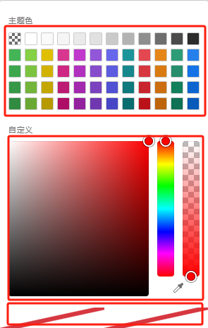

点击控件属性右侧的颜色选择器，弹出如下显示的界面

- 界面上方是预设的多种主题颜色，允许用户快速选择所需颜色；

- 中间是自定义颜色选择区允许用户点击选择所需的颜色，右侧是选择颜色透明度；右下角是取色器，点击允许用户在任意界面选取所需颜色

- 最下方显示的是当前已选的颜色；默认为空，显示如下图的斜杠

####  选择主题色中的透明色

#### f(x) 模式下的颜色选择器

点击 fx 按钮，在输入框内输入颜色字符串，支持 `hex`、`rgb`、`hsl`格式，具体参考 [颜色码表](https://htmlcolorcodes.com/zh/)

 模式下的透明色")

