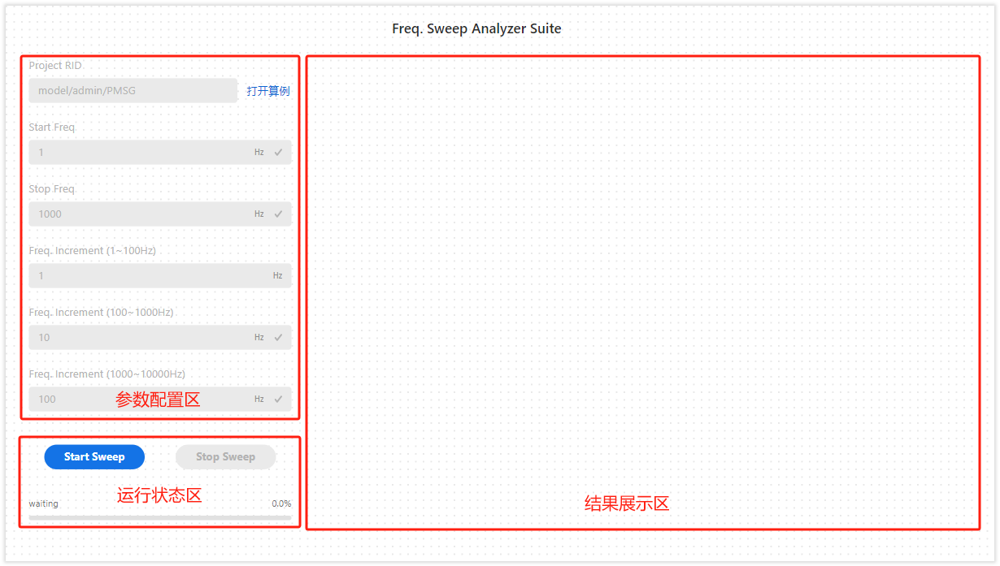
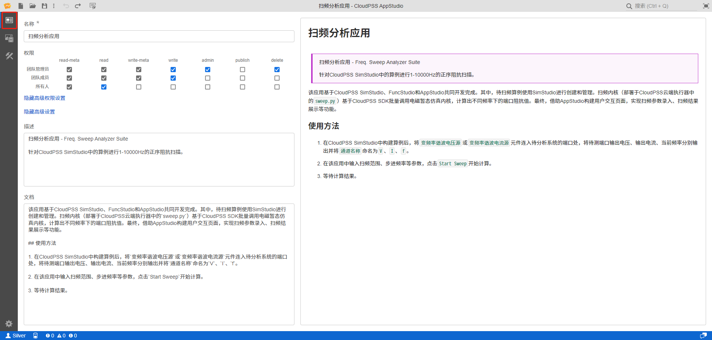
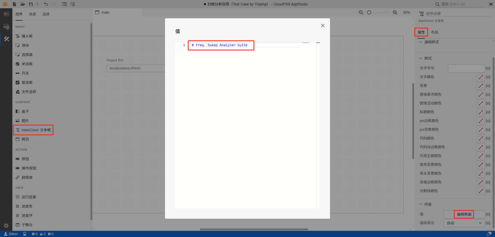
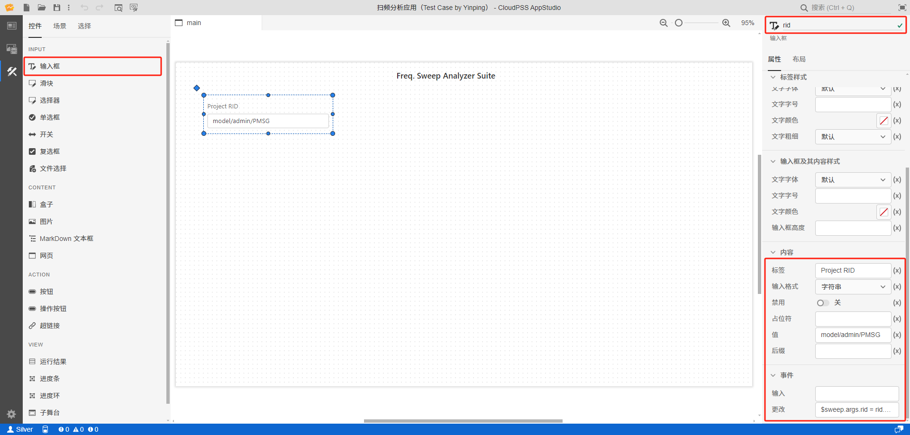
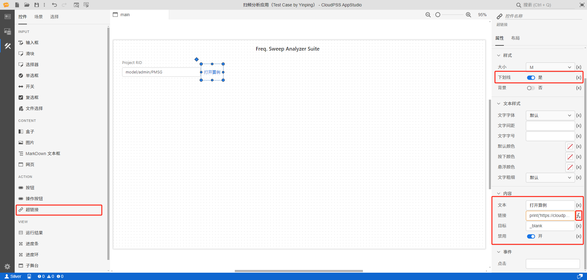
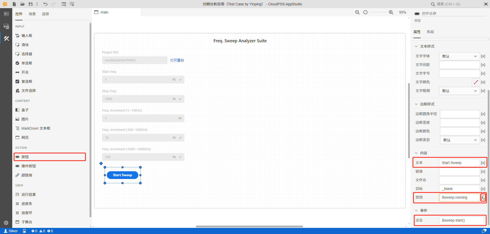

本文档主要介绍如何使用 AppStudio 构建 [扫频分析应用](https://cloudpss.net/application/CloudPSSDemo/Freq_Sweep_Analyzer#/summary) 典型案例。

## 案例概述

扫频分析应用，针对 CloudPSS SimStudio 中的算例进行 1-10000Hz 的正序阻抗扫描。该应用主要由三大功能模块组成，分别为**参数配置区**、**运行状态区**以及**结果展示区**，如下图所示。

扫频分析应用基于 CloudPSS SimStudio、FuncStudio 和 AppStudio 共同开发完成。其中，扫频算例使用 SimStudio 进行创建和管理。扫频内核（部署于 CloudPSS 云端执行器中的 `sweep.py`）基于CloudPSS SDK 批量调用电磁暂态仿真内核，计算出不同频率下的端口阻抗值。最终，借助 AppStudio 构建用户交互页面，实现扫频参数录入、扫频结果展示等功能。本文档主要围绕 **“AppStudio 构建用户交互页面”环节，具体介绍如何搭建应用**。

## 创建应用

首先登录到 CloudPSS 的主页，点击 AppStudio 图标进入个人中心，点击**新建空白项目**，即创建一个空白项目，并进入 AppStudio 工作台。

## 配置基本信息

点击左上方标签栏**总览**，切换至总览标签页，配置应用名称、权限、描述等基本信息，编写应用文档，如下图所示。

## 配置资源

配置使用 FuncStudio 构建的**扫频分析内核**，以供调用：点击左上方标签栏**资源**，切换至资源标签页。然后点击**新建资源**，选择函数**资源类型**，新建资源。将**函数名称**命名为 sweep，然后点击**选择资源**，在弹出框中输入 **sweep_python** 搜索**扫频分析内核**，选择第一个搜索结果，并确定，完成资源配置。

## 设计场景

### 场景
点击左上方标签栏**场景**，切换至场景标签页。在默认 main 场景下，在右侧**属性编辑板块**中，将场景**宽度**设置为 1280，**高度**设置为 720，如下图所示。

### 标题
在左侧 **控件库与场景板块** - **控件** 中，点击 **MarkDown 文本框**控件，中央**场景编辑板块**会出现一个默认的 MarkDown 文本框。在右侧**属性编辑板块** - **属性标签** - **内容** - **值**栏，点击**编辑数据**，在弹出框中输入该应用标题的 Markdown 文本 `# Freq. Sweep Analyzer Suite`。

然后，将**属性编辑板块**状态切换至**布局标签**，设置标题控件**大小和位置**属性，如下图所示。

### 参数配置区

扫频分析应用需要的输入参数包括算例/内核（Project RID）、开始频率（Start Freq.）、停止频率（Stop Freq.）、（1-100Hz、100-1000Hz、1000-10000Hz）频率增量（Freq. Increment）。具体参数配置列表如下所示。

| 控件名称 | 控件类型 | 标签 | 输入格式 | 禁用 | 值 | 后缀 | 更改 | X | Y | 宽度 | 高度 |
| :--: | :--: | :--: | :--: | :--: | :--: | :--: | :--: | :--: | :--: | :--: | :--: |
| `rid` | 输入框 | Project RID | 字符串 | 开 | model/admin/PMSG | - | `$sweep.args.rid = rid.value` | 30 | 60 | 270 | 70 |
| `fs` | 输入框 | Start Freq | 整数 | 开 | 1 | Hz | `$sweep.args.fs = fs.value` | 30 | 140 | 340 | 70 |
| `fe` | 输入框 | Stop Freq | 整数 | 开 | 1000 | Hz | `$sweep.args.fe = fe.value` | 30 | 220 | 340 | 70 |
| `K1` | 输入框 | Freq. Increment (1~100Hz) | 整数 | 开 | 1 | Hz | `$sweep.args.K1 = K1.value` | 30 | 300 | 340 | 70 |
| `K2` | 输入框 | Freq. Increment (100~1000Hz) | 整数 | 开 | 10 | Hz | `$sweep.args.K2 = K2.value` | 30 | 380 | 340 | 70 |
| `K3` | 输入框 | Freq. Increment (1000~10000Hz) | 整数 | 开 | 100 | Hz | `$sweep.args.K3 = K3.value` | 30 | 460 | 340 | 70 |

接下来，我们将以 Project RID、Start Freq 参数控件为例，对参数配置区的控件构建进行详细介绍。

import Tabs from '@theme/Tabs';
import TabItem from '@theme/TabItem';

<Tabs>
<TabItem value="case1" label="Project RID 控件组构建">

- **构建Project RID 控件**

在左侧 **控件库与场景板块** - **控件** 中，点击**输入框**控件，中央**场景编辑板块**会出现一个默认的输入框控件。在右侧 **属性编辑板块** - **属性标签** 中配置**控件名称**、**标签**、**输入格式**、**禁用**、**值**、**后缀**、**更改**参数项。其中，**值**输入 model/admin/PMSG，是配置资源时选择的**扫频分析内核**的 `项目RID`；**更改**输入 `$sweep.args.rid = rid.value`（`rid` 为控件名称），作用是当用户更改输入内容后，新内容会被赋值给该控件，并同步给内核。

然后，将**属性编辑板块**状态切换至**布局标签**，配置控件**大小和位置**属性。

- **构建打开算例控件**

接下来，将介绍如何构建位于 Project RID 控件右侧的打开算例控件。用户在点击该控件后，浏览器会打开相应算例页面。

在左侧 **控件库与场景板块** - **控件** 中，点击**超链接**控件，中央**场景编辑板块**会出现一个默认的超链接控件。在右侧 **属性编辑板块** - **属性标签** 中配置**下划线**、**文本**、**链接**、**目标**、**禁用**参数项。其中，配置**链接**时，需要点击输入框右侧的 **fx** 按钮，切换为表达式输入模式后，再输入 `print('https://cloudpss.net/$rid')`，以实现点击控件打开链接功能。

最后，将**属性编辑板块**状态切换至**布局标签**，配置控件**大小和位置**属性。

</TabItem>
<TabItem value="case" label="Start Freq 控件构建">

在左侧 **控件库与场景板块** - **控件** 中，点击**输入框**控件，中央**场景编辑板块**会出现一个默认的输入框控件。在右侧 **属性编辑板块** - **属性标签** 中配置**控件名称**、**标签**、**输入格式**、**禁用**、**值**、**后缀**、**更改**参数项。其中，利用 **后缀** 输入 HZ，在输入框右侧显示 Start Freq. 参数的单位 ；**更改**输入 `$sweep.args.fs = fs.value`（`fs` 为控件名称），作用是当用户更改输入内容后，新内容会被赋值给该控件，并同步给内核。

最后，将**属性编辑板块**状态切换至**布局标签**，配置控件**大小和位置**属性。

</TabItem>
</Tabs>

### 运行状态区

运行状态区主要由一个开始扫频（Start Sweep）**按钮**控件、一个停止扫频（Stop Sweep）**按钮**控件和一个内核运行**进度条**控件组成。

- **构建开始扫频控件**

在左侧 **控件库与场景板块** - **控件** 中，点击**按钮**控件，中央**场景编辑板块**会出现一个默认的按钮控件。在右侧 **属性编辑板块** - **属性标签**中配置**文本**、**禁用**、**点击**参数项。其中，配置**禁用**时，需要点击输入框右侧的 **fx** 按钮，切换为表达式输入模式后，再输入 `$sweep.running`，以实现当内核 sweep 运行时，该控件为禁用状态，用户此时点击该按钮时无效的效果。在**点击**输入 `$sweep.start()`，以实现用户在点击该按钮时，调用 sweep 内核程序。最后，将**属性编辑板块**状态切换至**布局标签**，配置控件**大小和位置**属性，**X、Y、宽度、高度**分别配置为50、560、130、50。

停止扫频控件的构建方式与开始扫频控件的构建方式相同，不同的是：**禁用**需配置 `not $sweep.running`；**点击**需配置 `$sweep.terminate()`；**X、Y、宽度、高度**分别需配置为220、560、130、50。

- **构建进度条控件**

在左侧 **控件库与场景板块** - **控件** 中，点击**进度条**控件，中央**场景编辑板块**会出现一个默认的进度条控件。在右侧 **属性编辑板块** - **属性标签**中配置**标签**、**进度**参数项（在配置前，需要点击输入框右侧的 **fx** 按钮，切换为表达式输入模式）。其中，配置**标签**时，输入 `$sweep.running ? 'running' : $sweep.status`，将内核的运行状态赋值给控件。例如，在当前状态下，运行状态为 waiting，效果如下图所示。**进度**配置 `($sweep.progress * 100).toFixed(1)`，将内核运行进度赋值给控件。

最后，将**属性编辑板块**状态切换至**布局标签**，配置控件**大小和位置**属性，**X、Y、宽度、高度**分别配置为30、630、340、40。

### 结果展示区
结果展示区由两个**运行结果**控件组成，分别展示 `Z` 和 `P` 的扫频结果曲线图。接下来，将介绍如何分别通过配置**消息 key** 以及**消息类型**方式输出 `Z` 和 `P` 的扫频结果曲线图。

<Tabs>
<TabItem value="case1" label="配置消息 key 方式输出 Z 扫频结果曲线">

在左侧 **控件库与场景板块** - **控件** 中，点击**运行结果**控件，中央**场景编辑板块**会出现一个默认的运行结果控件。在右侧 **属性编辑板块** - **属性标签**中配置**结果 ID**、**消息 key**参数项（在配置前，需要点击输入框右侧的 **fx** 按钮，切换为表达式输入模式）。配置**结果 ID** 时，输入 `$sweep.job.id`，绑定内核。配置**消息 key** 时，输入 `"plot-1"`，指定所有输出中的某一特定结果作为该控件要显示的结果。

最后，将**属性编辑板块**状态切换至**布局标签**，配置控件**大小和位置**属性，**X、Y、宽度、高度**分别配置为 400、40、950、340。

</TabItem>
<TabItem value="case" label="配置消息类型方式输出 P 扫频结果曲线">

在左侧 **控件库与场景板块** - **控件** 中，点击**运行结果**控件，中央**场景编辑板块**会出现一个默认的运行结果控件。在右侧 **属性编辑板块** - **属性标签**中配置**结果 ID**、**消息 key**参数项。配置**结果 ID**前，需要点击输入框右侧的 **fx** 按钮，切换为表达式输入模式，再输入 `$sweep.job.id`，绑定内核。配置**消息类型**时，输入 `plot`，将会把内核输出结果中的所有 `plot` 类型结果进行输出，如下图所示。

最后，将**属性编辑板块**状态切换至**布局标签**，配置控件**大小和位置**属性，**X、Y、宽度、高度**分别配置为400、360、950、350。

:::tip
此控件输出了所有 `plot` 类型的结果，但由于控件尺寸原因，只将 P 的扫频图完全展示出来，如下图所示。用户可滑动鼠标滚轮，查看其它未显示的结果。
:::

</TabItem>
</Tabs>

## 效果展示
通过以上步骤，用户可构建一个完整的扫频分析应用。构建完成后，用户可点击**预览**按钮，预览和使用应用，如下图所示。用户可点击**保存**、**发布**按钮，对项目进行保存或发布。

