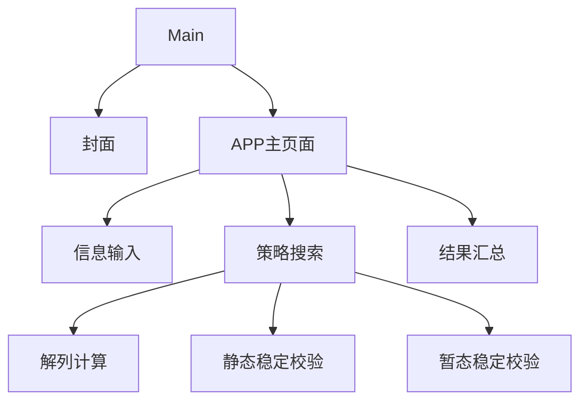
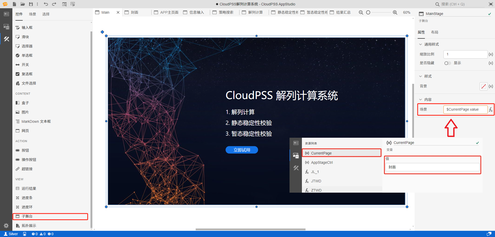
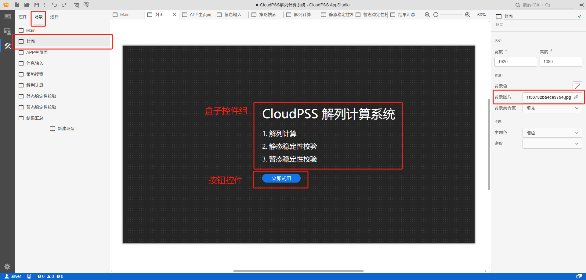
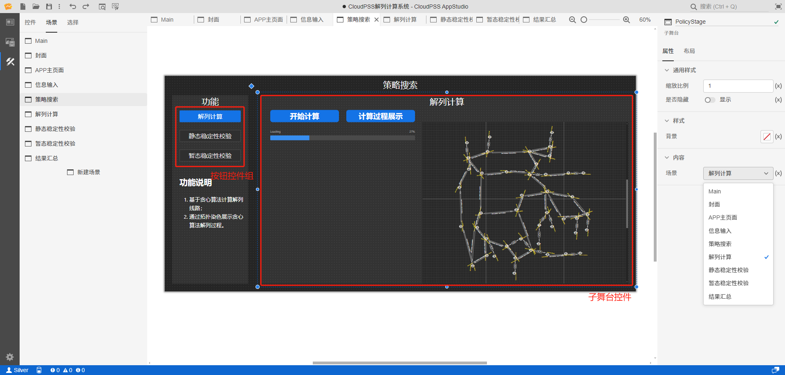
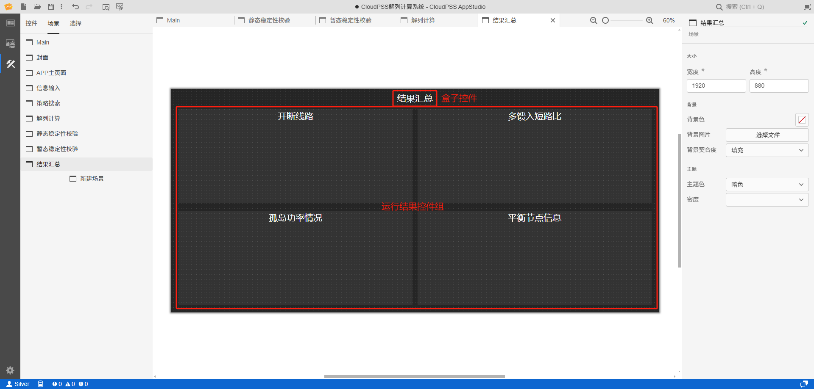

本文档主要介绍如何使用 AppStudio 构建 [解列计算系统](https://cloudpss.net/application/CloudPSSDemo/SystemSplitting#/summary) 典型案例。本文档将会基于应用搭建流程，重点选择 AppStudio 的重要功能及其应用细节进行详细介绍。较为基础的功能以及案例中的控件的参数等信息，请通过访问以上案例链接进行查看。

## 案例概述

解列计算系统是基于 CloudPSS XStudio、潮流计算内核和电磁暂态仿真内核制作，用于生成安全、稳定的解列策略，并加以验证。应用主要包含以下 3 项功能：

1. 参数输入：用于录入解列计算的对象和参数，即相关算例在 SimStudio 的工程名和解列算法参数。

2. 业务功能
   1. 解列策略生成：基于贪心算法计算解列线路，生成解列策略；在 SimStudio 拓扑图上通过染色方式展示贪心算法解列过程。
   2. 静态稳定校验：对解列后的各孤岛进行潮流计算；展示解列前后静态工作点节点电压的变化；展示解列前后静态工作点发电机功率的变化。
   3. 暂态稳定校验：对系统解列瞬间进行电磁暂态仿真；展示解列前后发电机机端电压变化；展示解列前后发电机转子转速变化。

3. 结果汇总：展示解列计算系统的输出结果，包括开断线路表、多馈入短路比表、孤岛功率情况表和平衡节点信息表。

以上三大功能通过应用的封面和主页面实现与用户交互，如下图所示。

封面和主页面通过 AppStudio 构建的 9 个场景搭建而成，场景的架构如下图所示。通过在 Main 场景中建立子舞台，以 [场景嵌套](../../50-app-design/30-layered-scenes/index.md#场景嵌套) 的方式，使应用在与用户交互时实现在不同场景中切换。接一下来，将以场景剖析的方式，对应用以及 AppStudio 重点功能进行介绍。

## Main 场景

Main 场景仅由一个 MainStage 子舞台控件构成，子舞台的 `场景` 以表达式形式关联变量资源 CurrentPage，以 [场景嵌套](../../50-app-design/30-layered-scenes/index.md#场景嵌套) 的方式实现场景切换，如下图所示。具体来说，用户通过页面操作改变 CurrentPage 值，触发 MainStage 子舞台控件改变其关联的场景，以实现显示页面的切换。

这里资源变量 CurrentPage 配置的值（默认值）为封面，因此下图 Main 场景此时显示为子舞台控件关联的封面场景。

### 封面场景

封面场景主要由盒子控件组以及按钮控件构成。按钮控件配置了 `事件-点击` 属性，关联到资源变量 CurrentPage，起到点击按钮切换显示页面至 APP 主页面场景的效果。此外，封面场景配置了其 `背景图片` 属性，具体如下图所示。

### APP 主页面场景

APP 主页面场景主要由盒子控件组、按钮控件组以及子舞台控件构成。其中，按钮控件配置了 `事件-点击`，关联资源变量 AppStageCtrl，起到用户点击不同的按钮，子舞台控件会切换到解列计算、静态稳定校验、暂态稳定校验中相对应的场景。AppStageCtrl 配置的默认值为信息输入，因此子舞台此时显示信息输入场景画面，如下图所示。

此外，此场景配置了与封面场景相同的背景图片。

### 信息输入场景

信息输入场景主要通过输入控件，配合按钮控件以及链接控件，使用户通过页面录入解列计算的对象和参数，即相关算例在SimStudio的工程名和解列算法参数，如下图所示。

### 策略搜索场景

策略搜索场景与 APP 主页面场景相似，主要由按钮控件以及子舞台控件构成，如下图所示。用户可通过左侧按钮控件组，控制右侧子舞台控件的展示内容。

### 解列计算场景

解列计算场景主要由计算及结果展示区和计算过程可视化展示区两部分组成，如下图所示。其中，计算及结果展示区的构建方法可参见 [扫频分析应用案例-设计场景](../10-Freq-Sweep-Analyzer%20/index.md#设计场景)。

计算过程可视化展示区是基于计算结果，通过有序高亮拓扑中元件的方式动态展示解列计算的详细过程。用户点击**计算过程展示**按钮控件，触发后台算法，后台算法不断更新需要高亮的元件 `key` 数据，然后通过 `plot` 方法发送出来（一种让前端能读取数据的技巧），实现元件的高亮。对应地，拓扑展示控件的 `高亮` 属性配置参数及说明如下图所示。

关于此场景下拓扑展示控件，重点还需要关注以下配置。其中，下表 `覆盖样式` 配置表达式中的 `transpose` 与上图 `flatten` 用一致，用于覆盖元件，通过高亮和覆盖的结合实现元件的高亮和消失效果。

| 属性 | 值/表达式 |
| :--: | :--: |
| `模型 RID` | model/CloudPSSDemo/IEEE39 |
| `高亮` | `flatten($RS.value.table2.traces[1]["cells.values"])` |
| `覆盖样式` | `transpose($RS.value.table1.traces[1]["cells.values"])` |

### 静态稳定性校验场景

静态稳定性校验场景与解列计算场景相似，主要由按钮控件、进度条控件以及运行结果控件组构成。用户通过按钮控件触发后台内核计算，内核运行状态与输出结果通过进度条控件以及运行结果控件组在页面进行显示。

### 暂态稳定性校验场景

暂态稳定性校验场景与静态稳定性校验场景基本相同，仅少了一个运行结果控件。此外，AppStudio 可从 SimStudio 仿真过程中 [实时获取仿真结果](../../../../80-sdk-python/40-emtlab-sdk/20-advanced/20-advanced-case2/index.md#代码解析)，预览效果如下图所示。

### 结果汇总场景

结果展示区主要由四个运行结果控件组成，分别展示开断路线、多馈入短路比、孤岛功率情况以及平衡节点信息结果，如下图所示。

