本文档主要介绍如何使用 AppStudio 构建 [绿电分析系统](https://cloudpss.net/application/CloudPSSDemo/GreenEnergy#/summary) 典型案例。本文档将会基于应用搭建流程，重点选择 AppStudio 的重要功能及其应用细节进行详细介绍。较为基础的功能以及案例中的控件的参数等信息，请通过访问以上案例链接进行查看。

## 案例概述

绿电分析系统是基于 SimStudio 能量流计算内核和气象预测数据，分析某区域电网在一段时间内的发电及负荷利用情况，并结合 AppStudio 搭建的交互式应用。该系统主要包含 1 个 500kV 和 5 个 220kV 变电站，在其中 1 处 220kV 变电站下挂接了 6 处 10kV 开闭站及其负荷，另外 4 处 220kV 变电站下都接入了新能源电厂，主要新能源设备包括风机和光伏。通过仿真计算分析在未来 2 周内系统的负荷情况、气象条件以及新能源的发电利用情况。该系统主要包含拓扑展示、负荷预测、气象设置和结果展示 4 个模块，如下图所示。

1. **拓扑展示模块**：在拓扑展示模块的左半部分主要用于显示系统整体拓扑，在这里可以清晰看到系统结构和各区块间的连接关系，而模块的右半部分主要用于显示各区块内部的详细拓扑，在这里可以查看每个区块内的新能源电厂内部有多少风机、光伏以及相互之间的连接方式。
1. **负荷预测模块**：在负荷预测模块可以对不同负荷工况模式下区块4所挂接负荷的负荷曲线以及平均负荷进行预测，主要的负荷工况模式包括低负荷、正常负荷以及高负荷三种模式。
1. **气象设置模块**：在气象设置模块可对1月1日-1月14日期间每天的气象参数进行设置，从而预测每天的平均温度以及光照和风速曲线，其中可设置的气象参数包括天气条件（晴、多云、雨、雪）和风速等级。
1. **结果展示模块**：在结果展示模块可基于前面所设置的负荷以及气象条件，对1月1日-1月14日期间的系统运行情况进行仿真，并利用仿真结果计算新能源发电量、新能源利用率以及二氧化碳减排量等关键指标。

该应用主要由欢迎页和主页面构成，如下图所示。其中，上述四大模块在应用主页面通过上方标题栏按钮控件切换。

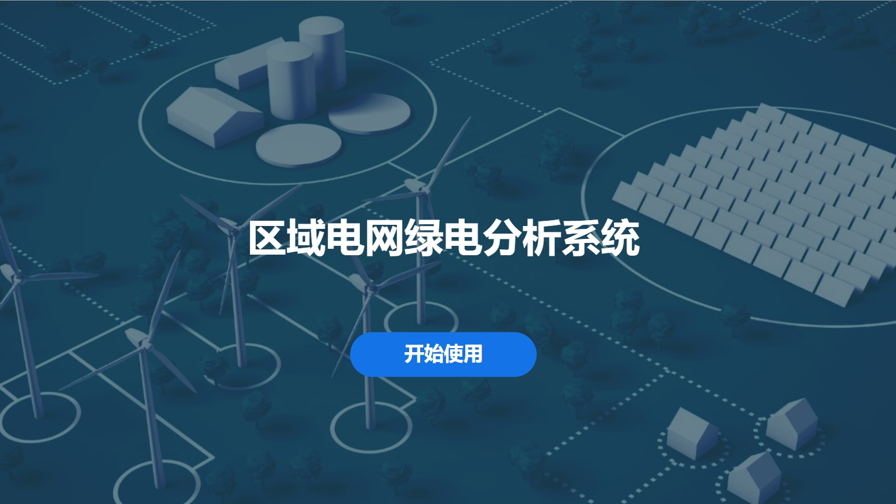

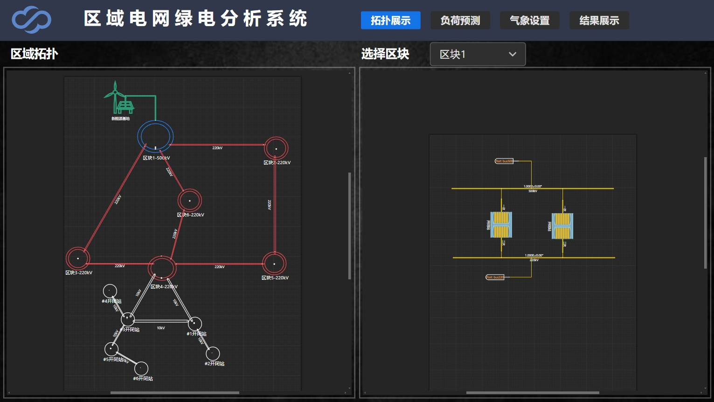

欢迎页和主页面由通过 AppStudio 构建的 8 个场景搭建而成，场景的架构如下图所示。通过在 Main 场景中建立子舞台，以 [场景嵌套](../../50-app-design/30-layered-scenes/index.md#场景嵌套) 的方式，使应用在与用户交互时实现在不同场景中切换。接一下来，将以场景剖析的方式，对应用以及 AppStudio 重点功能进行介绍。

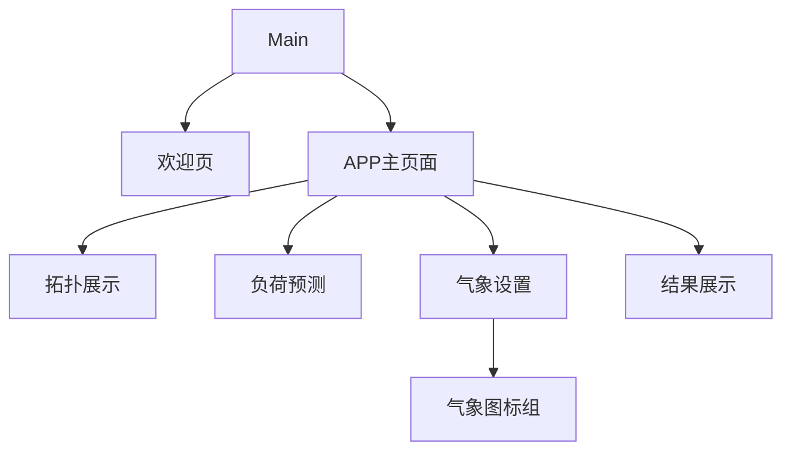

## Main 场景

Main 场景仅由一个 MainStage 子舞台控件构成，子舞台的 `场景` 以表达式形式关联变量资源 CurrentPage，以 [场景嵌套](../../50-app-design/30-layered-scenes/index.md#场景嵌套) 的方式实现场景切换，如下图所示。具体来说，用户通过页面操作改变 CurrentPage 值，触发 MainStage 子舞台控件改变其关联的场景，以实现显示页面的切换。

这里资源变量 CurrentPage 配置的值（默认值）为 Welcome，因此下图 Main 场景此时显示为子舞台控件关联的欢迎页（Welcome）场景。

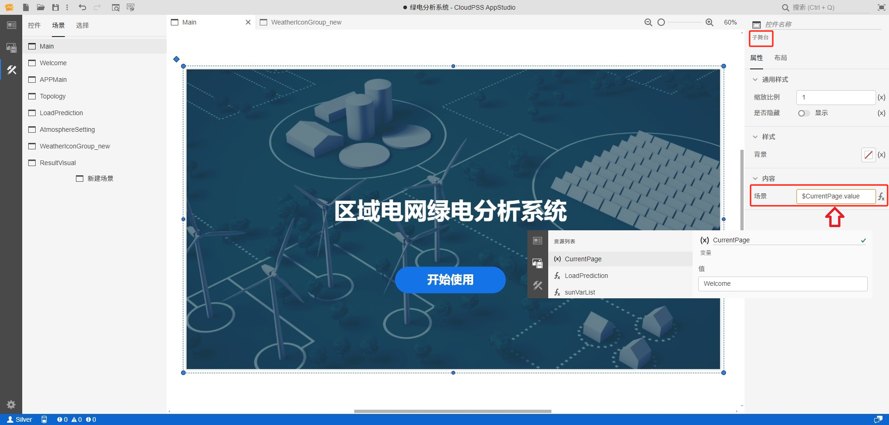

### 欢迎页场景

欢迎页（Welcome）场景主要由盒子控件组以及按钮控件构成。按钮控件配置了 `事件-点击` 属性，关联到资源变量 CurrentPage，起到点击按钮切换显示页面至 APP 主页面场景的效果。此外，封面场景配置了其 `背景图片` 属性，具体如下图所示。

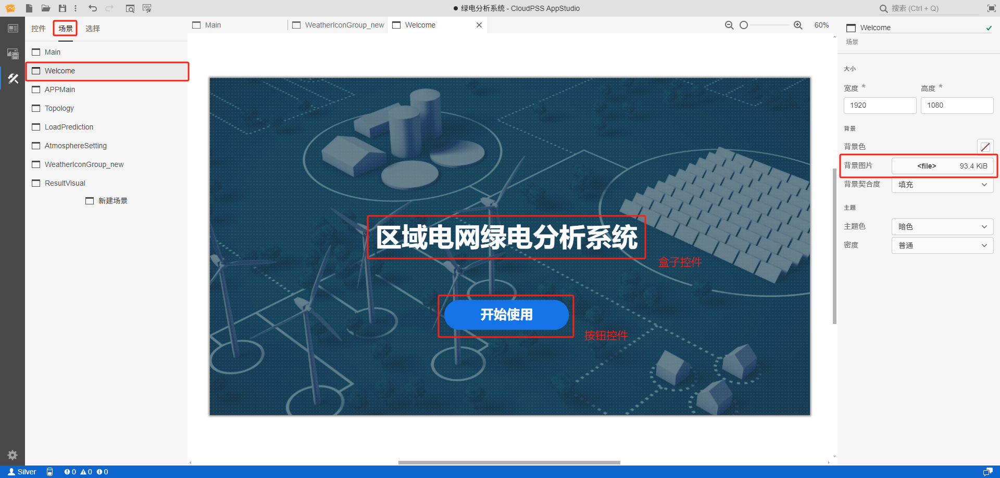

### APP 主页面场景

APP 主页面场景主要由 MarkDown 文本框控件、盒子控件组、按钮控件组以及子舞台控件构成。其中，按钮控件配置了 `事件-点击`，关联资源变量 AppStageCtrl，起到用户点击不同的按钮，子舞台控件会切换到解列计算、静态稳定校验、暂态稳定校验中相对应的场景。AppStageCtrl 配置的默认值为信息输入，因此子舞台此时显示信息输入场景画面，如下图所示。

此外，此场景同样配置了背景图片。

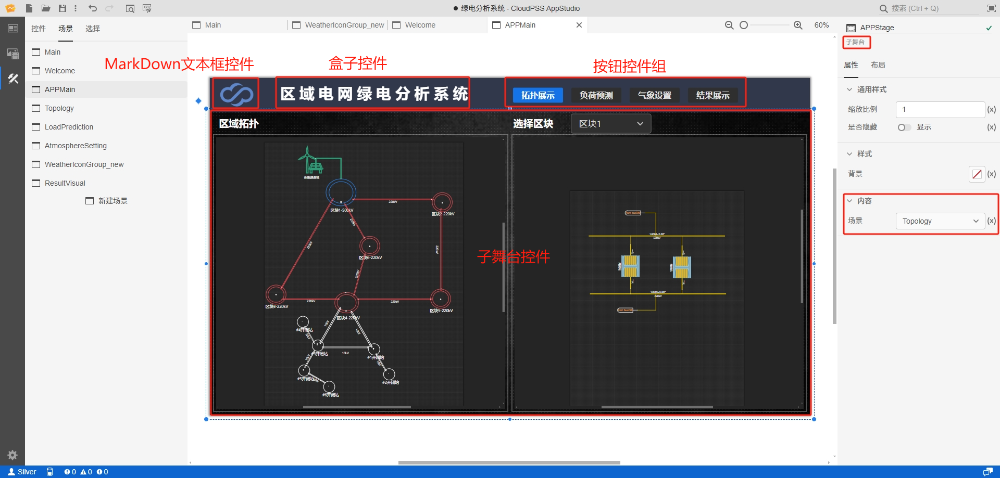

### 拓扑展示场景

拓扑展示（Topology）场景主要由标题区、系统结构区、区块拓扑区组成。其中，标题区主要由一个盒子控件构建；系统结构区主要由一个拓扑展示控件构成，显示在SimStudio中构建的系统数字孪生模型整体拓扑，在这里可以清晰看到系统结构和各区块间的连接关系；区块拓扑区主要由一个选择器控件和一个拓扑展示控件构成，用户通过选择器控件切换显示各区块内部的详细拓扑，在这里可以查看每个区块内的新能源电厂内部的风机、光伏以及相互之间的连接方式，如下图所示。

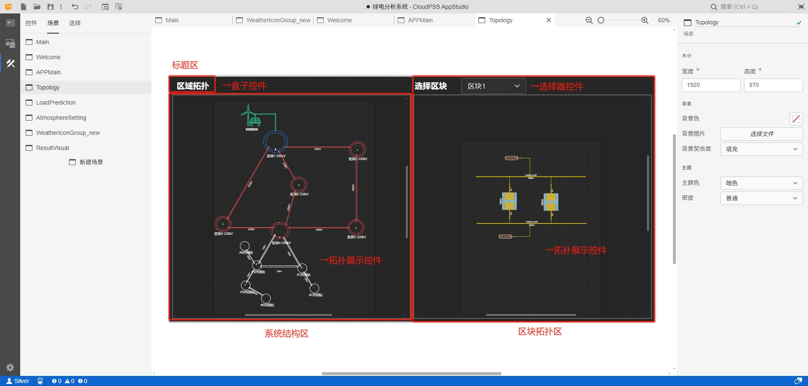

构建区块拓扑区的关键在于 TopoSelector 选择器控件与拓扑展示控件的交互。在配置拓扑展示控件的 `模型 RID` 属性时，采用表达式方式，将 TopoSelector `可选项` （表达式方式）值 `["区块1", "区块2", "区块3", "区块4", "区块5", "区块6", "#1开闭站",  "#2开闭站", "#3开闭站", "#4开闭站", "#5开闭站", "#6开闭站"]` 分别与不同区块拓扑模型 RID 进行关联，具体方式及语法如下图所示。

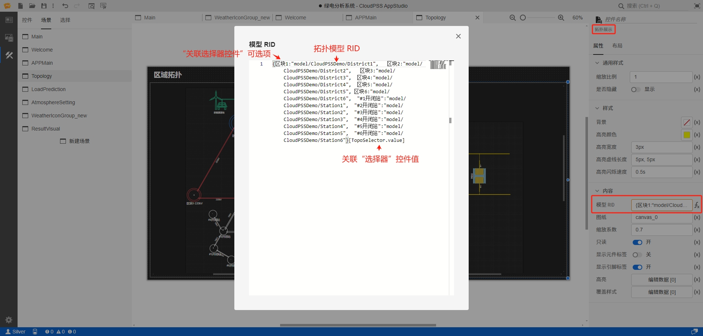

### 负荷预测场景

负荷预测（LoadPrediction）场景的主要逻辑是主要由负荷模式选择器控件，控制解释盒子控件、平均负荷盒子控件组以及运行结果控件的显示结果。用户可选择低负荷模式、正常负荷模式或高负荷模，查看该模式下区块4所挂接负荷的负荷曲线以及平均负荷的预测结果，如下图所示。

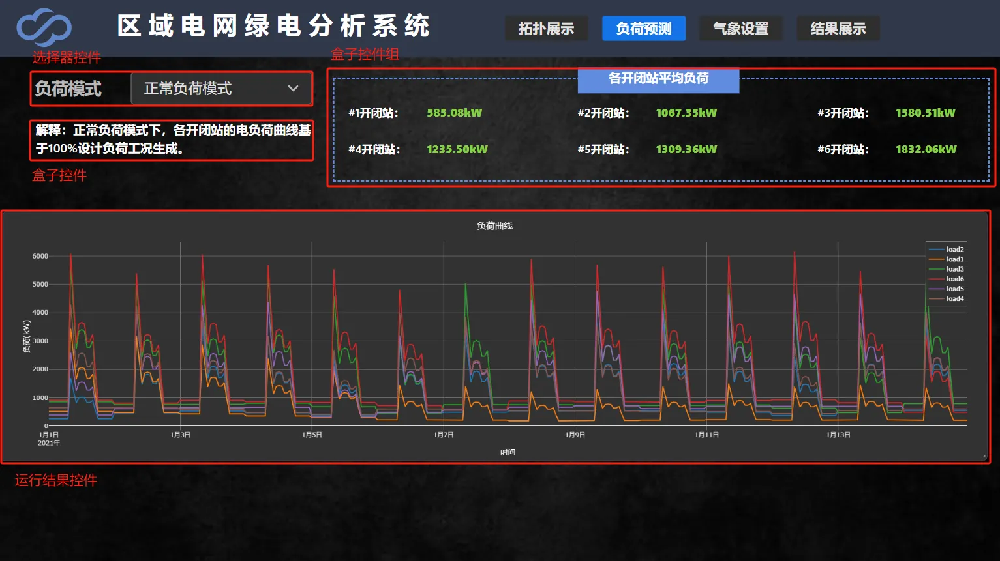

具体而言，配置负荷模式选择器控件 `事件` - `更改` 属性，将选择器值赋值给 LoadPrediction 资源函数的变量，并触发函数内核运行，如下图所示。运行结果控件则关联 LoadPrediction 资源函数输出。而解释盒子控件和平均负荷盒子控件组关联负荷模式选择器控件值，会在选择器值发生改变时，相应改变控件显示结果。

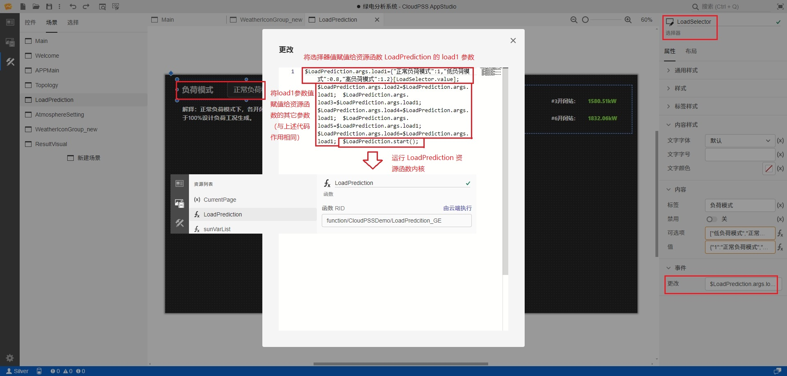

### 气象设置场景

气象设置（AtmosphereSetting）场景主要由按钮控件、盒子控件、WeatherStage 子舞台控件以及运行结果控件构成。用户通过 WeatherStage 子舞台控件设置气象参数，然后通过点击生成气象曲线按钮控件，运行资源函数 WeatherPrediction2 内核。内核会基于设置的气象参数，生成光照曲线与风速曲线，并在运行结果控件组显示，如下图所示。

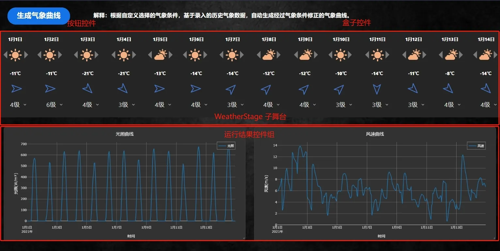

### 气象图标组场景

气象图标组（WeatherlconGroup_new）场景（上述气象设置场景 WeatherStage 子舞台控件）由日期显示区、光照及温度设置区以及风速设置区组成。用户通过左右按钮控件设置天气条件（晴、多云、雨、雪），改变天气条件的图标显示，同时基于配置的天气与温度的映射关系改变温度；通过选择器控件，设置风速等级。接下来，将对光照及温度设置区的构建进行详细的介绍。

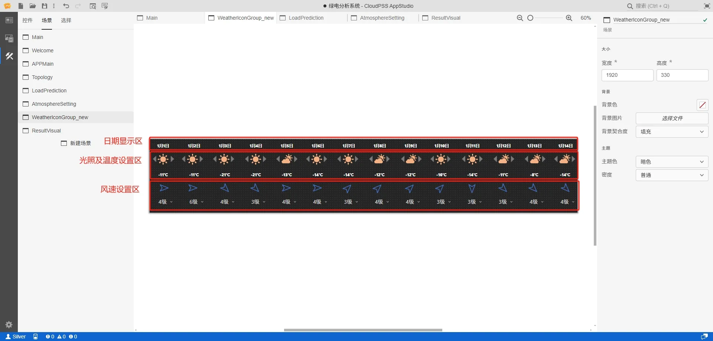

以从左第一个右按钮为例，首先基于配置的资源函数 sunVarList，配置左右按钮控件（）的 `事件` - `点击` 属性为 `$sunVarList.args.varList[1]=($sunVarList.args.varList[1]+1)%4`, 当按钮触发后 sunVarList 的 `varList` 第一个值会 +1，基于值与图标的映射关系，1月1日气象条件图标将相应改变。相似地，关联了 sunVarList 的 `varList` 值的温度盒子控件，显示值同样会相应地改变，具体，将`内容` - `文本` 属性地表达式配置为 `{"0":"-11℃","1":"-12℃","2":"-14℃","3":"-16℃"}[$sunVarList.args.varList[1].toString()]`。

### 结果展示场景 

结果展示（ResultVisual）场景需配置 ResultView 资源函数，通过开始计算按钮控件触发，读取前面所设置的负荷以及气象条件，若下图所示；并基于 SimStudio 能量流计算内核，对未来2周的系统运行情况进行仿真，并利用仿真结果计算新能源发电量、新能源利用率以及二氧化碳减排量等关键指标，由盒子控件组展示。结果展示控件展示仿真结果曲线。

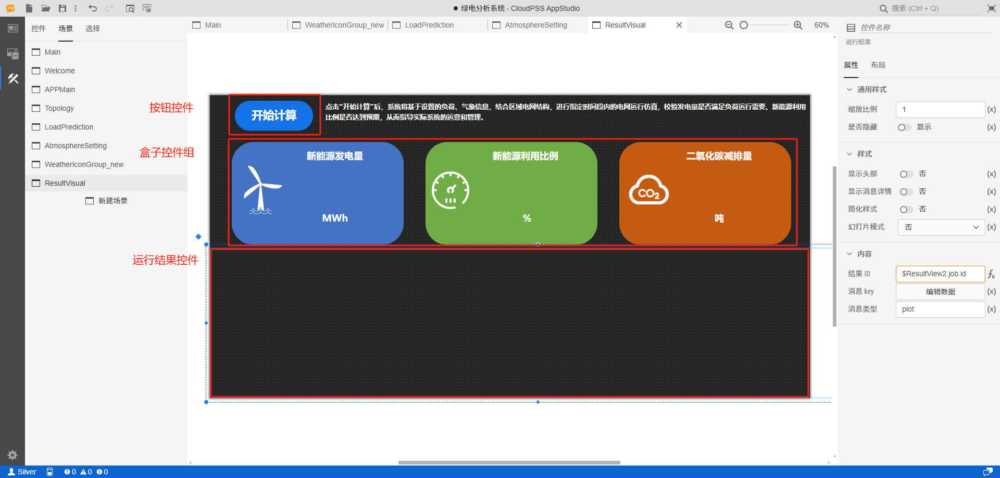