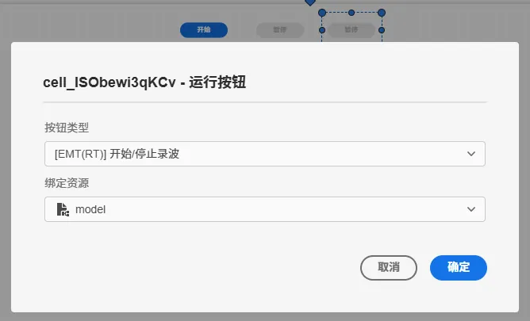
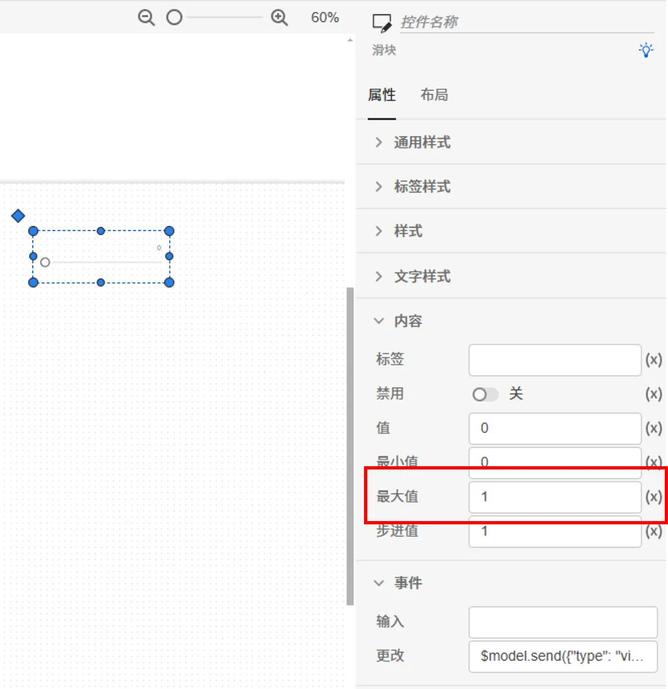
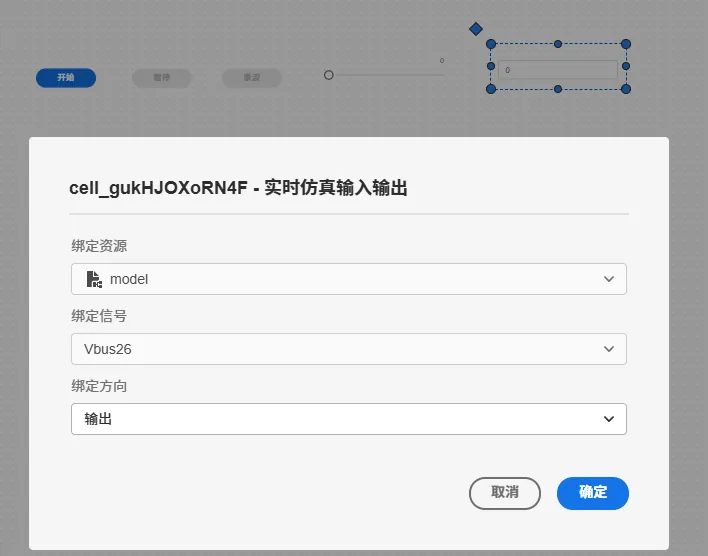
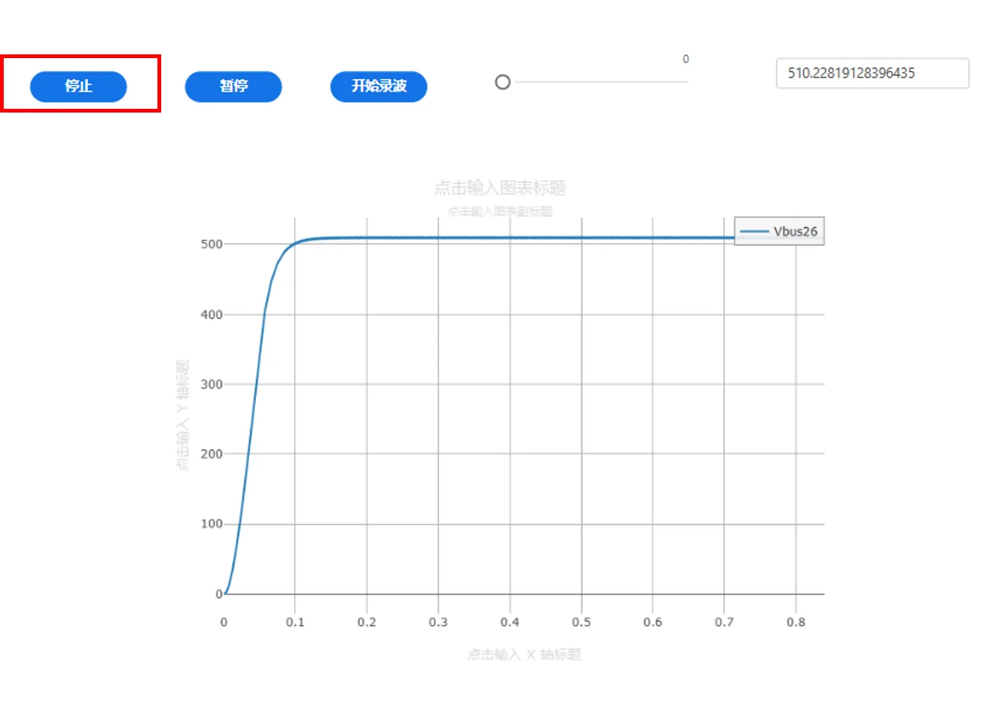

--- 
title: 实时仿真应用
description: 实时仿真应用
tags:
- xstudio
- appstudio
- cases
- advanced
---

SimStudio 模型工坊、FuncStudio 函数工坊和 AppStudio 应用工坊之间可以实现灵活的协同交互，例如：

+ 在 FuncStudio 中，可利用 CloudPSS SDK 调用 SimStudio 的模型和仿真内核构建更复杂的应用内核
+ 在 AppStudio 中可以直接导入 SimStudio 的模型拓扑图，并直接展示仿真结果

其中利用 CloudPSS SDK 调用 SimStudio 的仿真内核，获取仿真结果详见[仿真内核调用及结果获取 SDK](../../../../80-sdk-python/40-emtlab-sdk/20-advanced/20-advanced-case2/index.md)。

本节以一个简单的案例介绍如何在不利用 SDK 构建 FuncStudio 函数的情况下在 AppStudio 里面构建一个实时仿真应用。

公网试用平台暂不支持实时仿真，公网用户可参照本应用自己构建离线仿真应用。

## 在 SimStudio 构建实时仿真算例

### 添加虚拟输入端口

- 进入 SimStudio 平台新建一个 IEEE 10 机 39 节点标准测试系统，添加一个虚拟输入端口元件，名称配置为`brk`，引脚名称配置为`brk`

- 给 bus26 母线元件添加三相接地断路器，将断路器的控制信号配置为`brk`，代表断路器开断由虚拟输入端口信号实时控制。

### 添加虚拟输出端口

- 再添加一个虚拟输出端口元件，名称配置为`Vbus26`，引脚名称配置为`Vbus26`，并将 bus26 母线元件的电压均方根值量测参数配置为`Vbus26`，代表该母线的电压有效值由虚拟输出端口实时输出。

### 配置实时仿真计算方案

- 构建好算例后，进入运行标签页，选择电磁暂态仿真方案，将仿真类型设置为实时仿真，积分步长设置为 0.00005s,
实时仿真模式切换为主模式，在数值型输出通道和曲线型输出通道里面都添加`Vbus26`虚拟输出端口。

:::tip
可根据需求自行调整仿真结束时间。
:::

### 模型运行

- 启动任务进行实时仿真，确保项目成功运行

### 保存

- 保存项目

 

## 应用构建

进入 AppStuido 平台，新建一个空白应用。

### 添加模型资源

在资源标签页内新建一个模型资源，选择刚才构建的IEEE 10 机 39 节点标准测试系统，命名为 model

### 场景编辑

#### 添加按钮控件

进入场景标签页，添加三个按钮控件，分别用于控制实时仿真的开始/停止、暂停/恢复、开始/停止录波。

- 添加第一个按钮控件，点击进入向导页面，将按钮类型选择为开始/停止，资源绑定为 model ，使用当前计算方案

- 添加第二个按钮控件，点击进入向导页面，将按钮类型选择为EMT(RT)暂停/恢复，资源绑定为 model
 

- 添加第三个按钮控件，点击进入向导页面，将按钮类型选择为EMT(RT)开始/停止录波，资源绑定为 model

#### 添加滑块控件

- 添加一个滑块控件，点击进入向导页面，资源绑定为 model ，信号绑定为`brk`，方向为输入，触发事件方式为更改，并将滑块的最大值设为 1，用于修改虚拟输入端口的值，实现对bus26母线接地开关的通断控制。
  

#### 添加输入框控件

- 添加一个输入框控件，点击进入向导页面，资源绑定为 model ，信号绑定为`Vbus26`，方向为输出，用于实时显示 bus26 母线的电压有效值
  

#### 添加示波器控件

- 添加一个示波器控件，将资源选择 `$model` ，点击输出通道，添加一个示波器分组，在该分组内添加 `Vbus26` 的输出通道。
  

### 应用预览

- 进入预览模式，点击开始按钮后，输入框实时显示 bus26 母线的电压有效值，示波器实时展示 bus26 母线电压有效值的变化曲线

- 在仿真过程中，修改滑块的值，随时控制母线的接地断路器的开断，1 表示闭合，0 表示断开

- 点击暂停按钮，暂停仿真；点击恢复按钮，恢复仿真

- 点击录波按钮，开始录制仿真波形；点击停止录波按钮，停止录波，并生成录波数据文件。

