--- 
title: 实时电磁暂态仿真应用
description: 实时电磁暂态仿真应用
tags:
- xstudio
- appstudio
- cases
- advanced
---

本文档主要介绍如何使用 AppStudio 快速构建实时电磁暂态仿真应用典型案例。

## 案例概述

基于 AppStudio 的“实时仿真输入输出”向导，快速绑定实时仿真模型的虚拟输入输出端口，构建了光伏逆变器实物控制器的硬件在环实时仿真应用，实现光伏逆变器在故障穿越下的数字物理动态特性的快速模拟，如下图所示：

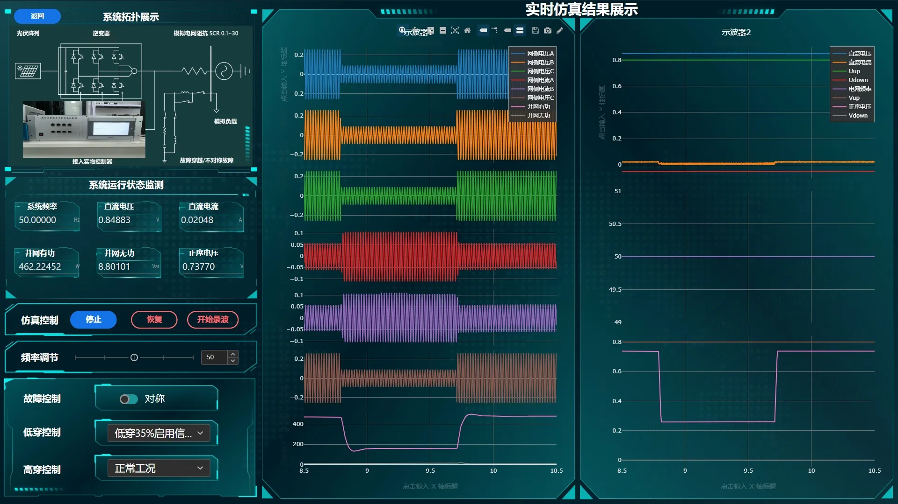

## 应用构建

### 添加模型资源

基于 CloudPSS 实时仿真平台，建立了包括光伏电池组、自同步电压源型光伏逆变器的主电路、故障穿越及接地故障以及电源的光伏逆变器实物控制器的硬件在环实时仿真模型

通过CloudPSS I/O 信号枢纽向自同步电压源光伏逆变器实物控制器提供交流电压/电流、直流电压/电流、s 开关位置节点等模拟/数字信号

光伏逆变器实物控制器通过对采集信号进行程序运算并生成控制信号，对逆变器、各试验开关等模型进行控制，构成闭环试验环境。

:::tip
用户可根据需求自行构建或使用其他实时仿真模型。
:::

在资源标签页内创建模型资源，选择构建好的光伏逆变器实物控制器的硬件在环实时仿真模型，命名为 model

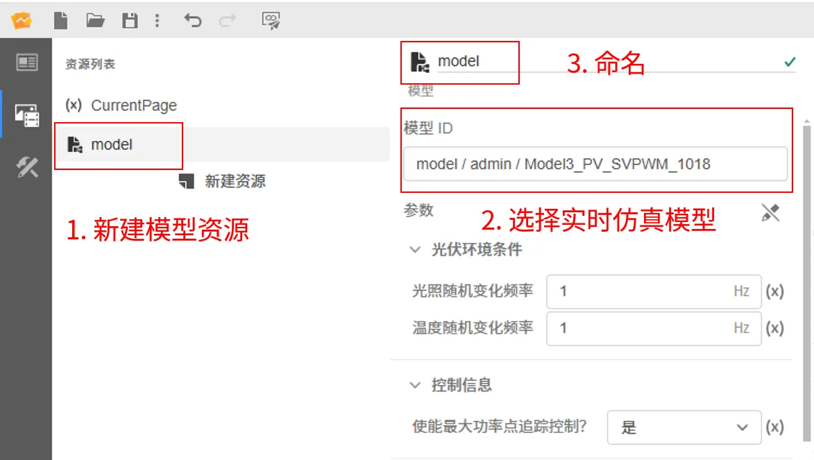

### 场景编辑

本应用包含`Main`、`Welcome`、`RTSim`三个场景

#### Main 场景

Main 场景包含一个子舞台控件，其场景属性为`$CurrentPage.value`，表示通过`CurrentPage`变量资源的来值控制子舞台控件展示的当前场景，`CurrentPage`的初始值为 Welcome` ，子舞台控件展示的初始场景为 Welcome 场景。

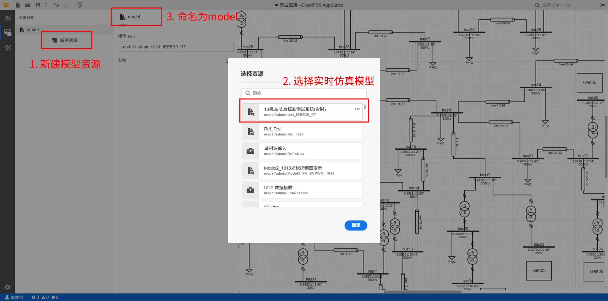

#### Welcome 场景

Welcome 场景包含一个盒子控件和一个按钮控件

- 盒子控件的文本属性为`光伏逆变控制器数字物理动态模拟系统`，作为本应用的标题

- 按钮控件的事件为`$CurrentPage.value = "RTSim"`，点击后进入 RTSim 场景

:::tip
用户可根据需求使用其他背景模板。
:::

#### RTSim 场景

RTSim 场景主要由系统拓扑展示区、系统运行状态监测区、仿真控制面板、参数及故障调节面板、实时仿真结果展示区组成

- 系统拓扑展示区为光伏逆变器实物控制器的硬件在环实时仿真模型示意图，也可使用**拓扑展示控件**绑定 SimStudio 模型 RID 来展示模型拓扑

- 系统运行状态监测区为一组输入框控件，通过“实时仿真输入输出”向导分别绑定为模型资源对应的虚拟输出端口，平台会将向导中设置的方案按照特定的表达式自动写入输入框控件的值属性中。例如：`$model.value.rt_state.outputs.电网频率.value.toFixed(5)`，表示用该输入框来实时显示名为`电网频率`的虚拟输出端口的值，并使用了toFixed(5)方法来只显示 5 位小数。

- 仿真控制面板包括三个按钮控件，通过“运行按钮”向导对绑定的模型资源快速设置按钮的点击事件，将其分别绑定为实时仿真模型资源的开始/结束仿真、暂停/恢复仿真、录波/结束功能；

- 参数及故障调节面板包括频率调节滑块、故障控制开关以及高低穿故障选择器
    - 通过“实时仿真输入输出”向导将频率调节滑块绑定为模型资源名为``虚拟输出端口，频率调节滑块

- 将向导中设置的方案按照特定的表达式自动写入输入控件的属性输入框中
  
- 用于实时显示仿真结果。
  将向导中设置的方案按照特定的表达式自动写入输入控件的属性输入框中

进入场景标签页，添加三个按钮控件，分别用于控制实时仿真的开始/停止、暂停/恢复、开始/停止录波。

- 添加第一个按钮控件，点击进入向导页面，将按钮类型选择为开始/停止，资源绑定为 model ，使用当前计算方案

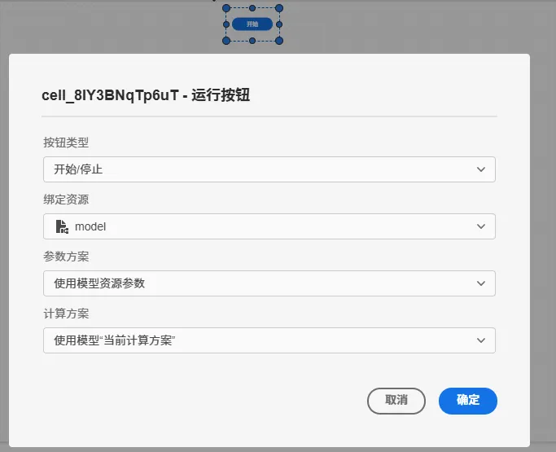

- 添加第二个按钮控件，点击进入向导页面，将按钮类型选择为EMT(RT)暂停/恢复，资源绑定为 model
 
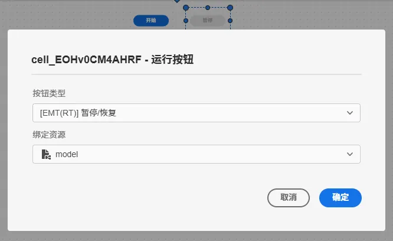

- 添加第三个按钮控件，点击进入向导页面，将按钮类型选择为EMT(RT)开始/停止录波，资源绑定为 model

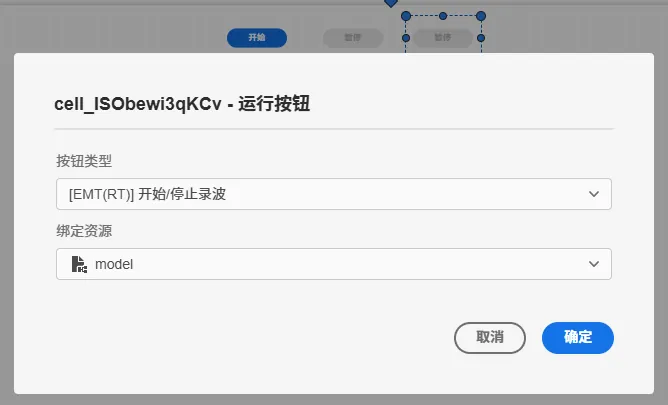

#### 添加滑块控件

- 添加一个滑块控件，点击进入向导页面，资源绑定为 model ，信号绑定为`brk`，方向为输入，触发事件方式为更改，并将滑块的最大值设为 1，用于修改虚拟输入端口的值，实现对bus26母线接地开关的通断控制。
  
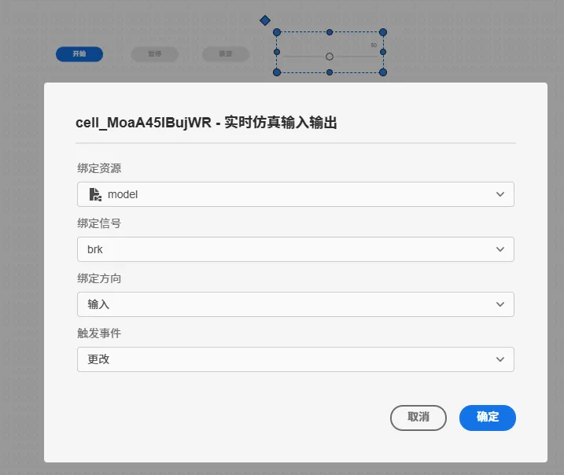

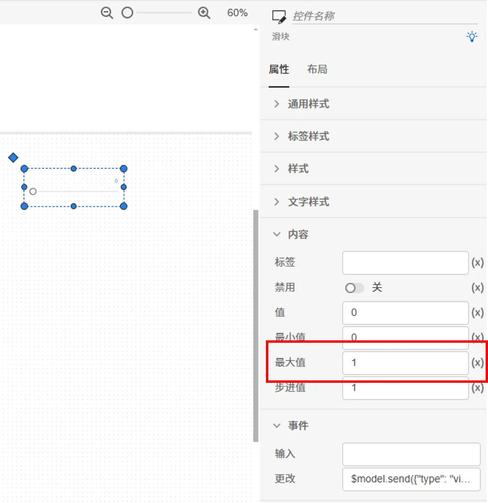

#### 添加输入框控件

- 添加一个输入框控件，点击进入向导页面，资源绑定为 model ，信号绑定为`Vbus26`，方向为输出，用于实时显示 bus26 母线的电压有效值
  
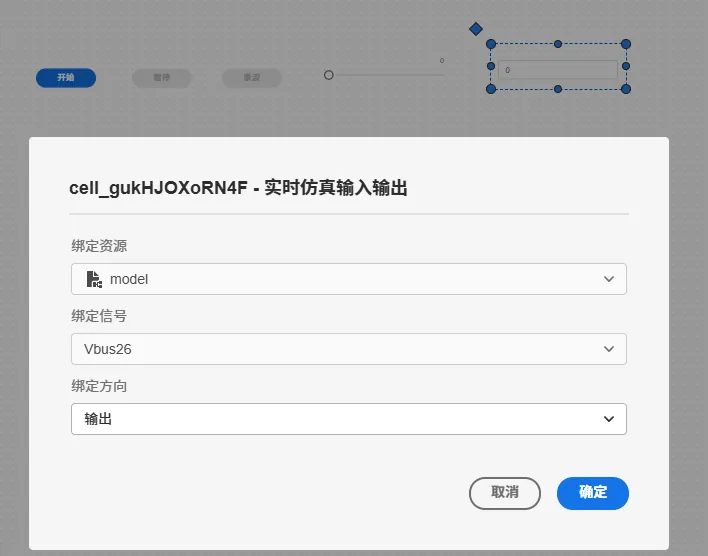

#### 添加示波器控件

- 添加一个示波器控件，将资源选择 `$model` ，点击输出通道，添加一个示波器分组，在该分组内添加 `Vbus26` 的输出通道。
  
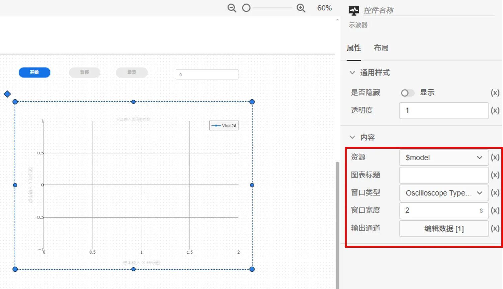

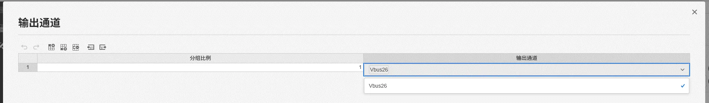

### 应用预览

- 进入预览模式，点击开始按钮后，输入框实时显示 bus26 母线的电压有效值，示波器实时展示 bus26 母线电压有效值的变化曲线

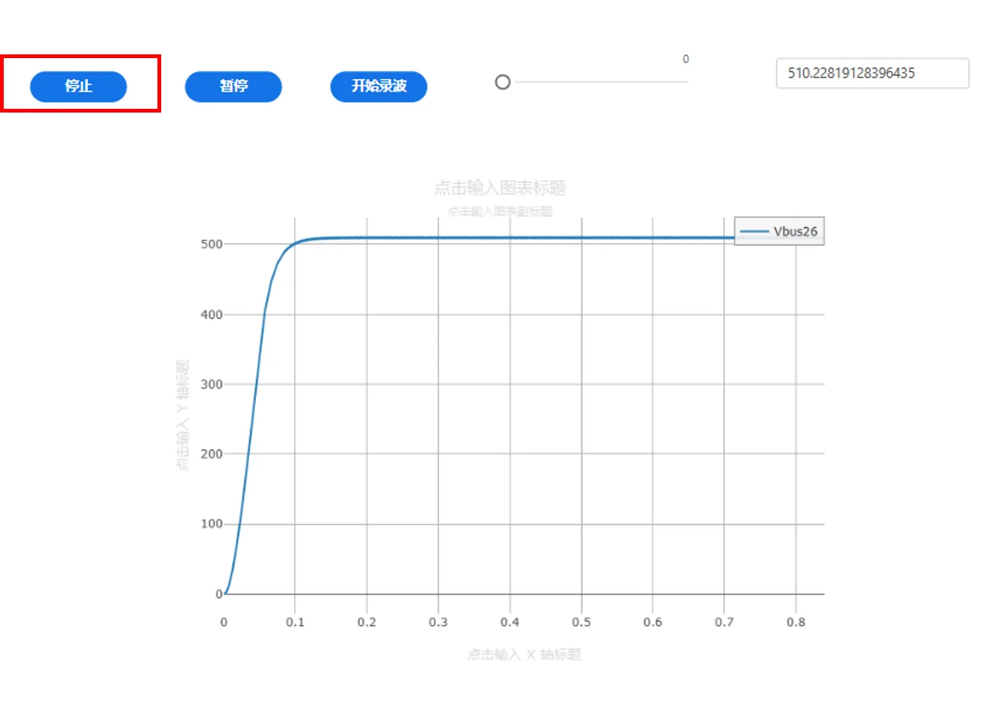

- 在仿真过程中，修改滑块的值，随时控制母线的接地断路器的开断，1 表示闭合，0 表示断开

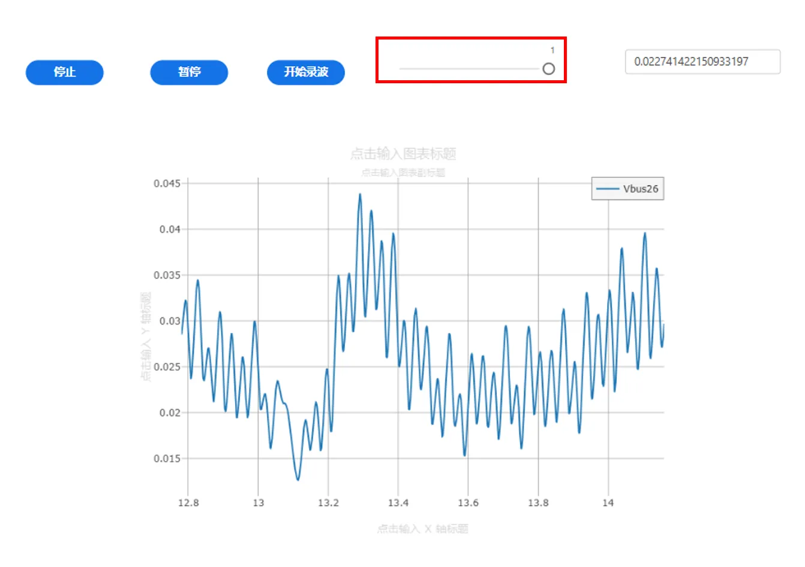

- 点击暂停按钮，暂停仿真；点击恢复按钮，恢复仿真

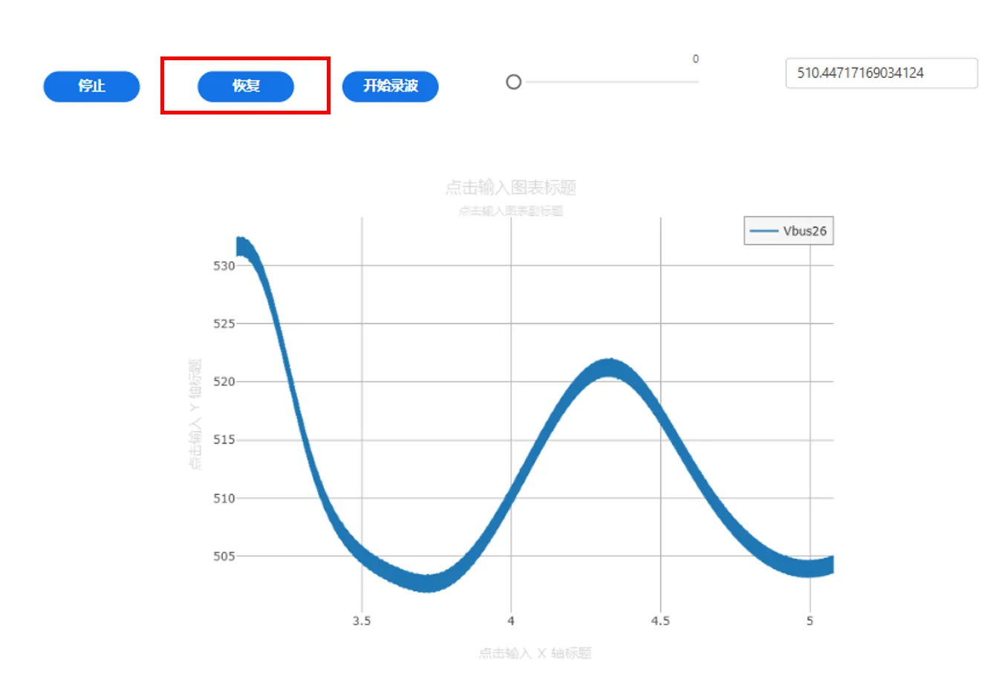

- 点击录波按钮，开始录制仿真波形；点击停止录波按钮，停止录波，并生成录波数据文件。

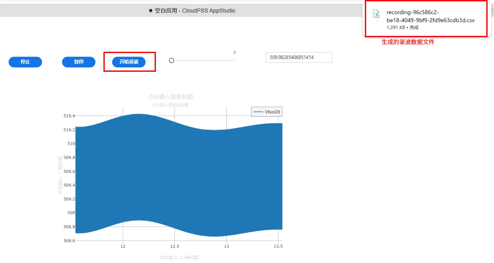

