--- 
title: 自定义实时态应用
description: 使用向导功能快速构建自定义实时态应用
tags:
- xstudio
- appstudio
- cases
- advanced
---

CloudPSS AppStudio现提供示波器、指示器等一系列控件和配置向导，通过简单的拖拽、绑定操作，即可快速构建CloudPSS实时仿真任务的自定义监控页面，实现启停控制、指令下发、波形实时监控、录波等操作。本文档主要介绍如何使用 AppStudio 快速构建实时电磁暂态仿真应用典型案例。

## 案例概述

现以一个光伏逆变器仿真测试系统为例介绍操作流程。

首先，在 CloudPSS RT 实时仿真器中准备好仿真模型。其中包括：光伏逆变器的电气主电路、控制系统和故障模拟部分。

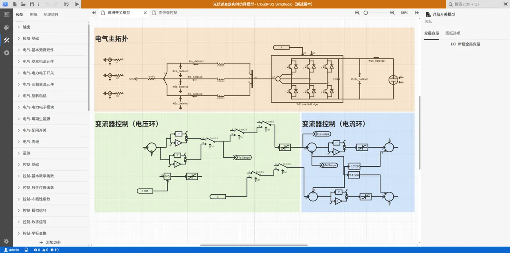

为了在实时仿真过程中可以灵活控制故障，在模型中添加了多类高低穿故障使能信号等控制指令通道。仿真过程中可随时下发控制指令，触发不同程度的高低电压故障。

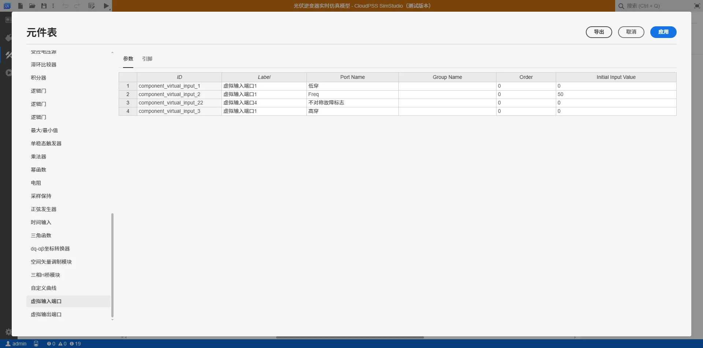

同时，添加了并网点电压、电流、直流侧电压/电流等多个模拟量输出通道，用于监测光伏逆变器在故障下的动态特性。

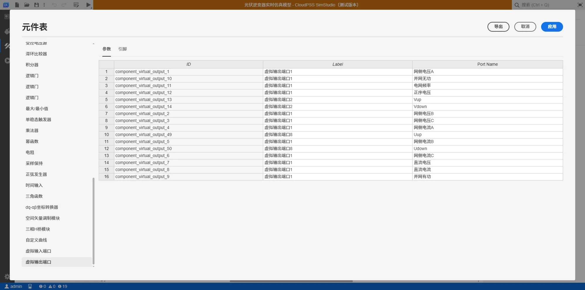

模型准备完成后，选择实时仿真计算方案，启动实时仿真，在CloudPSS 实时曲线监控器中，可通过实时配置需要观测的输出通道、实时下发控制指令、冻结或恢复波形、开始或停止录波等操作，测试模型及各通道配置是否正确。

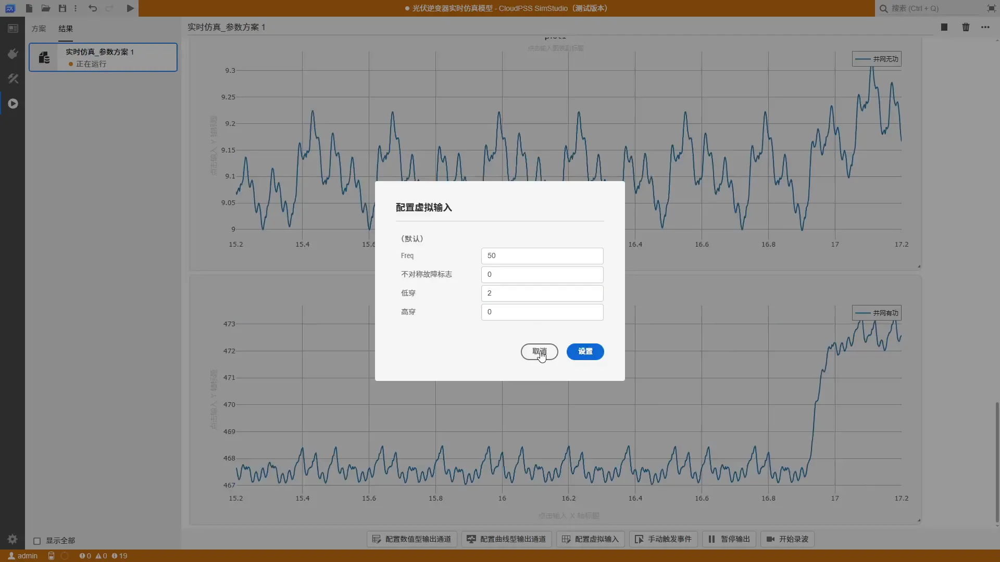

:::tip
用户可根据需求自行构建或使用其他实时仿真模型。
:::

使用CloudPSS AppStudio，用户可进一步构建自定义的实时仿真监控界面，方便同时集成模型拓扑展示、仿真启停控制、波形监测、控制指令下发等功能。

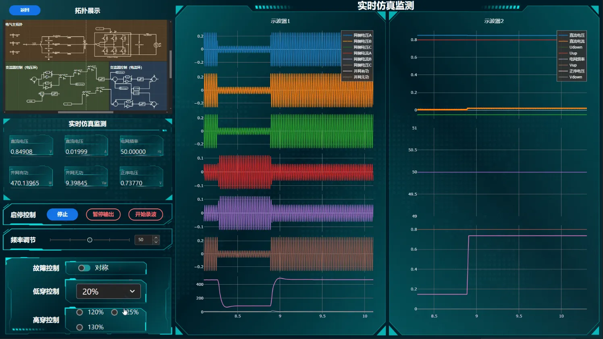

## 应用构建

下面，详细介绍本应用的构建流程。

### 添加模型资源

需要在 AppStudio 资源中添加实时仿真模型资源，进入 AppStudio 资源标签页，新建一个模型资源，选择准备好的实时仿真模型，命名为model，便于后续模型绑定。

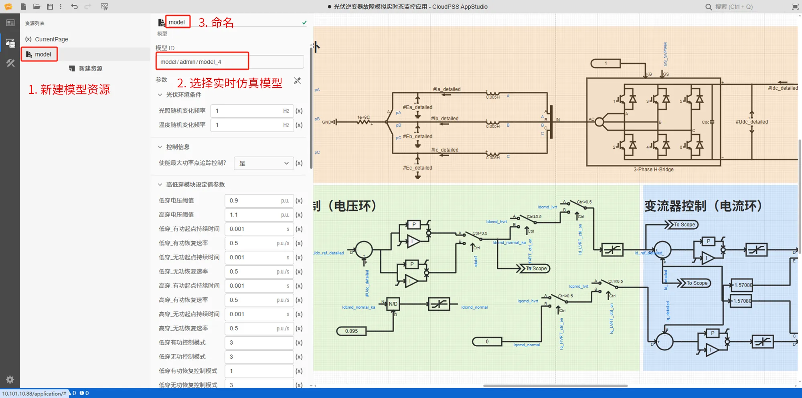

### 场景编辑

本应用包含`Main`、`Welcome`、`RTSim`三个场景

#### Main 场景

Main 场景包含一个子舞台控件，其场景属性为`$CurrentPage.value`，表示通过`CurrentPage`变量资源的来值控制子舞台控件展示的当前场景，`CurrentPage`的初始值为 Welcome` ，子舞台控件展示的初始场景为 Welcome 场景。

#### Welcome 场景

Welcome 场景包含一个盒子控件和一个按钮控件

- 盒子控件的文本属性为`光伏逆变控制器数字物理动态模拟系统`，作为本应用的标题

- 按钮控件的事件为`$CurrentPage.value = "RTSim"`，点击后进入 RTSim 场景

:::tip
用户可根据需求使用其他背景模板。
:::

#### RTSim 场景

在 AppStudio 舞台中搭建实时仿真监控场景，确定好应用的显示比例，此处设置为与显示器大小一致的 1920*1080。

导入预先设计好的应用背景图，将场景划分为4个区域，分别为拓扑展示区、启停控制区、实时数据监测区、和实时指令控制区。

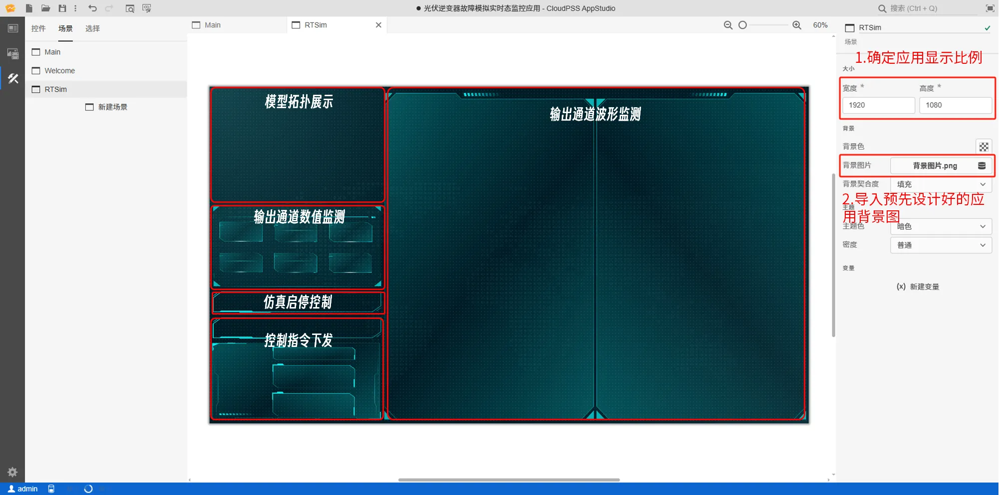

- 第一步，搭建拓扑展示区

  添加一个拓扑展示控件，点击模型 ID，选择准备好的实时仿真模型进行绑定，即可在监控场景中展示对应模型的拓扑图。

  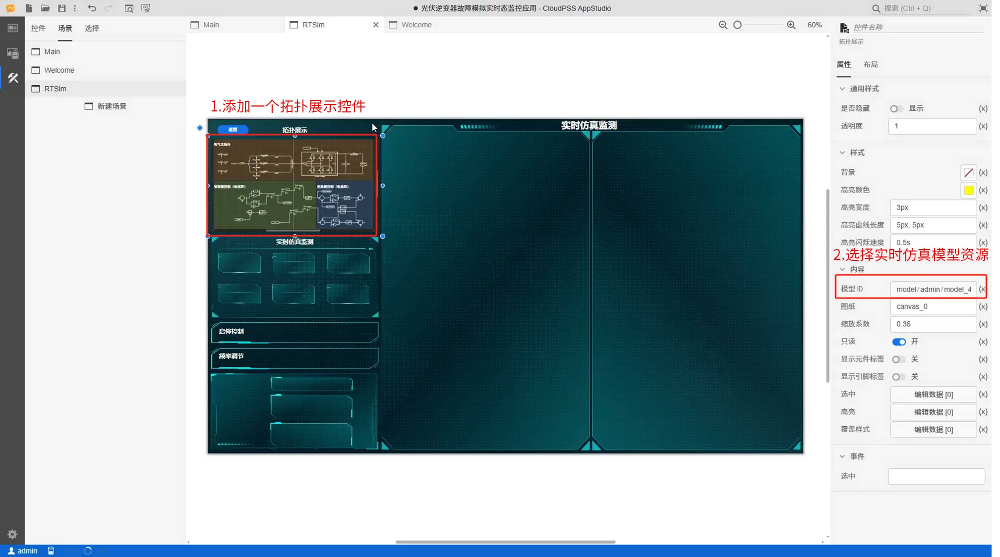

- 第二步，搭建实时仿真启停控制面板

  添加一个按钮控件，选中该按钮，点击右上方的向导图标，进入配置向导界面；选择按钮类型为开始/停止，绑定资源为所添加的实时仿真模型，其他方案默认不变, 点击确定。

  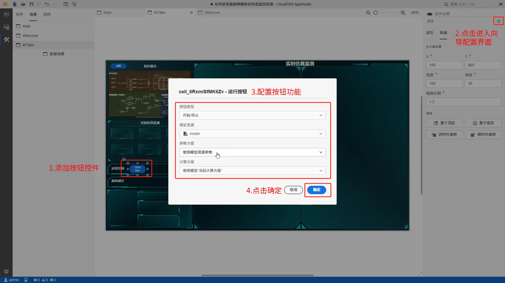
  
  同理，再添加两个按钮，将第二个按钮类型绑定为暂停/恢复输出、第三个按钮类型绑定为开始/停止录波。应用发布后，即可通过点击该按钮组控制实时仿真进程。

  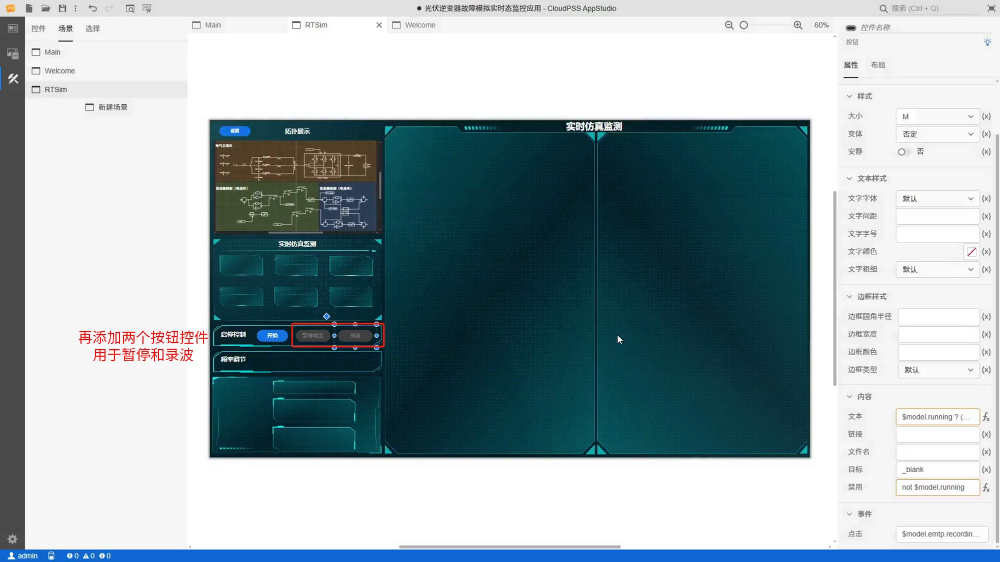

- 第三步，搭建实时仿真监测面板

  - 添加 6 个输入框控件，用于展示输出仿真信号的动态数值。选中第一个输入框控件，点击右上方的向导图标，进入配置向导界面；绑定资源为所添加的实时仿真模型，绑定信号为直流电压；绑定方向选择输出；设置显示小数位数、标签、等其他属性，点击确认。
  
  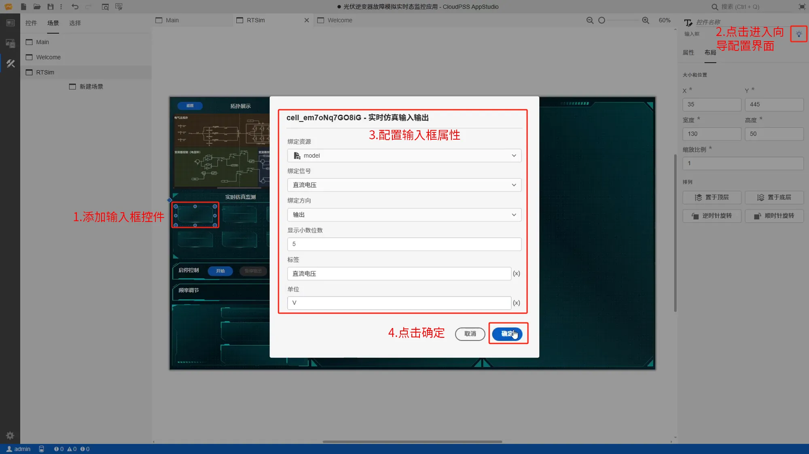

  同理，将其余5个输入框分别与直流电流、电网频率、并网有功、并网无功、正序电压输出信号绑定。

  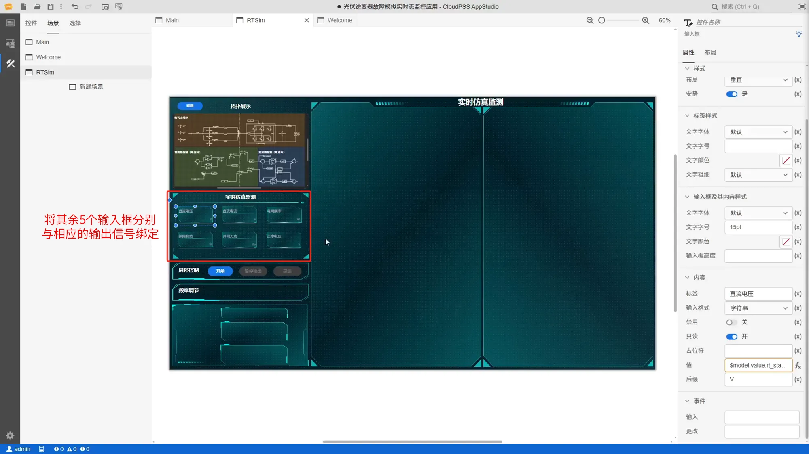
  
  - 添加示波器控件，用于展示输出信号的实时曲线。选中示波器，调整为合适的大小。在属性标签页内绑定资源为所添加的实时仿真模型，输入图表标题，X轴标题，选择窗口类型，设置窗口宽度为2s；

  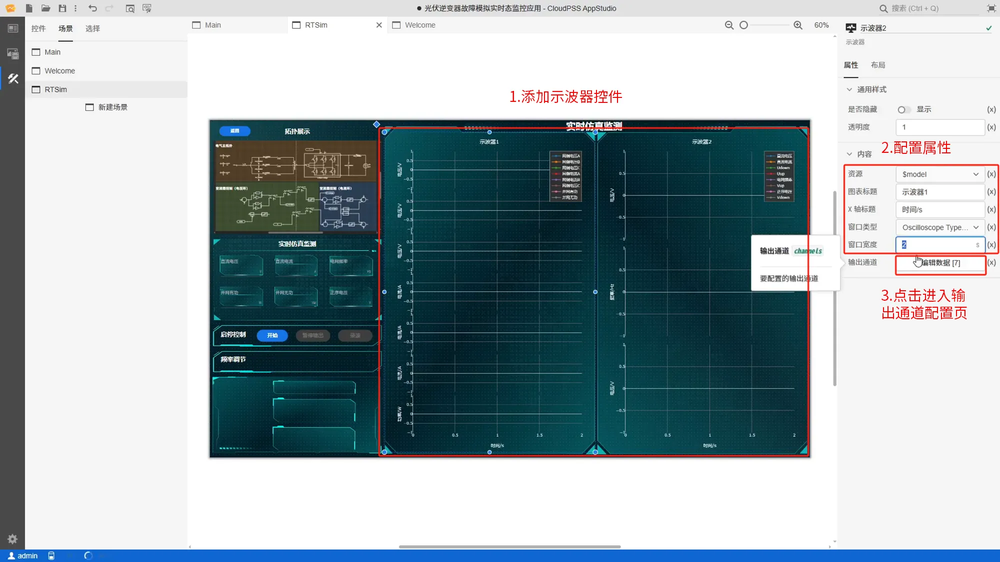

  点击输出通道的编辑数据按钮，配置示波器的显示通道。此处，我们添加了7个分组，分组比例均设为1，表示该示波器包含7个等高的分组。在每个分组中选择需要监测的输出信号进行绑定；并填写Y轴标题。此处配置方法与SimStudio电磁暂态仿真功能一致。

  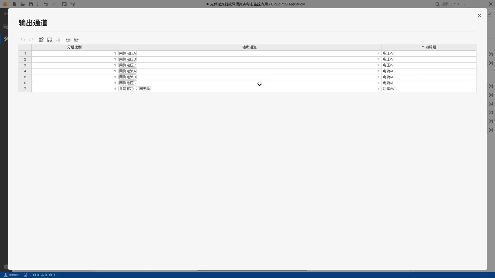

- 第四步，搭建实时仿真控制指令下发面板

  此处，我们需要添加频率调节、不对称故障、低电压穿越、高电压穿越4组指令控件。

  - 首先，添加一个滑块控件，用于控制电源频率变化；在向导界面，绑定当前模型资源，选择绑定频率输入信号；触发事件选择输入；填写默认值、最大最小值、步进值，点击确定，从而实现滑动滑块实时控制系统频率。

  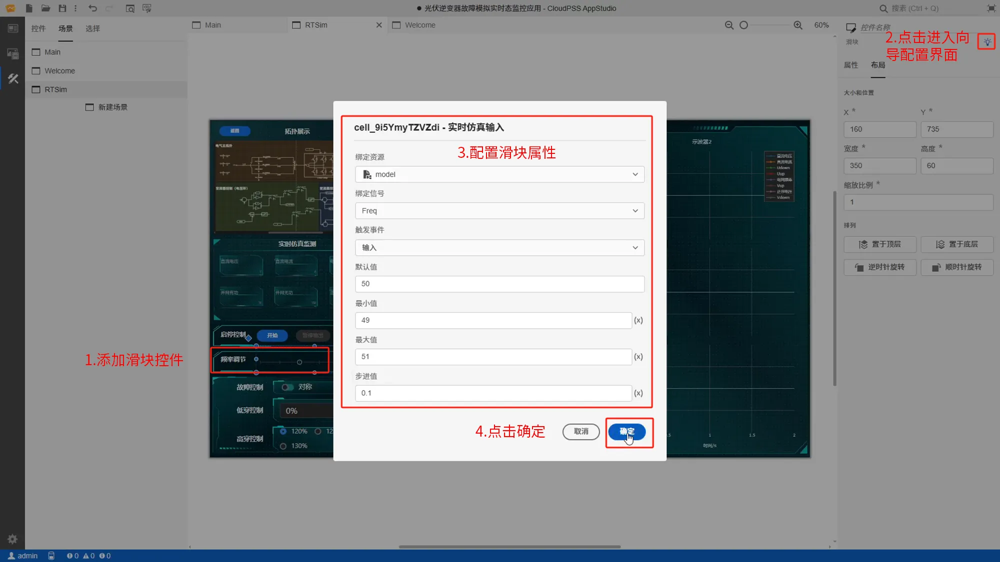

  - 添加一个开关控件，绑定0、1数字量输入信号，用于切换对称、不对称故障控制信号；在向导界面，绑定当前模型资源，选择绑定不对称故障标志输入信号；绑定方向选择输入；触发事件选择更改；填写默认值、标签等属性，点击确定，从而实现通过切换选项，实时控制不同的故障类型。

  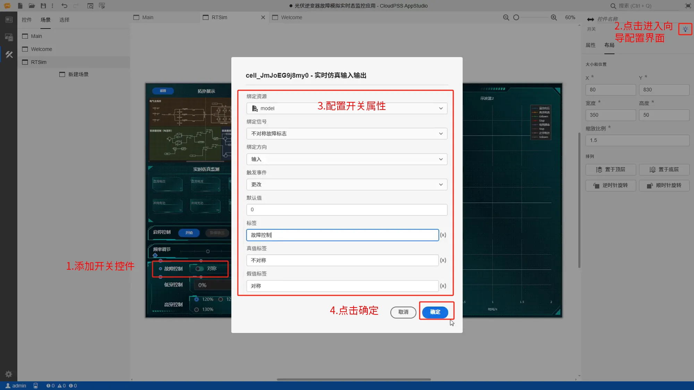

  - 添加一个选择器控件，绑定多值数字量输入信号，用于控制不同电压跌落幅度的低电压触发信号；在向导界面，绑定当前模型资源，选择绑定低穿输入信号；触发事件选择更改；添加不同程度的电压跌落故障选项，及其对应的输入信号值，填写默认值、标签属性，点击确定，从而实现通过切换选项实时下发不同程度的低穿故障指令。
  
  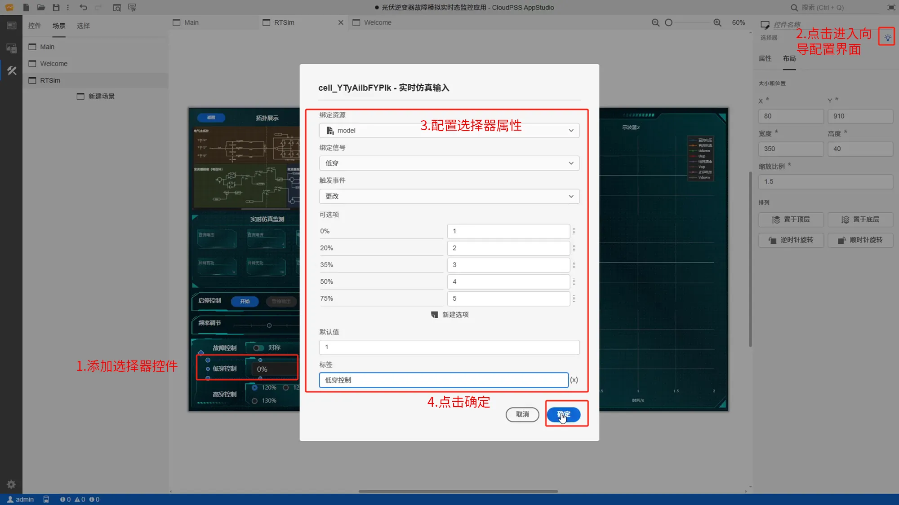
  <!--  -->

  - 同理，可添加一个单选框控件。与选择器控件类似，用于绑定并控制高电压信号指令下发。

  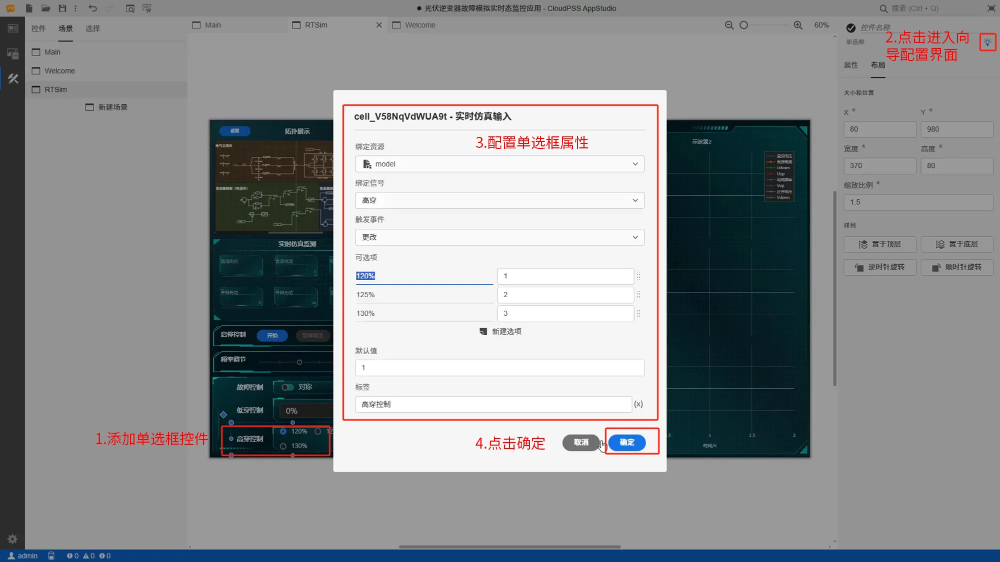

### 应用发布

至此，一个完整的光伏逆变器故障模拟实时态监控应用已快速构建完成。保存并发布为web应用。点击发布链接，即可进入实时仿真监控场景。

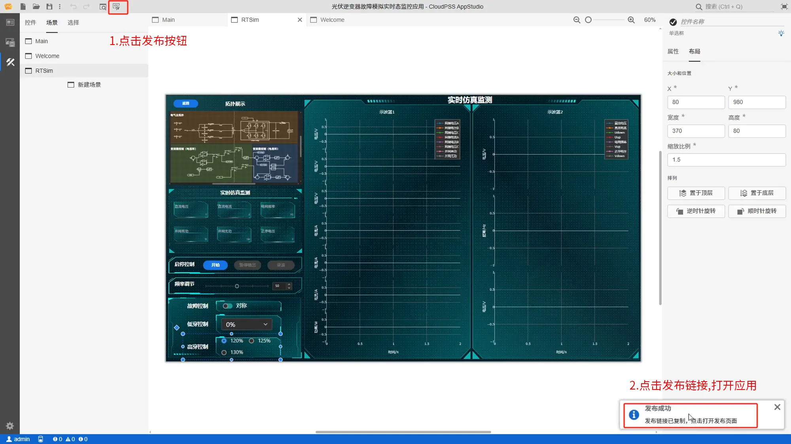

- 点击开始按钮，启动实时仿真;点击开始录波，录制仿真波形；
  
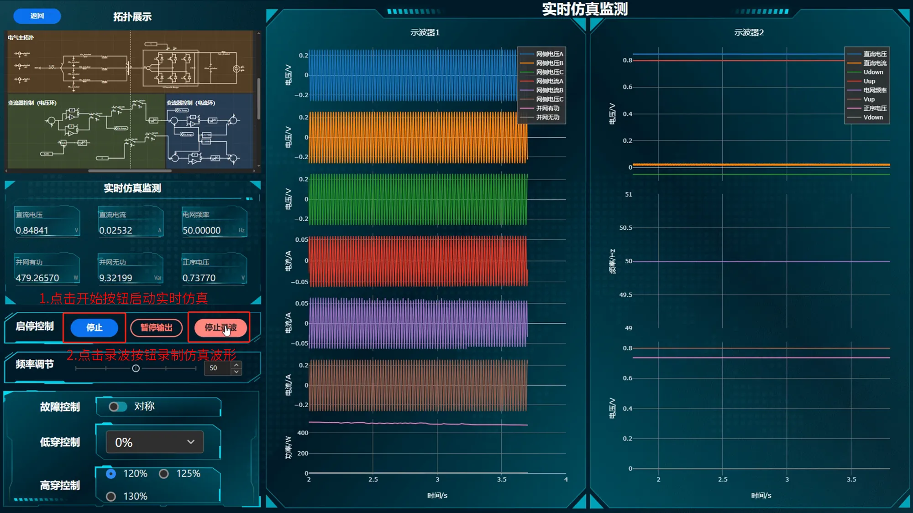

- 在仿真过程中通过滑动滑块控制系统频率；
  
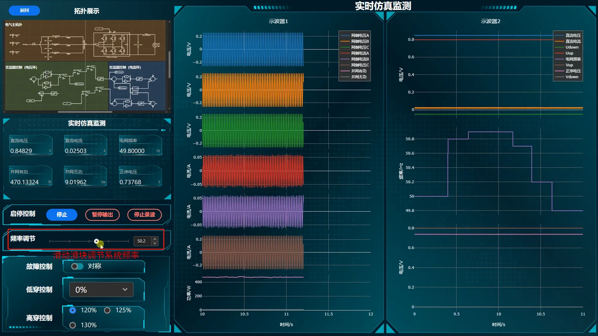

- 选择不同程度的高低穿故障，实时下发控制指令，

- 点击暂停输出按钮，显示当前示波器快照，监测故障过程中光伏逆变器的电压电流波形;此时仿真任务进程不会暂停；点击恢复输出按钮，恢复实时波形显示；
  
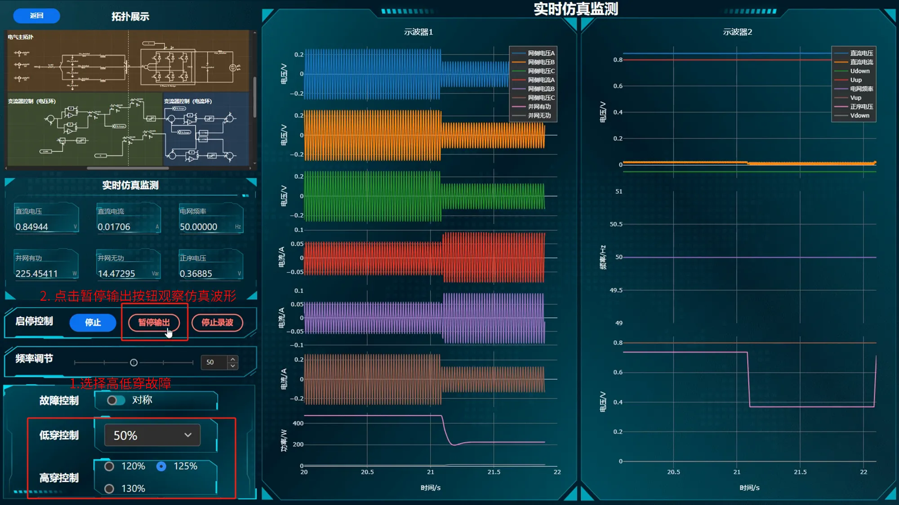

- 点击停止录波按钮，生成录波文件；点击停止按钮，即可结束实时仿真。

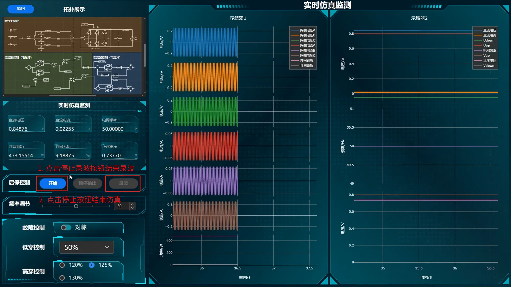
