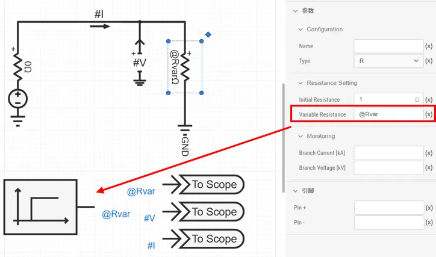
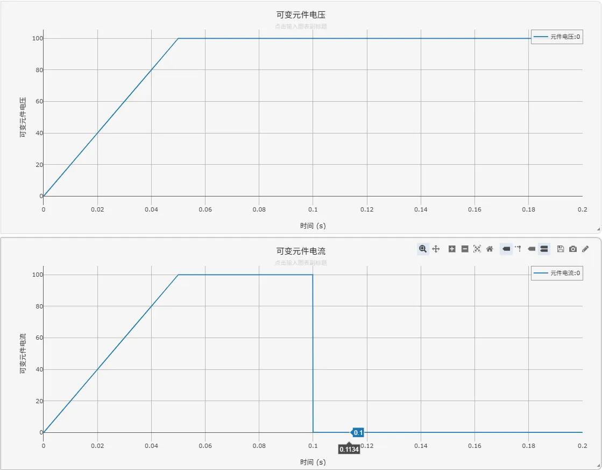
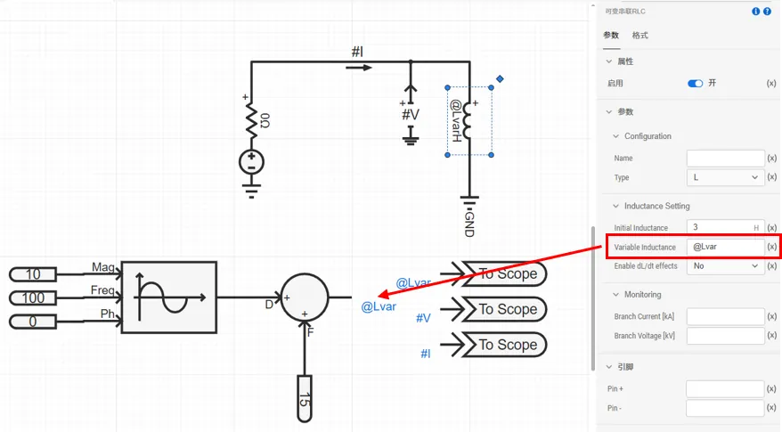
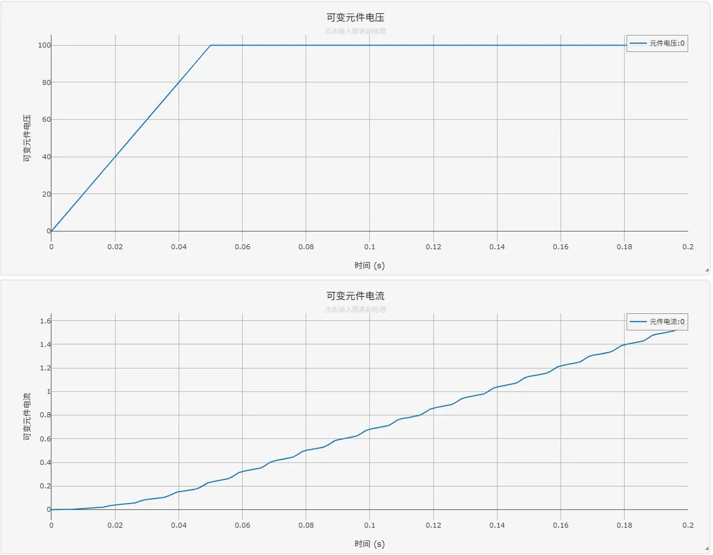
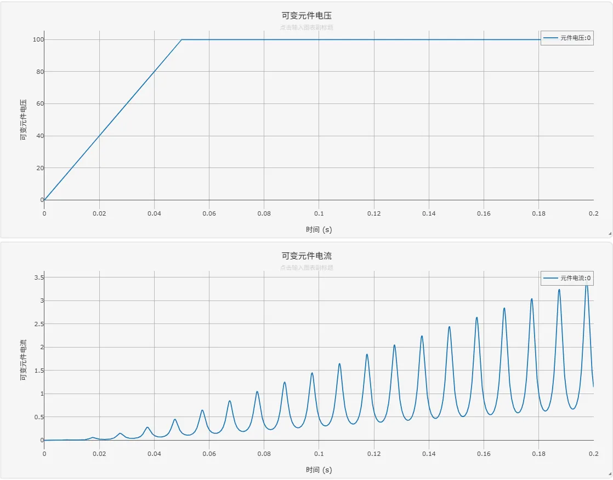
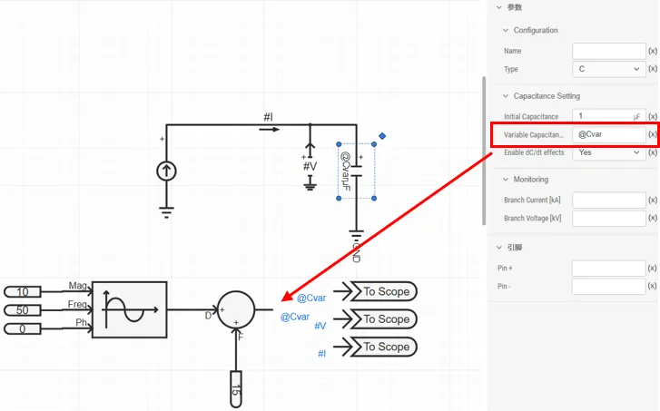
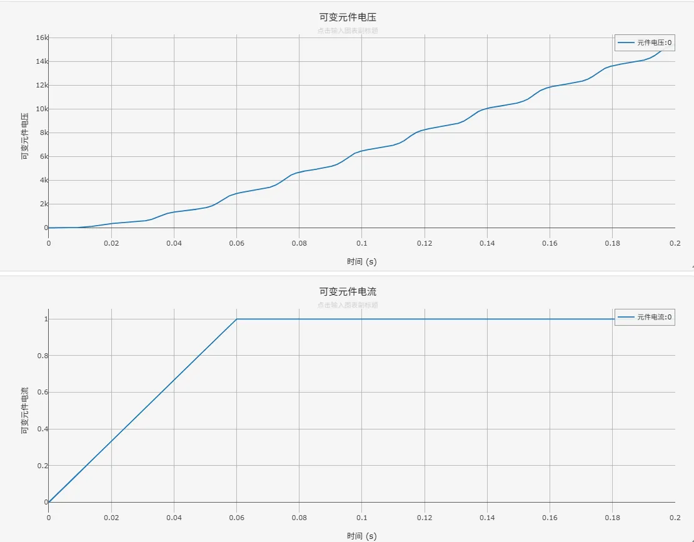
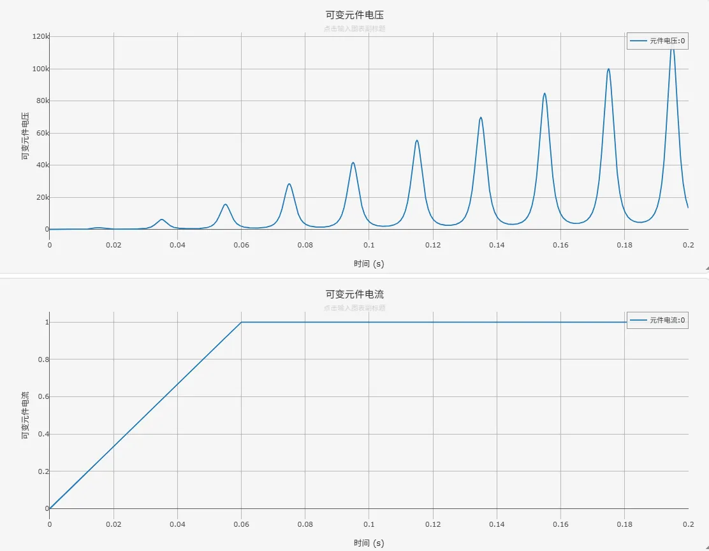

## 元件定义

该元件用以建模可变电阻，可变电感或可变电容。

## 元件说明

### 属性

CloudPSS 元件包含统一的**属性**选项，其配置方法详见 [参数卡](docs/documents/software/10-xstudio/20-simstudio/40-workbench/20-function-zone/30-design-tab/30-param-panel/index.md) 页面。

### 参数

import Parameters from './_parameters.md'

<Parameters/>

### 引脚

import Pins from './_pins.md'

<Pins/>

## 案例

### 可变电阻
可变电阻元件的使用方法如下：将元件类型  `Type` 设为 R，即可通过 `R_var` 虚拟引脚输入控制信号来调节阻值。  
例如，设置一个直流电压源（幅值 100kV，启动时间 0.05s）为电路供电，将阶跃信号发生器（0.1s 时从 1 阶跃至 1000）连接至可变电阻的 R_var 引脚。电磁暂态仿真结果显示，在 0.1s 时刻，电阻电流随即从 100kA 急剧下降至 0.1kA，直观验证了可变电阻的受控特性。

    
    
    

案例文件下载：[可变电阻案例](./可变电阻案例.cmdl)

### 可变电感
可变电感元件的使用方法如下：将元件类型  `Type` 设为 L，即可通过 `L_var` 虚拟引脚接入控制信号来调节电感值。需要注意的是，电感值需要大于 0 H。  
例如，设置一个直流电压源（幅值 100kV，启动时间 0.05s）为电路供电，并采用一个正弦波（频率 100Hz，幅值 5~25，相角 0）控制可变电感。通过对比两组仿真结果，可以明确**是否考虑 $dL/dt$ 的影响**项的作用：
- 当**是否考虑 $dL/dt$ 的影响**设置为 No 时，即使用 $v = L * di/dt$，假设电感为线性电感，在电感变化时强行修改电感值。电磁暂态仿真结果显示，电感电流随时间逐渐增大。
- 当**是否考虑 $dL/dt$ 的影响**设置为 Yes 时，即使用 $v = dΨ/dt = d(Li)/dt$，假设电感为非线性电感，需保证磁链 $Ψ$ 不会突变。电磁暂态仿真结果显示，为了维持磁链 $Ψ$ 的连续性，当电感增大或减小时，电感电流 $i$ 必须急剧减小或增大。

    

    

    

案例文件下载：[可变电感案例](./可变电感案例.cmdl)

### 可变电容
可变电容元件的使用方法如下：将元件类型  `Type` 设为 C，即可通过 `C_var` 虚拟引脚接入控制信号来调节电容值。需要注意的是，电容的单位为 μF，并且电容值需要大于 0 μF。
例如，设置一个直流电流源（电流 1kA，启动时间 0.06s）为电路供电，并采用一个正弦波（频率 50Hz，幅值 5~25，相角 0）控制可变电容。通过对比两组仿真结果，可以明确**是否考虑 $dC/dt$ 的影响**项的作用：
- 当**是否考虑 $dC/dt$ 的影响**设置为 No 时，即使用 $i = C * du/dt$，假设电容为线性电容，在电容变化时强行修改电容值。电磁暂态仿真结果显示，电容电压随时间逐渐增大。
- 当**是否考虑 $dC/dt$ 的影响**设置为 Yes 时，即使用 $i = dq/dt = d(Cu)/dt$，假设电容为非线性电容，需保证电荷 $q$ 不会突变。电磁暂态仿真结果显示，为了维持电荷 $q$ 的连续性，当电容增大或减小时，电容电压 $u$ 必须急剧减小或增大。

    

    

    

案例文件下载：[可变电容案例](./可变电容案例.cmdl)
## 常见问题

